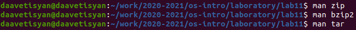
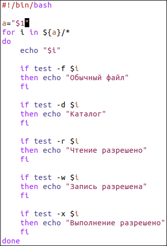

---
## Front matter
lang: ru-RU
title: Отчёт по лабораторной работе №11
author: Аветисян Давид Артурович
institute: РУДН, Москва, Россия
date: 29 мая 2021

## Formatting
toc: false
slide_level: 2
theme: metropolis
header-includes: 
 - \metroset{progressbar=frametitle,sectionpage=progressbar,numbering=fraction}
 - '\makeatletter'
 - '\beamer@ignorenonframefalse'
 - '\makeatother'
aspectratio: 43
section-titles: true
---

## Цель работы

Изучить основы программирования в оболочке ОС UNIX/Linux. Научиться писать небольшие командные файлы.

## Изучим команды архивации

Для начала я изучил команды архивации, используя команды «man zip», «man bzip2», «man tar» (рис. -@fig:001).

{ #fig:001 width=70% }

## Написал первый скрипт

После написал скрипт, который при запуске будет делать резервную копию самого себя (то есть файла, в котором содержится его исходный код) в другую директорию backup в моём домашнем каталоге. При этом файл должен архивироваться одним из архиваторов на выбор zip, bzip2 или tar (рис. -@fig:002). При написании скрипта использовал архиватор bzip2.

{ #fig:002 width=70% }

## Написал второй скрипт

Написал пример командного файла, обрабатывающего любое произвольное число аргументов командной строки, в том числе превышающее десять. Например, скрипт может последовательно распечатывать значения всех переданных аргументов (рис. -@fig:003).

{ #fig:003 width=70% }

## Написал третий скрипт

Написал командный файл − аналог команды ls (без использования самой этой команды и команды dir). Он должен выдавать информацию о нужном каталоге и выводить информацию о возможностях доступа к файлам этого каталога (рис. -@fig:004).

{ #fig:004 width=70% }

## Написал четвёртый скрипт

Написал командный файл, который получает в качестве аргумента командной строки формат файла (.txt, .doc, .jpg, .pdf и т.д.) и вычисляет количество таких файлов в указанной директории. Путь к директории также передаётся в виде аргумента командной строки (рис. -@fig:005).

{ #fig:005 width=70% }

## Вывод

В ходе выполнения данной лабораторной работы я изучил основы программирования в оболочке ОС UNIX/Linux и научился писать небольшие командные файлы.

## {.standout}

Спасибо за внимание!
