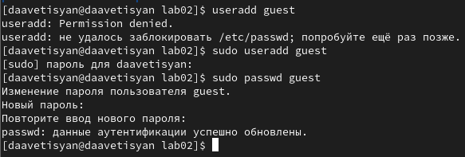
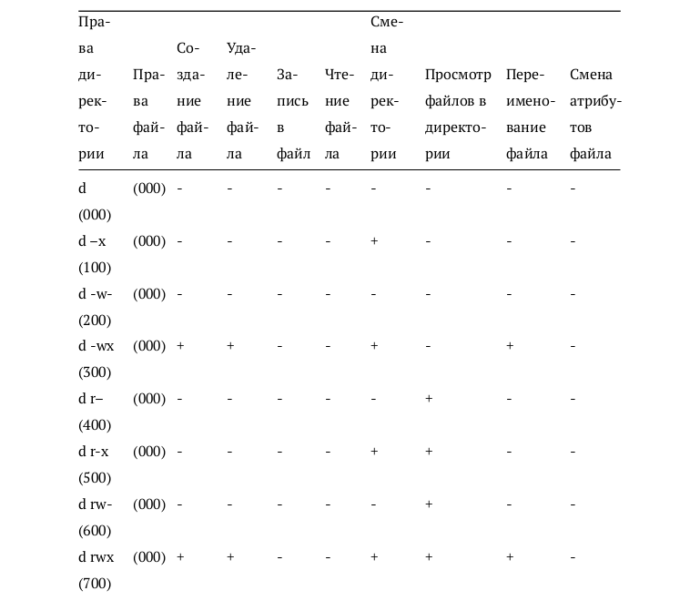
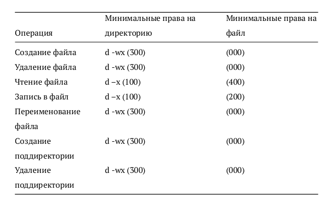

---
## Front matter
lang: ru-RU
title: Отчёт по лабораторной работе №2
author: Аветисян Давид Артурович
institute: РУДН, Москва, Россия

date: 13 Сентября 2023

## Formatting
toc: false
slide_level: 2
theme: metropolis
header-includes: 
 - \metroset{progressbar=frametitle,sectionpage=progressbar,numbering=fraction}
 - '\makeatletter'
 - '\beamer@ignorenonframefalse'
 - '\makeatother'
aspectratio: 43
section-titles: true
---

# Отчет по лабораторной работе №2

## Создание нового пользователя

{ width=70% }

## Вход

{ width=70% }

## Проверка 

{ width=70% }

## Просмотр прав

{ width=70% }

## Удаление прав

{ width=70% }

## Итог удаления

{ width=70% }

## Первая таблица

{ width=70% }

## Вторая таблица

{ width=70% }

## Выводы

- Я получил практические навыки работы в консоли с атрибутами файлов, закрепил теоретические основы дискреционного разграничения доступа в современных системах с открытым кодом на базе ОС Linux.
