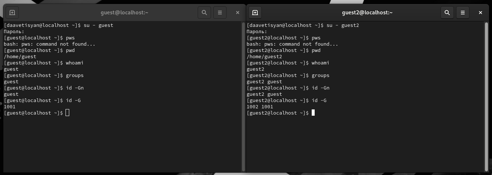

---
# Front matter
lang: ru-RU
title: "Лабораторная работа №3"
subtitle: "Дисциплина: Основы информационной безопасности"
author: "Аветисян Давид Артурович"

# Formatting
toc-title: "Содержание"
toc: true # Table of contents
toc_depth: 2
lof: true # Список рисунков
lot: true # Список таблиц
fontsize: 12pt
linestretch: 1.5
papersize: a4paper
documentclass: scrreprt
polyglossia-lang: russian
polyglossia-otherlangs: english
mainfont: PT Serif
romanfont: PT Serif
sansfont: PT Sans
monofont: PT Mono
mainfontoptions: Ligatures=TeX
romanfontoptions: Ligatures=TeX
sansfontoptions: Ligatures=TeX,Scale=MatchLowercase
monofontoptions: Scale=MatchLowercase
indent: true
pdf-engine: lualatex
header-includes:
  - \linepenalty=10 # the penalty added to the badness of each line within a paragraph (no associated penalty node) Increasing the value makes tex try to have fewer lines in the paragraph.
  - \interlinepenalty=0 # value of the penalty (node) added after each line of a paragraph.
  - \hyphenpenalty=50 # the penalty for line breaking at an automatically inserted hyphen
  - \exhyphenpenalty=50 # the penalty for line breaking at an explicit hyphen
  - \binoppenalty=700 # the penalty for breaking a line at a binary operator
  - \relpenalty=500 # the penalty for breaking a line at a relation
  - \clubpenalty=150 # extra penalty for breaking after first line of a paragraph
  - \widowpenalty=150 # extra penalty for breaking before last line of a paragraph
  - \displaywidowpenalty=50 # extra penalty for breaking before last line before a display math
  - \brokenpenalty=100 # extra penalty for page breaking after a hyphenated line
  - \predisplaypenalty=10000 # penalty for breaking before a display
  - \postdisplaypenalty=0 # penalty for breaking after a display
  - \floatingpenalty = 20000 # penalty for splitting an insertion (can only be split footnote in standard LaTeX)
  - \raggedbottom # or \flushbottom
  - \usepackage{float} # keep figures where there are in the text
  - \floatplacement{figure}{H} # keep figures where there are in the text
---

# Цель работы

Получение практических навыков работы в консоли с атрибутами файлов для групп пользователей.

# Теоретическое введение

В операционной системе Linux есть много отличных функций безопасности, но одна из самых важных - это система прав доступа к файлам. Изначально каждый файл имел три параметра доступа. Вот они:
• Чтение - разрешает получать содержимое файла, но на запись нет. Для каталога позволяет получить список файлов и каталогов, расположенных в нем 
• Запись - разрешает записывать новые данные в файл или изменять существующие, а также позволяет создавать и изменять файлы и каталоги
• Выполнение - невозможно выполнить программу, если у нее нет флага выполнения. Этот атрибут устанавливается для всех программ и скриптов, именно с помощью него система может понять, что этот файл нужно запускать как программу

Каждый файл имеет три категории пользователей, для которых можно устанавливать различные сочетания прав доступа:
• Владелец - набор прав для владельца файла, пользователя, который его создал или сейчас установлен его владельцем. Обычно владелец имеет все права, чтение, запись и выполнение
• Группа - любая группа пользователей, существующая в системе и привязанная к файлу. Но это может быть только одна группа и обычно это группа владельца, хотя для файла можно назначить и другую группу
• Остальные - все пользователи, кроме владельца и пользователей, входящих в группу файла

Команды, которые могут понадобиться при работе с правами доступа:
• “ls -l” - для просмотра прав доступа к файлам и каталогам
• “chmod категория действие флаг файл или каталог” - для изменения прав доступа к файлам и каталогам (категорию действие и флаг можно заменить на набор из трех цифр от 0 до 7)

Значения флагов прав:
• — - нет никаких прав
• –x - разрешено только выполнение файла, как программы, но не изменение
и не чтение
• -w- - разрешена только запись и изменение файла
• -wx - разрешено изменение и выполнение, но в случае с каталогом, невозможно посмотреть его содержимое
• r– - права только на чтение
• r-x - только чтение и выполнение, без права на запись
• rw- - права на чтение и запись, но без выполнения
• rwx - все права
Более подробно см. в [1]

# Выполнение лабораторной работы

1) В установленной при выполнении предыдущей лабораторной работы ОС создаём учётные записи пользователей guest и guest2 с помощью команды “sudo useradd” и задаём пароли для этих пользователей командой “sudo passwd”. Добавляем пользователя guest2 в группу guest с помощью команды “sudo gpasswd -a guest2 guest” (@fig:001).

{ #fig:001 }

2) Затем осуществляем вход в систему от двух пользователей на двух разных консолях при помощи команд “su - guest” и “su - guest2”. Определяем командой “pwd”, что оба пользователя находятся в своих домашних директориях, что совпадает с приглашениями командной строки. Уточняем имена пользователей командой “whoami”, получаем: guest и guest2. С помощью команд “groups guest” и “groups guest2” определяем, что пользователь guest входит в группу guest, а пользователь guest2 в группы guest и guest2. Сравниваем полученную информацию с выводом команд “id -Gn guest”, “id -Gn guest2”, “id -G guest” и “id -G guest2”: данные совпали, за исключением второй команды “id -G”, которая вывела номера групп 1001 и 1002, что также является верным (@fig:002).

{ #fig:002 }

3) Просматриваем файл /etc/group командой “cat /etc/group”, данные этого файла совпадают с полученными ранее. Они выделены на рисунке стрелочками (@fig:003).

{ #fig:003 }

4) От имени пользователя guest2 зарегистрируем этого пользователя в группе guest командой “newgrp guest”. Далее от имени пользователя guest меняем права директории /home/guest, разрешив все действия для пользователей группы командой “chmod g+rwx /home/guest”. От имени этого же пользователя снимаем с директории /home/guest/dir1 все атрибуты командой “chmod 000 dir1” и проверяем правильность снятия атрибутов командой “ls -l” (@fig:004).

{ #fig:004 }

5) Теперь заполним таблицу «Установленные права и разрешённые действия», меняя атрибуты у директории и файла от имени пользователя guest и делая проверку от пользователя guest2.
Создание файла: “echo”text” > /home/guest/dir1/file2”
Удаление файла: “rm -r /home/guest/dir1/file1”
Запись в файл: “echo”textnew” > /home/guest/dir1/file1”
Чтение файла: “cat /home/guest/dir1/file1”
Смена директории: “cd /home/guest/dir1”
Просмотр файлов в директории: “ls /home/guest/dir1”
Переименование файла: “mv /home/guest/dir1/file1 filenew”
Смена атрибутов файла: “chattr -a /home/guest/dir1/file1”

| Права директории | Права файла | Создание файла | Удаление файла | Запись в файл | Чтение файла | Смена директории | Просмотр файлов в директории | Переименование файла | Смена атрибутов файла |
|------------------|-------------|----------------|----------------|---------------|--------------|------------------|------------------------------|----------------------|-----------------------|
| d (000)          | (000)       | -              | -              | -             | -            | -                | -                            | -                    | -                     |
| d –x (010)       | (000)       | -              | -              | -             | -            | +                | -                            | -                    | -                     |
| d -w- (020)      | (000)       | -              | -              | -             | -            | -                | -                            | -                    | -                     |
| d -wx (030)      | (000)       | +              | +              | -             | -            | +                | -                            | +                    | -                     |
| d r– (040)       | (000)       | -              | -              | -             | -            | -                | +                            | -                    | -                     |
| d r-x (050)      | (000)       | -              | -              | -             | -            | +                | +                            | -                    | -                     |
| d rw- (060)      | (000)       | -              | -              | -             | -            | -                | +                            | -                    | -                     |
| d rwx (070)      | (000)       | +              | +              | -             | -            | +                | +                            | +                    | -                     |
|------------------|-------------|----------------|----------------|---------------|--------------|------------------|------------------------------|----------------------|-----------------------|
| d (000)          | (010)       | -              | -              | -             | -            | -                | -                            | -                    | -                     |
| d –x (010)       | (010)       | -              | -              | -             | -            | +                | -                            | -                    | -                     |
| d -w- (020)      | (010)       | -              | -              | -             | -            | -                | -                            | -                    | -                     |
| d -wx (030)      | (010)       | +              | +              | -             | -            | +                | -                            | +                    | -                     |
| d r– (040)       | (010)       | -              | -              | -             | -            | -                | +                            | -                    | -                     |
| d r-x (050)      | (010)       | -              | -              | -             | -            | +                | +                            | -                    | -                     |
| d rw- (060)      | (010)       | -              | -              | -             | -            | -                | +                            | -                    | -                     |
| d rwx (070)      | (010)       | +              | +              | -             | -            | +                | +                            | +                    | -                     |
|------------------|-------------|----------------|----------------|---------------|--------------|------------------|------------------------------|----------------------|-----------------------|
| d (000)          | (020)       | -              | -              | -             | -            | -                | -                            | -                    | -                     |
| d –x (010)       | (020)       | -              | -              | +             | -            | +                | -                            | -                    | -                     |
| d -w- (020)      | (020)       | -              | -              | -             | -            | -                | -                            | -                    | -                     |
| d -wx (030)      | (020)       | +              | +              | +             | -            | +                | -                            | +                    | -                     |
| d r– (040)       | (020)       | -              | -              | -             | -            | -                | +                            | -                    | -                     |
| d r-x (050)      | (020)       | -              | -              | +             | -            | +                | +                            | -                    | -                     |
| d rw- (060)      | (020)       | -              | -              | -             | -            | -                | +                            | -                    | -                     |
| d rwx (070)      | (020)       | +              | +              | +             | -            | +                | +                            | +                    | -                     |
|------------------|-------------|----------------|----------------|---------------|--------------|------------------|------------------------------|----------------------|-----------------------|
| d (000)          | (030)       | -              | -              | -             | -            | -                | -                            | -                    | -                     |
| d –x (010)       | (030)       | -              | -              | +             | -            | +                | -                            | -                    | -                     |
| d -w- (020)      | (030)       | -              | -              | -             | -            | -                | -                            | -                    | -                     |
| d -wx (030)      | (030)       | +              | +              | +             | +            | +                | -                            | +                    | -                     |
| d r– (040)       | (030)       | -              | -              | -             | -            | -                | +                            | -                    | -                     |
| d r-x (050)      | (030)       | -              | -              | +             | -            | +                | +                            | -                    | -                     |
| d rw- (060)      | (030)       | -              | -              | -             | -            | -                | +                            | -                    | -                     |
| d rwx (070)      | (030)       | +              | +              | +             | +            | +                | +                            | +                    | -                     |
|------------------|-------------|----------------|----------------|---------------|--------------|------------------|------------------------------|----------------------|-----------------------|
| d (000)          | (040)       | -              | -              | -             | -            | -                | -                            | -                    | -                     |
| d –x (010)       | (040)       | -              | -              | -             | +            | +                | -                            | -                    | -                     |
| d -w- (020)      | (040)       | -              | -              | -             | -            | -                | -                            | -                    | -                     |
| d -wx (030)      | (040)       | +              | +              | -             | +            | +                | -                            | +                    | -                     |
| d r– (040)       | (040)       | -              | -              | -             | -            | -                | +                            | -                    | -                     |
| d r-x (050)      | (040)       | -              | -              | -             | +            | +                | +                            | -                    | -                     |
| d rw- (060)      | (040)       | -              | -              | -             | -            | -                | +                            | -                    | -                     |
| d rwx (070)      | (040)       | +              | +              | -             | +            | +                | +                            | +                    | -                     |
|------------------|-------------|----------------|----------------|---------------|--------------|------------------|------------------------------|----------------------|-----------------------|
| d (000)          | (050)       | -              | -              | -             | -            | -                | -                            | -                    | -                     |
| d –x (010)       | (050)       | -              | -              | -             | +            | +                | -                            | -                    | -                     |
| d -w- (020)      | (050)       | -              | -              | -             | -            | -                | -                            | -                    | -                     |
| d -wx (030)      | (050)       | +              | +              | -             | +            | +                | -                            | +                    | -                     |
| d r– (040)       | (050)       | -              | -              | -             | -            | -                | +                            | -                    | -                     |
| d r-x (050)      | (050)       | -              | -              | -             | +            | +                | +                            | -                    | -                     |
| d rw- (060)      | (050)       | -              | -              | -             | -            | -                | +                            | -                    | -                     |
| d rwx (070)      | (050)       | +              | +              | -             | +            | +                | +                            | +                    | -                     |
|------------------|-------------|----------------|----------------|---------------|--------------|------------------|------------------------------|----------------------|-----------------------|
| d (000)          | (060)       | -              | -              | -             | -            | -                | -                            | -                    | -                     |
| d –x (010)       | (060)       | -              | -              | +             | +            | +                | -                            | -                    | -                     |
| d -w- (020)      | (060)       | -              | -              | -             | -            | -                | -                            | -                    | -                     |
| d -wx (030)      | (060)       | +              | +              | +             | +            | +                | -                            | +                    | -                     |
| d r– (040)       | (060)       | -              | -              | -             | -            | -                | +                            | -                    | -                     |
| d r-x (050)      | (060)       | -              | -              | +             | +            | +                | +                            | -                    | -                     |
| d rw- (060)      | (060)       | -              | -              | -             | -            | -                | +                            | -                    | -                     |
| d rwx (070)      | (060)       | +              | +              | +             | +            | +                | +                            | +                    | -                     |
|------------------|-------------|----------------|----------------|---------------|--------------|------------------|------------------------------|----------------------|-----------------------|
| d (000)          | (070)       | -              | -              | -             | -            | -                | -                            | -                    | -                     |
| d –x (010)       | (070)       | -              | -              | +             | +            | +                | -                            | -                    | -                     |
| d -w- (020)      | (070)       | -              | -              | -             | -            | -                | -                            | -                    | -                     |
| d -wx (030)      | (070)       | +              | +              | +             | +            | +                | -                            | +                    | -                     |
| d r– (040)       | (070)       | -              | -              | -             | -            | -                | +                            | -                    | -                     |
| d r-x (050)      | (070)       | -              | -              | +             | +            | +                | +                            | -                    | -                     |
| d rw- (060)      | (070)       | -              | -              | -             | -            | -                | +                            | -                    | -                     |
| d rwx (070)      | (070)       | +              | +              | +             | +            | +                | +                            | +                    | -                     |
|------------------|-------------|----------------|----------------|---------------|--------------|------------------|------------------------------|----------------------|-----------------------|

6) Сравнивая полученную таблицу с таблицей из прошлой лабораторной работы, приходим к выводу, что изменился только последний столбец, позволяющий изменять атрибуты у файла: теперь это сделать невозможно, т.к. у владельца файла и директории нет на это прав (во всех случаях в первой позиции стоят 0). При определенном наборе прав остальные действия выполняются или не выполняются аналогично предыдущей таблице, но теперь как для владельца, так и для группы.

Заполним таблицу «Минимально необходимые права для выполнения операций внутри директории».

| Операция               | Минимальные права на директорию | Минимальные права на файл |
|------------------------|---------------------------------|---------------------------|
| Создание файла         | d -wx (300)                     | (000)                     |
| Удаление файла         | d -wx (300)                     | (000)                     |
| Чтение файла           | d –x (100)                      | (040)                     |
| Запись в файл          | d –x (100)                      | (020)                     |
| Переименование файла   | d -wx (300)                     | (000)                     |
| Создание поддиректории | d -wx (300)                     | (000)                     |
| Удаление поддиректории | d -wx (300)                     | (000)                     |

# Выводы

В ходе выполнения данной лабораторной работы я получил практические навыки работы в консоли с атрибутами файлов для групп пользователей.

# Список литературы

- Права доступа к файлам в Linux [Электронный ресурс]. 2019. URL: https://losst.ru/prava-dostupa-k-fajlam-v-linux.
