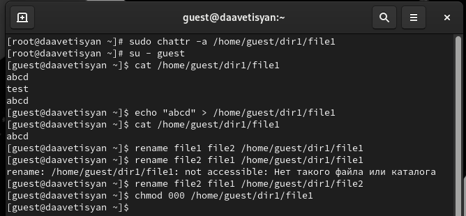

---
## Front matter
lang: ru-RU
title: Отчёт по лабораторной работе №4
author: Аветисян Давид Артурович
institute: РУДН, Москва, Россия

date: 30 Сентября 2023

## Formatting
toc: false
slide_level: 2
theme: metropolis
header-includes: 
 - \metroset{progressbar=frametitle,sectionpage=progressbar,numbering=fraction}
 - '\makeatletter'
 - '\beamer@ignorenonframefalse'
 - '\makeatother'
aspectratio: 43
section-titles: true
---

# Отчет по лабораторной работе №4

##

Цель работы: Получение практических навыков работы в консоли с расширенными атрибутами файлов.

## 

В UNIX-системах, кроме стандартных прав доступа, существуют также дополнительные или специальные атрибуты файлов, которые поддерживает файловая система. Управлять атрибутами можно с помощью команды “chattr”.
Виды расширенных атрибутов:
• a - файл можно открыть только в режиме добавления для записи
• A - при доступе к файлу его запись atime не изменяется
• c - файл автоматически сжимается на диске ядром
• C - файл не подлежит обновлению «копирование при записи»
• d - файл не является кандидатом для резервного копирования при запуске
программы dump
• D - при изменении каталога изменения синхронно записываются на диск
• e - файл использует экстенты для отображения блоков на диске. Его нельзя
удалить с помощью chattr
• E - файл, каталог или символическая ссылка зашифрованы файловой системой. Этот атрибут нельзя установить или сбросить с помощью chattr, хотя
он может быть отображён с помощью lsattr
• F -директория указывает, что все поиски путей внутри этого каталога выполняются без учёта регистра. Этот атрибут можно изменить только в пустых
каталогах в файловых системах с включённой функцией casefold
• i - файл не может быть изменён: его нельзя удалить или переименовать,
нельзя создать ссылку на этот файл, большую часть метаданных файла
нельзя изменить, и файл нельзя открыть в режиме записи
• и другие

## 

Расширенные атрибуты файла

{ width=70% }

##  

Установка расширенного атрибута “a” от имени суперпользователя

{ width=70% }

## 

Попытка выполнить действия над файлом после установки атрибута “a”

{ width=70% }

## 

Попытка выполнить действия над файлом после снятия атрибута “a”

{ width=70% }

## 

Попытка выполнить действия над файлом после установки атрибута “i”

{ width=70% }

## Выводы

- В ходе выполнения данной лабораторной работы я получил практические навыки работы в консоли с расширенными атрибутами файлов, на практике опробовал действие расширенных атрибутов “a” и “i”.
