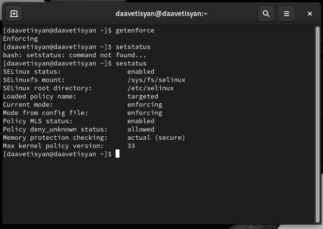
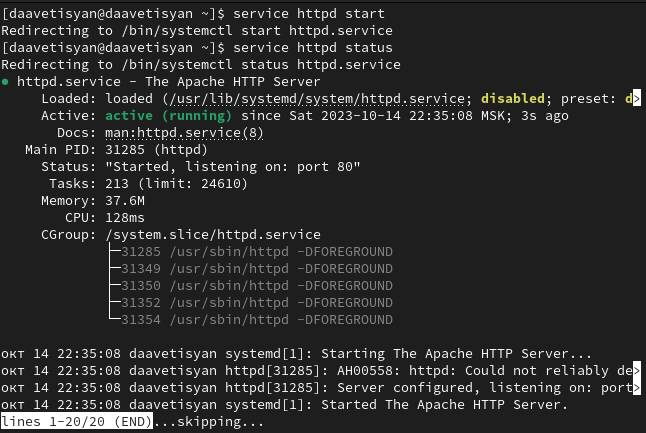
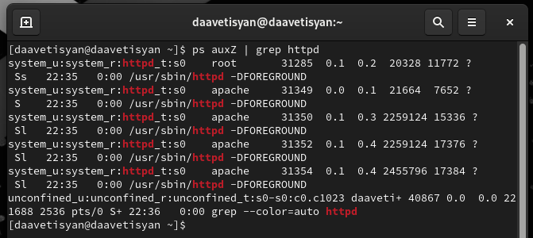
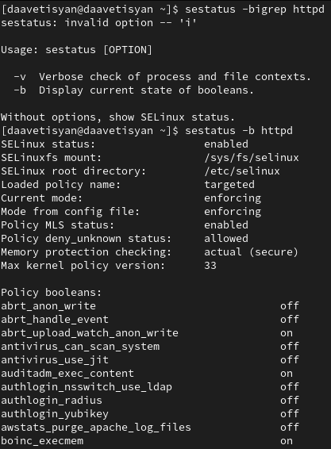
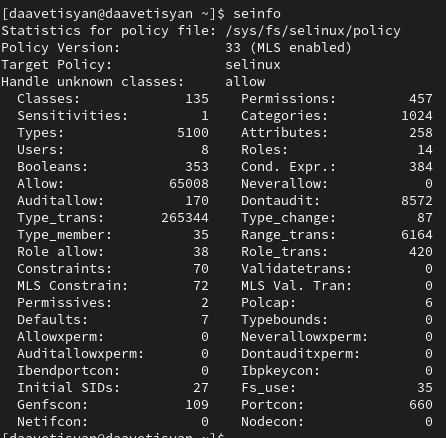
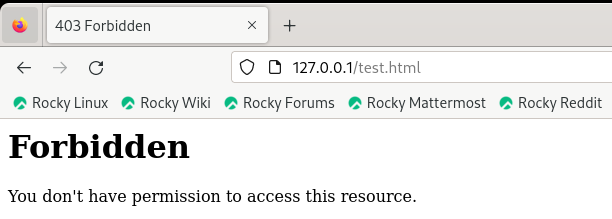
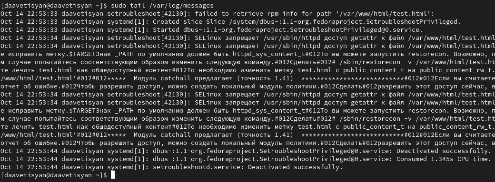
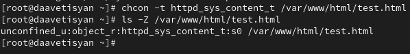
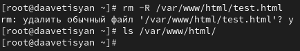

---
# Front matter
lang: ru-RU
title: "Лабораторная работа №6"
subtitle: "Дисциплина: Основы информационной безопасности"
author: "Аветисян Давид Артурович"

# Formatting
toc-title: "Содержание"
toc: true # Table of contents
toc_depth: 2
lof: true # Список рисунков
lot: true # Список таблиц
fontsize: 12pt
linestretch: 1.5
papersize: a4paper
documentclass: scrreprt
polyglossia-lang: russian
polyglossia-otherlangs: english
mainfont: PT Serif
romanfont: PT Serif
sansfont: PT Sans
monofont: PT Mono
mainfontoptions: Ligatures=TeX
romanfontoptions: Ligatures=TeX
sansfontoptions: Ligatures=TeX,Scale=MatchLowercase
monofontoptions: Scale=MatchLowercase
indent: true
pdf-engine: lualatex
header-includes:
  - \linepenalty=10 # the penalty added to the badness of each line within a paragraph (no associated penalty node) Increasing the value makes tex try to have fewer lines in the paragraph.
  - \interlinepenalty=0 # value of the penalty (node) added after each line of a paragraph.
  - \hyphenpenalty=50 # the penalty for line breaking at an automatically inserted hyphen
  - \exhyphenpenalty=50 # the penalty for line breaking at an explicit hyphen
  - \binoppenalty=700 # the penalty for breaking a line at a binary operator
  - \relpenalty=500 # the penalty for breaking a line at a relation
  - \clubpenalty=150 # extra penalty for breaking after first line of a paragraph
  - \widowpenalty=150 # extra penalty for breaking before last line of a paragraph
  - \displaywidowpenalty=50 # extra penalty for breaking before last line before a display math
  - \brokenpenalty=100 # extra penalty for page breaking after a hyphenated line
  - \predisplaypenalty=10000 # penalty for breaking before a display
  - \postdisplaypenalty=0 # penalty for breaking after a display
  - \floatingpenalty = 20000 # penalty for splitting an insertion (can only be split footnote in standard LaTeX)
  - \raggedbottom # or \flushbottom
  - \usepackage{float} # keep figures where there are in the text
  - \floatplacement{figure}{H} # keep figures where there are in the text
---

# Цель работы

Развить навыки администрирования ОС Linux. Получить первое практическое знакомство с технологией SELinux. Проверить работу SELinux на практике совместно с веб-сервером Apache.

# Теоретическое введение

SELinux (Security-Enhanced Linux) обеспечивает усиление защиты путем внесения изменений как на уровне ядра, так и на уровне пространства пользователя, что превращает ее в действительно «непробиваемую» операционную систему.
Впервые эта система появилась в четвертой версии CentOS, а в 5 и 6 версии реализация была существенно дополнена и улучшена.
SELinux имеет три основных режим работы:
• Enforcing: Режим по-умолчанию. При выборе этого режима все действия, которые каким-то образом нарушают текущую политику безопасности, будут блокироваться, а попытка нарушения будет зафиксирована в журнале.
• Permissive: В случае использования этого режима, информация о всех действиях, которые нарушают текущую политику безопасности, будут зафиксированы в журнале, но сами действия не будут заблокированы.
• Disabled: Полное отключение системы принудительного контроля доступа.
Политика SELinux определяет доступ пользователей к ролям, доступ ролей к доменам и доступ доменов к типам.
Контекст безопасности — все атрибуты SELinux — роли, типы и домены.
Более подробно см. в [1].

Apache — это свободное программное обеспечение, с помощью которого можно создать веб-сервер. Данный продукт возник как доработанная версия другого HTTP-клиента от национального центра суперкомпьютерных приложений
(NCSA).

Для чего нужен Apache сервер:
• чтобы открывать динамические PHP-страницы,
• для распределения поступающей на сервер нагрузки,
• для обеспечения отказоустойчивости сервера,
• чтобы потренироваться в настройке сервера и запуске PHP-скриптов.

Apache является кроссплатформенным ПО и поддерживает такие операционные системы, как Linux, BSD, MacOS, Microsoft, BeOS и другие.
Более подробно см. в [2].

# Выполнение лабораторной работы

1) Входим в систему под своей учетной записью и убеждаемся, что SELinux работает в режиме enforcing политики targeted с помощью команд “getenforce” и “sestatus” (@fig:001).

{ #fig:001 }

2) Обращаемся с помощью браузера к веб-серверу, запущенному на моем компьютере, и убеждаемся, что последний работает с помощью команды “service httpd status” (@fig:002).

{ #fig:002 }

3) С помощью команды “ps auxZ | grep httpd” определяем контекст безопасности веб-сервера Apache - httpd_t (@fig:003).

{ #fig:003 }

4) Посмотрим текущее состояние переключателей SELinux для Apache с помощью команды “sestatus -bigrep httpd”, многие из переключателей находятся в положении “off” (@fig:004).

{ #fig:004 }

5) Посмотрим статистику по политике с помощью команды “seinfo”. Множество пользователей - 8, ролей - 14, типов 5100 (@fig:005).

{ #fig:005 }

6) С помощью команды “ls -lZ /var/www” посмотрим файлы и поддиректории, находящиеся в директории /var/www. Используя команду “ls -lZ /var/www/html”, определяем, что в данной директории файлов нет. Только владелец или суперпользователь может создавать файлы в директории /var/www/html (@fig:006).

{ #fig:006 }

7) От имени суперпользователя создаём html-файл /var/www/html/test.html. Контекст созданного файла - httpd_sys_content_t (@fig:007).

{ #fig:007 }

8) Обращаемся к файлу через веб-сервер, введя в браузере адрес “http://127.0.0.1/test.html”. Файл был успешно отображен (@fig:008).

{ #fig:008 }

9) Изучив справку man httpd_selinux, выясняем, что для httpd определены следующие контексты файлов: httpd_sys_content_t, httpd_sys_script_exec_t, httpd_sys_script_ro_t, httpd_sys_script_rw_t, httpd_sys_script_ra_t, httpd_unconfined_script_exec_t. Контекст моего файла - httpd_sys_content_t (в таком случае содержимое должно быть доступно для всех скриптов httpd и для самого демона). Изменяем контекст файла на samba_share_t командой “sudo chcon -t samba_share_t /var/www/html/test.html” и проверяем, что контекст поменялся (@fig:009).

{ #fig:009 }

10) Попробуем еще раз получить доступ к файлу через веб-сервер, введя в браузере адрес “http://127.0.0.1/test.html” и получаем сообщение об ошибке (т.к. к установленному ранее контексту процесс httpd не имеет доступа) (@fig:010).

{ #fig:010 }

11) Командой “ls -l /var/www/html/test.html” убеждаемся, что читать данный файл может любой пользователь. Просматриваем системный лог-файл веб-сервера Apache командой “sudo tail /var/log/messages”, отображающий ошибки (@fig:011).

{ #fig:011 }

12) В файле /etc/httpd/conf/httpd.conf заменяем строчку “Listen 80” на “Listen 81”, чтобы установить веб-сервер Apache на прослушивание TCP-порта 81 (@fig:012).

{ #fig:012 }

13) Перезапускаем веб-сервер Apache и анализируем лог-файлы командой “tail -nl /var/log/messages” (@fig:013).

{ #fig:013 }

14) Просматриваем файлы “var/log/http/error_log”, “/var/log/http/access_log” и “/var/log/audit/audit.log” и выясняем, что запись появилась в последнем файле (@fig:014).

{ #fig:014 }

15) Выполняем команду “semanage port -a -t http_port_t -р tcp 81” и убеждаемся, что порт TCP-81 установлен. Проверяем список портов командой “semanage port -l | grep http_port_t”, убеждаемся, что порт 81 есть в списке и запускаем веб-сервер Apache снова (@fig:015).

{ #fig:015 }

16) Вернём контекст “httpd_sys_cоntent_t” файлу “/var/www/html/test.html” командой “chcon -t httpd_sys_content_t /var/www/html/test.html” (@fig:016) и после этого пробуем получить доступ к файлу через веб-сервер, введя адрес “http://127.0.0.1:81/test.html”, в результате чего увидим содежимое файла - слово “test” (@fig:017).

{ #fig:016 }

{ #fig:017 }

17) Исправим обратно конфигурационный файл apache, вернув “Listen 80”. Попытаемся удалить привязку http_port к 81 порту командой “semanage port -d -t http_port_t -p tcp 81”, но этот порт определен на уровне политики, поэтому его нельзя удалить (@fig:018).

{ #fig:018 }

18) Удаляем файл “/var/www/html/test.html” командой “rm /var/www/html/test.html” (@fig:019).

{ #fig:019 }

# Выводы

- В ходе выполнения данной лабораторной работы я развил навыки администрирования ОС Linux, получил первое практическое знакомство с технологией SELinux и проверил работу SELinux на практике совместно с веб-сервером Apache.

# Список литературы

-  SELinux – описание и особенности работы с системой [Электронный ресурс]. URL: https://habr.com/ru/company/kingservers/blog/209644/.

-  Что такое Apache и зачем он нужен? [Электронный ресурс]. URL: https://2domains.ru/support/vps-i-servery/shto-takoye-apache.

