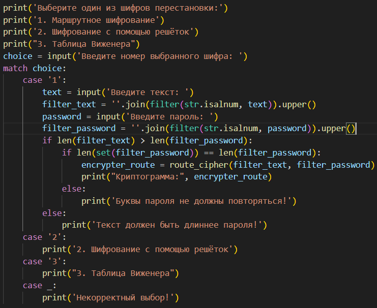
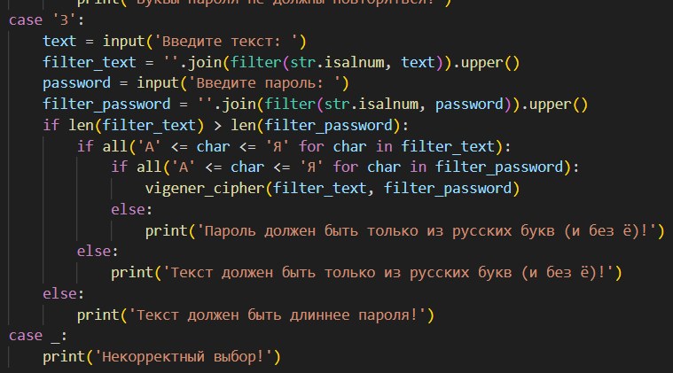

---
## Front matter
lang: ru-RU
title: Отчёт по лабораторной работе №2
author: Аветисян Давид Артурович
institute: РУДН, Москва, Россия

date: 27 Сентября 2024

## Formatting
toc: false
slide_level: 2
theme: metropolis
header-includes: 
 - \metroset{progressbar=frametitle,sectionpage=progressbar,numbering=fraction}
 - '\makeatletter'
 - '\beamer@ignorenonframefalse'
 - '\makeatother'
aspectratio: 43
section-titles: true
---

## Цель работы

1. Программно реализовать маршрутное шифрование.
2. Программно реализовать шифрование с помощью решёток.
3. Программно реализовать шифр Виженера.

## Реализация маршрутного шифрования

- Сначала я реализовал возможность выбора одного из трёх шифров пользователем. Затем начал с маршрутного шифрования. Я сделал запрос текста и пароля у пользователя, их фильтрацию и добавил проверки на соответствие требованиям для шифрования.

{ width=70% }

## Реализация маршрутного шифрования

- Я реализовал русский алфавит для удобного заполнения массивов. Далее я реализовал функцию route_cipher, в которой создал матрицу размером с текст пользователя и шириной с его пароль.

{ width=70% }

## Реализация маршрутного шифрования

- После я реализовал общую для первого и второго шифрования функцию cryptogram, которая из заданного массива и введённого пользователем пароля создаёт таблицу, которую выводит, а затем создаётся криптограмму.

{ width=70% }

## Реализация маршрутного шифрования

- Далее я запустил два теста через командную строку. Шифрование совпало с тестом в лабораторной работе №2, и реализовано верно.

{ width=70% }

## Реализация шифрования с помощью решёток

- Затем я перешёл к реализации шифрования с помощью решёток. Я аналогично предыдущему шифрованию запросил текст у пользователя, но в данном случае я запрашиваю пароль необходимой длины 2k, как сказано в теории к лабораторной работы. 

{ width=70% }

## Реализация шифрования с помощью решёток

- Далее я реализовал функцию lattice_cipher, в которой я создал матрицу размера 2k и заполнил её нулями.

{ width=70% }

## Реализация шифрования с помощью решёток

- Для того чтобы заполнить матрицу значениями от 1 до k**2, я реализовал функцию вращения матрицы на 90 градусов по часовой стрелке. 

{ width=70% }

## Реализация шифрования с помощью решёток

- Далее для правильного заполнения матрицы текстом пользователя, я реализовал 4 похожих, но разных цикла. Я заполнял все уникальные значения побуквенно текстом пользователя. 

{ width=70% }

## Реализация шифрования с помощью решёток

- Далее я запустил два теста через командную строку. Шифрование совпало с тестом в лабораторной работе №2, и реализовано верно.

{ width=70% }

## Реализация шифра Виженера

- В конце я перешёл к реализации шифра Виженера. В первую очередь для его реализации нам потребуется таблица с русским алфавитом, где каждая следующая строка сдвигается на одну букву. 

{ width=70% }

## Реализация шифра Виженера

- Затем я перешёл к реализации шифра Виженера. Я аналогично предыдущим шифрованиям запросил текст и пароль у пользователя, отфильтровал их, а также проверил на соответствие требованиям для шифрования.

{ width=70% }

## Реализация шифра Виженера

- Далее я реализовал функцию vigener_cipher, в которой создаётся матрица, где первая строка - текст пользователя, вторая строка - повторяющийся пароль пользователя, а третья строка пуста (для будущей криптограммы). 

{ width=70% }

## Реализация шифра Виженера

- Далее я запустил два теста через командную строку. Шифрование совпало с тестом в лабораторной работе №2, и реализовано верно.

{ width=70% }

## Выводы

- Я программно реализовал шифры перестановки.
