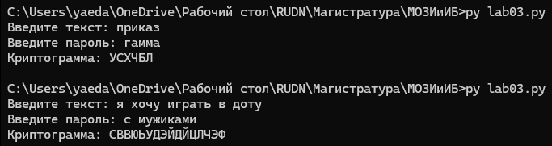

---
## Front matter
lang: ru-RU
title: Отчёт по лабораторной работе №3
author: Аветисян Давид Артурович
institute: РУДН, Москва, Россия

date: 12 октября 2024

## Formatting
toc: false
slide_level: 2
theme: metropolis
header-includes: 
 - \metroset{progressbar=frametitle,sectionpage=progressbar,numbering=fraction}
 - '\makeatletter'
 - '\beamer@ignorenonframefalse'
 - '\makeatother'
aspectratio: 43
section-titles: true
---

# Отчет по лабораторной работы №3

## Цель работы

- Познакомиться с шифрованием гаммированием.

## Запрос текста и пароля у пользователя

- Я решил реализовать шифрование гаммированием на языке Python. Сначала я задал матрицу с русскими буквами, а также реализовал запрос текста и пароля у пользователя. Все буквы в тексте и пароля я сделал заглавными, а затем я отфильтровал текст и пароль, оставив в нём только русские буквы.

{ width=70% }

## Шифрование гаммированием на языке Python

- Далее я реализовал само шифрование гаммированием. Я задал три матрицы: для текста, для гаммы и для результата. Пароль я увеличил повторением до длины текста, как указано в теории к лабораторной работе №3. Далее я, опираясь на матрицу с русскими буквами, заполнил первые две матрицы значениями, на которых стоят буквы из текста и пароля соответственно. А уже затем я заполнял третью матрицу складывая значения из первой и второй матрицы и находя остаток от деления. После чего я преобразовал каждое значение из третьей матрицы в букву, исходя из матрицы с русскими буквами, и вывел пользователю.

{ width=70% }

## Проверка метода шифрования гаммированием

- Далее я запустил два теста через командную строку. Один тест как в теории к лабораторной работе №3. Второй тест для дополнительной проверки. Шифрование совпало с тестом в лабораторной работе №3, и реализовано верно.

{ width=70% }

## Выводы

- Я реализовал шифрование гаммированием.
