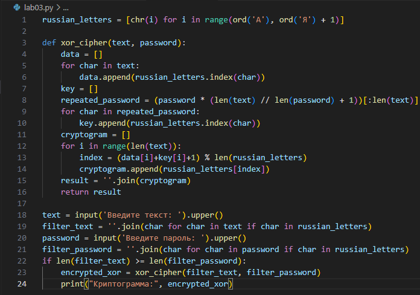

---
# Front matter
lang: ru-RU
title: "Лабораторная работа №3"
subtitle: "Дисциплина: Математические основы защиты информации и информационной безопасности"
author: "Аветисян Давид Артурович"

# Formatting
toc-title: "Содержание"
toc: true # Table of contents
toc_depth: 2
lof: true # Список рисунков
lot: true # Список таблиц
fontsize: 12pt
linestretch: 1.5
papersize: a4paper
documentclass: scrreprt
polyglossia-lang: russian
polyglossia-otherlangs: english
mainfont: PT Serif
romanfont: PT Serif
sansfont: PT Sans
monofont: PT Mono
mainfontoptions: Ligatures=TeX
romanfontoptions: Ligatures=TeX
sansfontoptions: Ligatures=TeX,Scale=MatchLowercase
monofontoptions: Scale=MatchLowercase
indent: true
pdf-engine: lualatex
header-includes:
  - \linepenalty=10 # the penalty added to the badness of each line within a paragraph (no associated penalty node) Increasing the value makes tex try to have fewer lines in the paragraph.
  - \interlinepenalty=0 # value of the penalty (node) added after each line of a paragraph.
  - \hyphenpenalty=50 # the penalty for line breaking at an automatically inserted hyphen
  - \exhyphenpenalty=50 # the penalty for line breaking at an explicit hyphen
  - \binoppenalty=700 # the penalty for breaking a line at a binary operator
  - \relpenalty=500 # the penalty for breaking a line at a relation
  - \clubpenalty=150 # extra penalty for breaking after first line of a paragraph
  - \widowpenalty=150 # extra penalty for breaking before last line of a paragraph
  - \displaywidowpenalty=50 # extra penalty for breaking before last line before a display math
  - \brokenpenalty=100 # extra penalty for page breaking after a hyphenated line
  - \predisplaypenalty=10000 # penalty for breaking before a display
  - \postdisplaypenalty=0 # penalty for breaking after a display
  - \floatingpenalty = 20000 # penalty for splitting an insertion (can only be split footnote in standard LaTeX)
  - \raggedbottom # or \flushbottom
  - \usepackage{float} # keep figures where there are in the text
  - \floatplacement{figure}{H} # keep figures where there are in the text
---

# Цель работы

Познакомиться с шифрованием гаммированием.

# Задание

1. Реализовать шифрование гаммированием.

# Выполнение лабораторной работы

1) Я решил реализовать шифрование гаммированием на языке Python. Сначала я задал матрицу с русскими буквами, а также реализовал запрос текста и пароля у пользователя. Все буквы в тексте и пароля я сделал заглавными, а затем я отфильтровал текст и пароль, оставив в нём только русские буквы.

{ width=70% }

2) Далее я реализовал само шифрование гаммированием. Я задал три матрицы: для текста, для гаммы и для результата. Пароль я увеличил повторением до длины текста, как указано в теории к лабораторной работе №3. Далее я, опираясь на матрицу с русскими буквами, заполнил первые две матрицы значениями, на которых стоят буквы из текста и пароля соответственно. А уже затем я заполнял третью матрицу складывая значения из первой и второй матрицы и находя остаток от деления. После чего я преобразовал каждое значение из третьей матрицы в букву, исходя из матрицы с русскими буквами, и вывел пользователю.

{ width=70% }

3) Далее я запустил два теста через командную строку. Один тест как в теории к лабораторной работе №3. Второй тест для дополнительной проверки. Шифрование совпало с тестом в лабораторной работе №3, и реализовано верно.

{ width=70% }

# Выводы

Я реализовал шифрование гаммированием.
