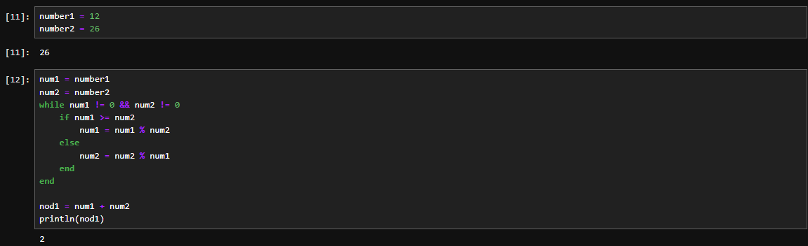

---
## Front matter
lang: ru-RU
title: Отчёт по лабораторной работе №4
author: Аветисян Давид Артурович
institute: РУДН, Москва, Россия

date: 26 октября 2024

## Formatting
toc: false
slide_level: 2
theme: metropolis
header-includes: 
 - \metroset{progressbar=frametitle,sectionpage=progressbar,numbering=fraction}
 - '\makeatletter'
 - '\beamer@ignorenonframefalse'
 - '\makeatother'
aspectratio: 43
section-titles: true
---

## Цель работы

- Реализовать алгоритмы вычисления наибольшего общего делителя.

## Алгоритм Евклида на языке Julia

- 1-5 строки: задание чисел, НОД которых ищем.
- 6-12 строки: реализация самого алгоритма Евклида: делим наибольшее число на наименьшее и записываем остаток до тех пор, пока одно из них не обнулится.
- 14-15 строки: записываем НОД в переменную и выводим.

{ width=70% }

## Бинарный алгоритм Евклида на языке Julia

- 1-3 строки: задание чисел, НОД которых ищем, и обнуление "сдвига".
- 5-23 строки: реализация самого бинарного алгоритма Евклида: смотрим на четность получающихся значений и записываем, насколько нам небходимо "сдвинуть" число, чтобы получить НОД.
- 25 строка: сдвиг влево и вывод получившегося НОД.

{ width=70% }

## Расширенный алгоритм Евклида на языке Julia

- 1 строка: задание рекурсивной функции.
- 2-3 строки: если второе число равно нулю, возвращаем ответ из трёх чисел.
- 5-7 строки: в ином случае запускаем рекурсию, а затем выводим ответ согласно формуле на строке 7.
- 8 строка: возвращаем вывод в качестве получившегося НОД; числа, что нужно домножить на первую цифру и на вторую, чтобы получить НОД.
- 11 строка: вызов функции и сохранение данных в переменные.
- 12 строка: вывод на экран.

{ width=70% }

## Расширенный бинарный алгоритм Евклида на языке Julia

Данная программа работает рекурсивно, рассматривая 4 случая:  
1. a четное  
2. a нечетное и b четное  
3. a нечетное и b нечетное, b > a  
4. a нечетное и b нечетное, a > b  

Каждая рекурсия сдвигает биты в цифрах, формирую окончательный ответ. В итоге выводит три значения: НОД; числа, которые нужно домножить на первую цифру и на вторую, чтобы получить НОД.

{ width=70% }

## Выводы

- Я реализовал алгоритмы вычисления наибольшего общего делителя.
