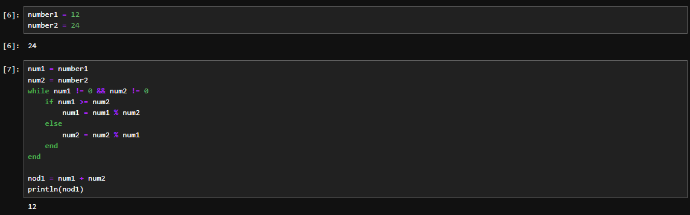
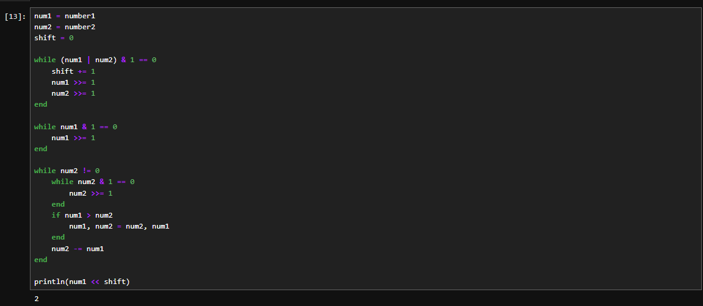
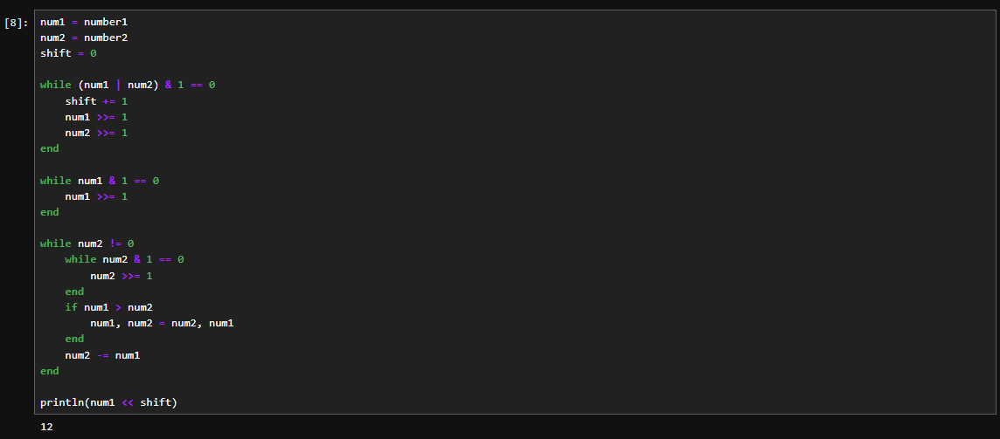
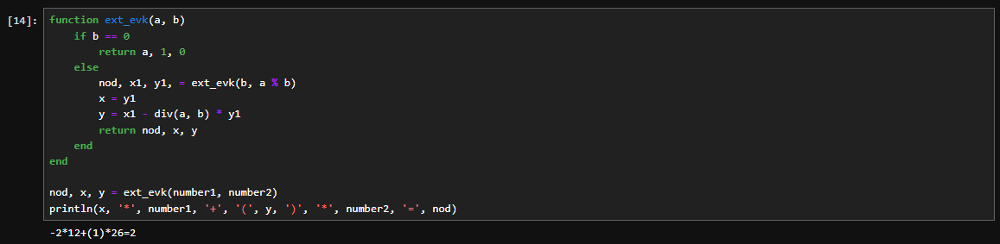
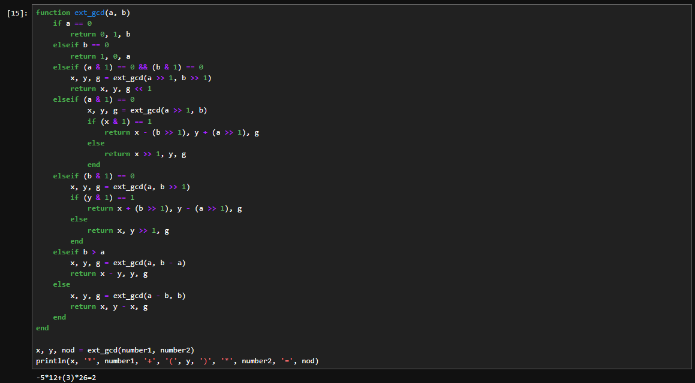
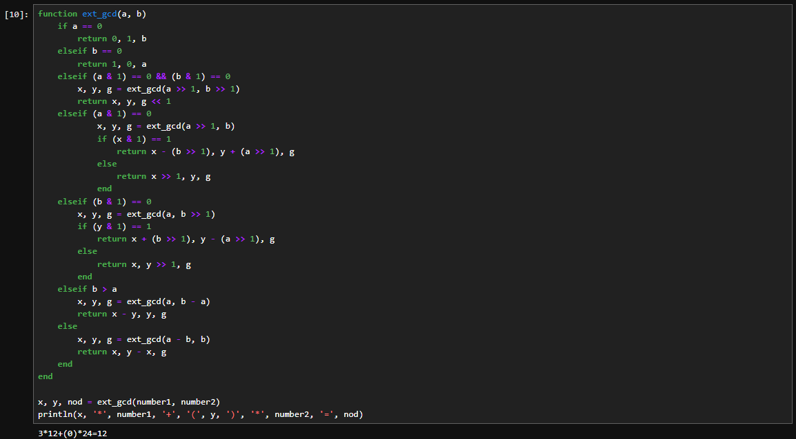

---
# Front matter
lang: ru-RU
title: "Лабораторная работа №4"
subtitle: "Дисциплина: Математические основы защиты информации и информационной безопасности"
author: "Аветисян Давид Артурович"

# Formatting
toc-title: "Содержание"
toc: true # Table of contents
toc_depth: 2
lof: true # Список рисунков
lot: true # Список таблиц
fontsize: 12pt
linestretch: 1.5
papersize: a4paper
documentclass: scrreprt
polyglossia-lang: russian
polyglossia-otherlangs: english
mainfont: PT Serif
romanfont: PT Serif
sansfont: PT Sans
monofont: PT Mono
mainfontoptions: Ligatures=TeX
romanfontoptions: Ligatures=TeX
sansfontoptions: Ligatures=TeX,Scale=MatchLowercase
monofontoptions: Scale=MatchLowercase
indent: true
pdf-engine: lualatex
header-includes:
  - \linepenalty=10 # the penalty added to the badness of each line within a paragraph (no associated penalty node) Increasing the value makes tex try to have fewer lines in the paragraph.
  - \interlinepenalty=0 # value of the penalty (node) added after each line of a paragraph.
  - \hyphenpenalty=50 # the penalty for line breaking at an automatically inserted hyphen
  - \exhyphenpenalty=50 # the penalty for line breaking at an explicit hyphen
  - \binoppenalty=700 # the penalty for breaking a line at a binary operator
  - \relpenalty=500 # the penalty for breaking a line at a relation
  - \clubpenalty=150 # extra penalty for breaking after first line of a paragraph
  - \widowpenalty=150 # extra penalty for breaking before last line of a paragraph
  - \displaywidowpenalty=50 # extra penalty for breaking before last line before a display math
  - \brokenpenalty=100 # extra penalty for page breaking after a hyphenated line
  - \predisplaypenalty=10000 # penalty for breaking before a display
  - \postdisplaypenalty=0 # penalty for breaking after a display
  - \floatingpenalty = 20000 # penalty for splitting an insertion (can only be split footnote in standard LaTeX)
  - \raggedbottom # or \flushbottom
  - \usepackage{float} # keep figures where there are in the text
  - \floatplacement{figure}{H} # keep figures where there are in the text
---

# Цель работы

Реализовать алгоритмы вычисления наибольшего общего делителя.

# Задание

1. Реализовать алгоритм Евклида.
2. Реализовать бинарный алгоритм Евклида.
3. Реализовать расширенный алгоритм Евклида.
4. Реализовать расширенный бинарный алгоритм Евклида.

# Выполнение лабораторной работы

Данная работа была выполнена на языку Julia.

1) Для реализации алгоритма Евклида была написана следующая программа.

{ width=70% }

В данной программе: 
- 1-5 строки: задание чисел, НОД которых ищем.
- 6-12 строки: реализация самого алгоритма Евклида: делим наибольшее число на наименьшее и записываем остаток до тех пор, пока одно из них не обнулится.
- 14-15 строки: записываем НОД в переменную и выводим.

Мы можем видеть результат для двух случае на рисунках выше и ниже. Программа работает верно.

{ width=70% }

2) Для реализации бинарного алгоритма Евклида была написана следующая программа.

{ width=70% }

В данной программе: 
- 1-3 строки: задание чисел, НОД которых ищем, и обнуление "сдвига".
- 5-23 строки: реализация самого бинарного алгоритма Евклида: смотрим на четность получающихся значений и записываем, насколько нам небходимо "сдвинуть" число, чтобы получить НОД.
- 25 строка: сдвиг влево и вывод получившегося НОД.

Мы можем видеть результат для двух случае на рисунках выше и ниже. Программа работает верно.

{ width=70% }

3) Для реализации расширенного алгоритма Евклида была написана следующая программа.

{ width=70% }

В данной программе: 
- 1 строка: задание рекурсивной функции.
- 2-3 строки: если второе число равно нулю, возвращаем ответ из трёх чисел.
- 5-7 строки: в ином случае запускаем рекурсию, а затем выводим ответ согласно формуле на строке 7.
- 8 строка: возвращаем вывод в качестве получившегося НОД; числа, что нужно домножить на первую цифру и на вторую, чтобы получить НОД.
- 11 строка: вызов функции и сохранение данных в переменные.
- 12 строка: вывод на экран.

Мы можем видеть результат для двух случае на рисунках выше и ниже. Программа работает верно.

{ width=70% }

4) Для реализации расширенного бинарного алгоритма Евклида была написана следующая программа.

{ width=70% }

Данная программа работает рекурсивно, рассматривая 4 случая:
1. a четное
2. a нечетное и b четное
3. a нечетное и b нечетное, b > a
4. a нечетное и b нечетное, a > b

Каждая рекурсия сдвигает биты в цифрах, формирую окончательный ответ. В итоге выводит три значения: НОД; числа, которые нужно домножить на первую цифру и на вторую, чтобы получить НОД.

Мы можем видеть результат для двух случае на рисунках выше и ниже. Программа работает верно.

{ width=70% }

Необходимо обратить внимание, что расширенные алгоритмы выводят разные множители, однако оба ответа верны и дают верный НОД.

# Выводы

Я реализовал алгоритмы вычисления наибольшего общего делителя.
