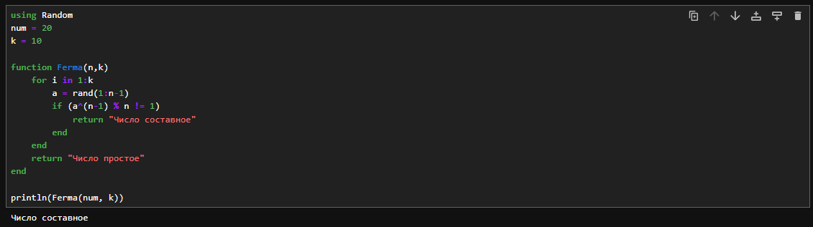
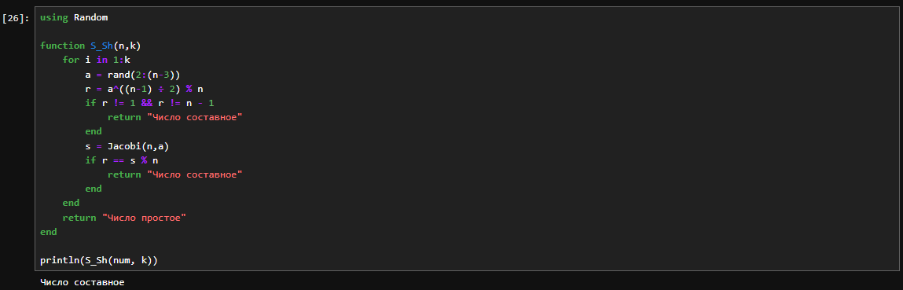

---
## Front matter
lang: ru-RU
title: Отчёт по лабораторной работе №5
author: Аветисян Давид Артурович
institute: РУДН, Москва, Россия

date: 9 ноября 2024

## Formatting
toc: false
slide_level: 2
theme: metropolis
header-includes: 
 - \metroset{progressbar=frametitle,sectionpage=progressbar,numbering=fraction}
 - '\makeatletter'
 - '\beamer@ignorenonframefalse'
 - '\makeatother'
aspectratio: 43
section-titles: true
---

## Цель работы

Познакомиться с вероятностными алгоритмами проверки чисел на простоту.

## Тест Ферма на языке Julia

- 2-3 строки: задание числа, которое нужн проверить на простоту, и количество проверок.
- 5 строка: задание функции.
- 6 строка: цикл проверки выполняется $k$ раз.
- 7 строка: берётся случайно число $a$ в диапазоне $[1,n-1]$.
- 8 строка: проводим проверку условия, при невыполнении сразу завершаем работу.
- 9-13 строки: выводим результат, закрываем функцию.

{ width=70% }

## Поиск символа Якоби на языке Julia

- 1-5 строки: задание функции, проверка условия для вычисления символа Якоби.
- 6-25 строки - реализация алгоритма: проверка трёх условия и действия согласно этим условиям: смена знака символа при четном и нечетном $k$, проверка остатков от деления.
- 26 строка: вывод результата раброты программы. В данном случае я вычислял Якоби 7 и 33. Вывод представлен на рисунке выше.

{ width=70% }

## Тест Соловэя-Штрассена на языке Julia

- 3 строка: задаём функцию.
- 4 строка: повторим проверку $k$ раз
- 5-16 строки - реализация алгоритма: выбираем случайное число $a$, вычисляем число $r$ по формуле в строке 6, а затем проверяем получившееся значение на два условия. Если оно не проходит, проверку, то сразу заканчиваем работу программы. Далее следует ещё одна проверка условия в строке 11, при провале также завершаем работу.
- 18 строка: вывод на экран. Результат работы программы с числами 20 и 5 и 10-ю проверками.

{ width=70% }

## Тест Миллера-Рабина на языке Julia

- 3 строка: задаём функцию.
- 4-9 строки: отсеивание числа 2 и остальных четных чисел.
- 11-29 строки - реализация алгоритма: выбираем случайное число $a$ и вычисляем число $x$ по формуле в строке 17. При условии в строке 18 выполняем дополнительные действия - вычисление остатка от деления квадра $x$ на проверяемое число. Если число прошло все проверки $k$ раз, мы определяем его как "вероятно, простое".

{ width=70% }

## Выводы

Я познакомился с вероятностными алгоритмами проверки чисел на простоту.
