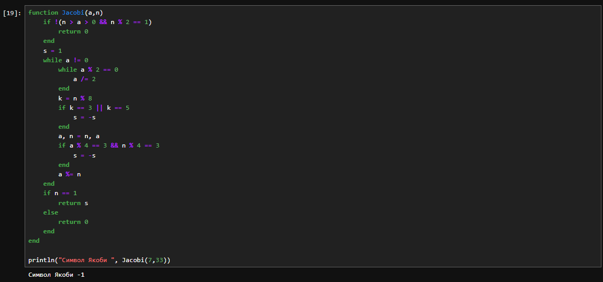
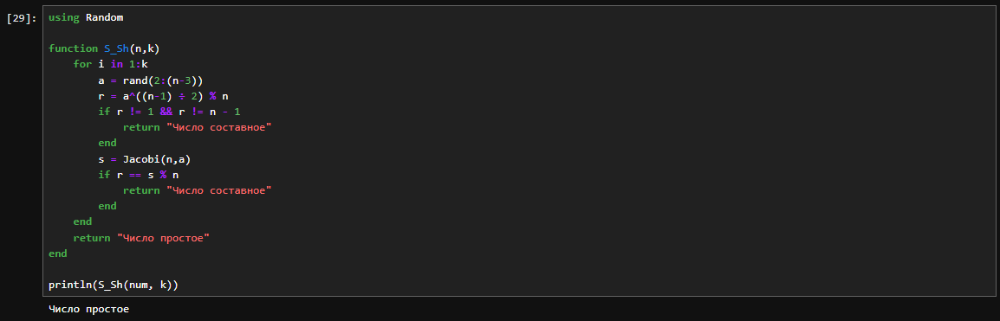
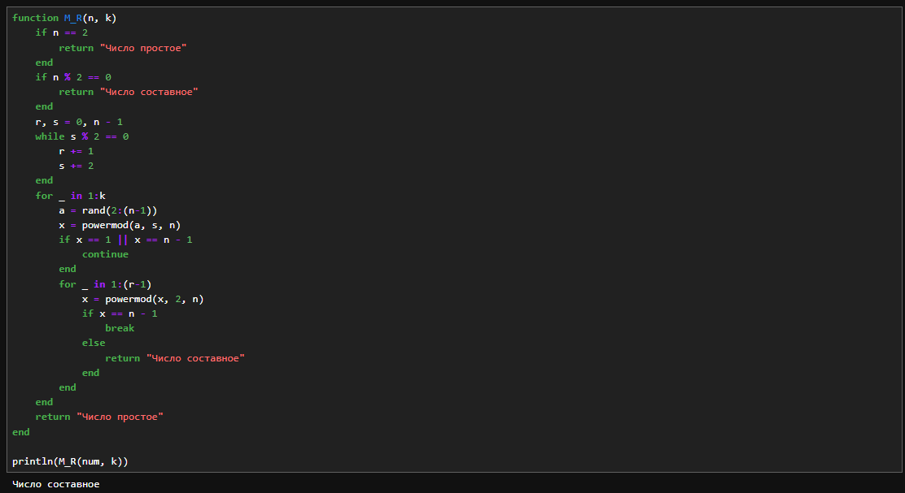

---
# Front matter
lang: ru-RU
title: "Лабораторная работа №5"
subtitle: "Дисциплина: Математические основы защиты информации и информационной безопасности"
author: "Аветисян Давид Артурович"

# Formatting
toc-title: "Содержание"
toc: true # Table of contents
toc_depth: 2
lof: true # Список рисунков
lot: true # Список таблиц
fontsize: 12pt
linestretch: 1.5
papersize: a4paper
documentclass: scrreprt
polyglossia-lang: russian
polyglossia-otherlangs: english
mainfont: PT Serif
romanfont: PT Serif
sansfont: PT Sans
monofont: PT Mono
mainfontoptions: Ligatures=TeX
romanfontoptions: Ligatures=TeX
sansfontoptions: Ligatures=TeX,Scale=MatchLowercase
monofontoptions: Scale=MatchLowercase
indent: true
pdf-engine: lualatex
header-includes:
  - \linepenalty=10 # the penalty added to the badness of each line within a paragraph (no associated penalty node) Increasing the value makes tex try to have fewer lines in the paragraph.
  - \interlinepenalty=0 # value of the penalty (node) added after each line of a paragraph.
  - \hyphenpenalty=50 # the penalty for line breaking at an automatically inserted hyphen
  - \exhyphenpenalty=50 # the penalty for line breaking at an explicit hyphen
  - \binoppenalty=700 # the penalty for breaking a line at a binary operator
  - \relpenalty=500 # the penalty for breaking a line at a relation
  - \clubpenalty=150 # extra penalty for breaking after first line of a paragraph
  - \widowpenalty=150 # extra penalty for breaking before last line of a paragraph
  - \displaywidowpenalty=50 # extra penalty for breaking before last line before a display math
  - \brokenpenalty=100 # extra penalty for page breaking after a hyphenated line
  - \predisplaypenalty=10000 # penalty for breaking before a display
  - \postdisplaypenalty=0 # penalty for breaking after a display
  - \floatingpenalty = 20000 # penalty for splitting an insertion (can only be split footnote in standard LaTeX)
  - \raggedbottom # or \flushbottom
  - \usepackage{float} # keep figures where there are in the text
  - \floatplacement{figure}{H} # keep figures where there are in the text
---

# Цель работы

Познакомиться с вероятностными алгоритмами проверки чисел на простоту.

# Задание

1. Реализовать тест Ферма.
2. Реализовать алгоритм вычисления символа Якоби.
3. Реализовать тест Соловэя-Штрассена.
4. Реализовать тест Миллера-Рабина.

# Выполнение лабораторной работы

Данная работа была выполнена на языку Julia.

1) Для реализации теста Ферма была написана следующая программа.

{ width=70% }

В данной программе: 
- 2-3 строки: задание числа, которое нужн проверить на простоту, и количество проверок.
- 5 строка: задание функции.
- 6 строка: цикл проверки выполняется $k$ раз.
- 7 строка: берётся случайно число $a$ в диапазоне $[1,n-1]$.
- 8 строка: проводим проверку условия, при невыполнении сразу завершаем работу.
- 9-13 строки: выводим результат, закрываем функцию.

Мы можем видеть результат для двух случае на рисунках выше и ниже. Программа работает верно.

{ width=70% }

2) Для реализации поиска символа Якоби была написана следующая программа.

{ width=70% }

В данной программе: 
- 1-5 строки: задание функции, проверка условия для вычисления символа Якоби.
- 6-25 строки - реализация алгоритма: проверка трёх условия и действия согласно этим условиям: смена знака символа при четном и нечетном $k$, проверка остатков от деления.
- 26 строка: вывод результата раброты программы. В данном случае я вычислял Якоби 7 и 33. Вывод представлен на рисунке выше.

3) Для реализации теста Соловэя-Штрассена была написана следующая программа.

{ width=70% }

В данной программе: 
- 3 строка: задаём функцию.
- 4 строка: повторим проверку $k$ раз
- 5-16 строки - реализация алгоритма: выбираем случайное число $a$, вычисляем число $r$ по формуле в строке 6, а затем проверяем получившееся значение на два условия. Если оно не проходит, проверку, то сразу заканчиваем работу программы. Далее следует ещё одна проверка условия в строке 11, при провале также завершаем работу.
- 18 строка: вывод на экран. Результат работы программы с числами 20 и 5 и 10-ю проверками.

Мы можем видеть результат для двух случае на рисунках выше и ниже. Программа работает верно.

{ width=70% }

4) Для реализации теста Миллера-Рабина была написана следующая программа.

{ width=70% }

Данная программа работает рекурсивно, рассматривая 4 случая:
- 3 строка: задаём функцию.
- 4-9 строки: отсеивание числа 2 и остальных четных чисел.
- 11-29 строки - реализация алгоритма: выбираем случайное число $a$ и вычисляем число $x$ по формуле в строке 17. При условии в строке 18 выполняем дополнительные действия - вычисление остатка от деления квадра $x$ на проверяемое число. Если число прошло все проверки $k$ раз, мы определяем его как "вероятно, простое".

Результат работы программы с числом 20 и 10-ю проверками представлен на рисунке выше.

# Выводы

Я познакомился с вероятностными алгоритмами проверки чисел на простоту.
