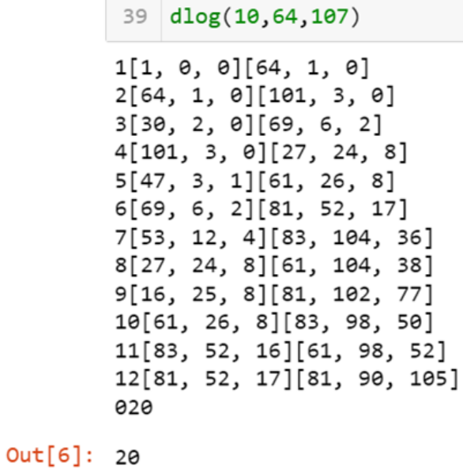

---
## Front matter
lang: ru-RU
title: Отчёт по лабораторной работе №7
author: Аветисян Давид Артурович
institute: РУДН, Москва, Россия

date: 7 декабря 2024

## Formatting
toc: false
slide_level: 2
theme: metropolis
header-includes: 
 - \metroset{progressbar=frametitle,sectionpage=progressbar,numbering=fraction}
 - '\makeatletter'
 - '\beamer@ignorenonframefalse'
 - '\makeatother'
aspectratio: 43
section-titles: true
---

## Цель работы

Познакомиться с дискретным логарифмированием в конечном поле.

## Выполнение лабораторной работы

В данной программе:  
- 1 строка: подключение библиотеки для нахождения НОД.  
- 3 строка: задание функции.  
- 4-16 строки: задание внутренней функции для вывода результатов.  
- 17 строка: задание начальных значений.  
- 18 строка: начало вычисления, пока не получим равенство.  
- 19-36 строки: запуск основного алгоритма, который с помощью вычисления остатков от деления и формул, представленных в теории лабораторной работы, формирует таблицу ответов.  
- 39 строка: запуск функции

{ width=70% }

## Выполнение лабораторной работы

Мы можем видеть результат на рисунке ниже. Программа работае верно.

{ width=70% }

## Выводы

Я познакомился с дискретным логарифмированием в конечном поле и реализовал p-метод Полларда.
