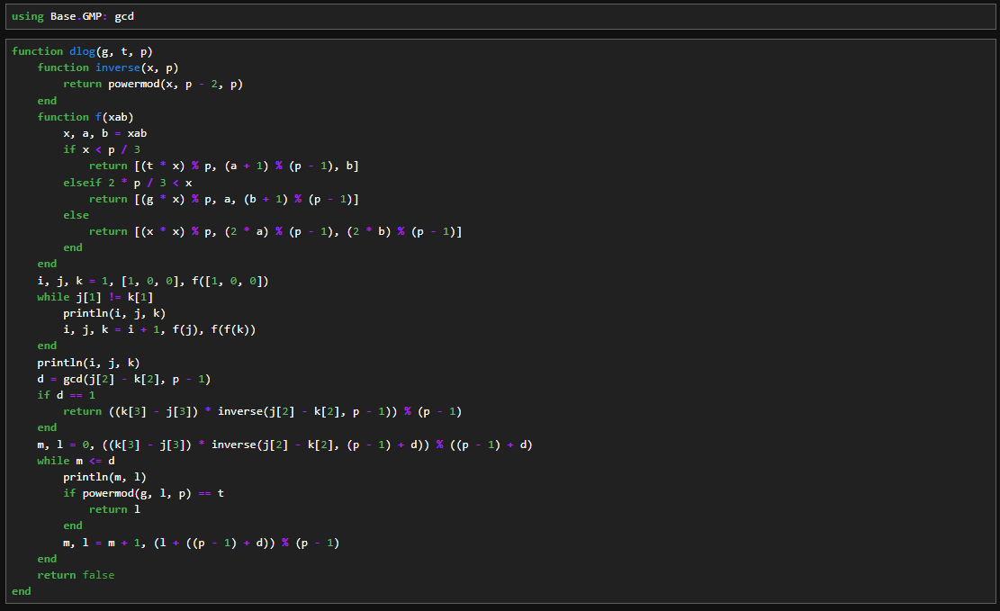

---
# Front matter
lang: ru-RU
title: "Лабораторная работа №7"
subtitle: "Дисциплина: Математические основы защиты информации и информационной безопасности"
author: "Аветисян Давид Артурович"

# Formatting
toc-title: "Содержание"
toc: true # Table of contents
toc_depth: 2
lof: true # Список рисунков
lot: true # Список таблиц
fontsize: 12pt
linestretch: 1.5
papersize: a4paper
documentclass: scrreprt
polyglossia-lang: russian
polyglossia-otherlangs: english
mainfont: PT Serif
romanfont: PT Serif
sansfont: PT Sans
monofont: PT Mono
mainfontoptions: Ligatures=TeX
romanfontoptions: Ligatures=TeX
sansfontoptions: Ligatures=TeX,Scale=MatchLowercase
monofontoptions: Scale=MatchLowercase
indent: true
pdf-engine: lualatex
header-includes:
  - \linepenalty=10 # the penalty added to the badness of each line within a paragraph (no associated penalty node) Increasing the value makes tex try to have fewer lines in the paragraph.
  - \interlinepenalty=0 # value of the penalty (node) added after each line of a paragraph.
  - \hyphenpenalty=50 # the penalty for line breaking at an automatically inserted hyphen
  - \exhyphenpenalty=50 # the penalty for line breaking at an explicit hyphen
  - \binoppenalty=700 # the penalty for breaking a line at a binary operator
  - \relpenalty=500 # the penalty for breaking a line at a relation
  - \clubpenalty=150 # extra penalty for breaking after first line of a paragraph
  - \widowpenalty=150 # extra penalty for breaking before last line of a paragraph
  - \displaywidowpenalty=50 # extra penalty for breaking before last line before a display math
  - \brokenpenalty=100 # extra penalty for page breaking after a hyphenated line
  - \predisplaypenalty=10000 # penalty for breaking before a display
  - \postdisplaypenalty=0 # penalty for breaking after a display
  - \floatingpenalty = 20000 # penalty for splitting an insertion (can only be split footnote in standard LaTeX)
  - \raggedbottom # or \flushbottom
  - \usepackage{float} # keep figures where there are in the text
  - \floatplacement{figure}{H} # keep figures where there are in the text
---

# Цель работы

Познакомиться с дискретным логарифмированием в конечном поле.

# Задание

Реализовать алгоритм, реализующий p-метод Полларда.

# Выполнение лабораторной работы

Данная работа была выполнена на языке Julia.

Для реализации p-метода Полларда была написана следующая программа.

{ width=70% }

В данной программе: 
- 1 строка: подключение библиотеки для нахождения НОД.
- 3 строка: задание функции.
- 4-16 строки: задание внутренней функции для вывода результатов.
- 17 строка: задание начальных значений.
- 18 строка: начало вычисления, пока не получим равенство.
- 19-36 строки: запуск основного алгоритма, который с помощью вычисления остатков от деления и формул, представленных в теории лабораторной работы, формирует таблицу ответов.
- 39 строка: запуск функции

Мы можем видеть результат на рисунке ниже. Программа работае верно.

{ width=70% }

# Выводы

Я познакомился с дискретным логарифмированием в конечном поле и реализовал p-метод Полларда.
