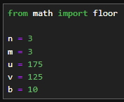
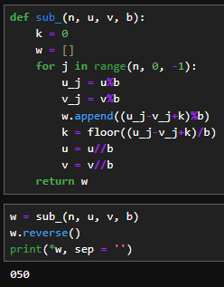

---
## Front matter
lang: ru-RU
title: Отчёт по лабораторной работе №8
author: Аветисян Давид Артурович
institute: РУДН, Москва, Россия

date: 21 декабря 2024

## Formatting
toc: false
slide_level: 2
theme: metropolis
header-includes: 
 - \metroset{progressbar=frametitle,sectionpage=progressbar,numbering=fraction}
 - '\makeatletter'
 - '\beamer@ignorenonframefalse'
 - '\makeatother'
aspectratio: 43
section-titles: true
---

## Цель работы

Познакомиться с целочисленной арифметикой многократной точности.

## Начальные данные

Для всех последующих алгоритмов были использованы числа u и v.

{ width=70% }

## Сложение неотрицательных целых чисел

- 1-3 строки. Задаём функцию и начальные данные  
- 4-10 строки. Реализация алгоритма: отделяем от числа цифры, производим с ними вычисления при помощи формул из лабораторной и отсекаем цифру.  
- 13 строка. Запись цифры ответа в список.  

{ width=70% }

## Вычитание неотрицательных целых чисел

Програма реализована аналогично предыдущей, но со знаком минуса. Вывод представлен на скриншоте ниже.

{ width=70% }

## Умножение неотрицательных целых чисел столбиком

- 1-3 строки. Задаём функцию и подготавливаем переменные  
- 4-29 строки. Реализация алгоритма: присваиваем нулевые значения, отделяем цифры от числа и вычисляем новое значение по нескольким формулам, затем отсекаем цифру от числа и начинаем алгоритм заново.  

{ width=70% }

## Алгоритм быстрого столбика

Данная программа считает произведение более коротким образом. Вывод представлен на скриншоте ниже. Он совпадает с предыдущим, но программа считает быстрее.

{ width=70% }

## Деление многоразрядных целых чисел

Данный алгоритм аналогично путём отделения цифр от чисел считает их частное и записывает остаток. С каждой цифрой работаем отдельно и записываем, что мы взяли от других разрядов. В данном случае я вычислил частное и остаток при делении 123456 на 9. 

{ width=70% }

## Выводы

Я познакомился с целочисленной арифметикой многократной точности.
