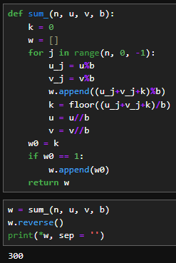
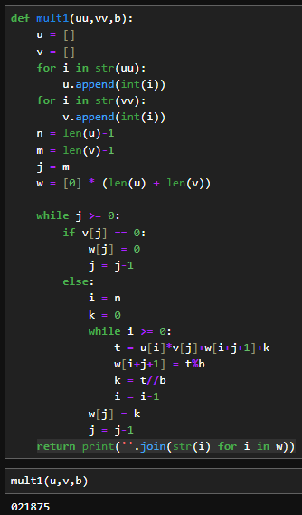
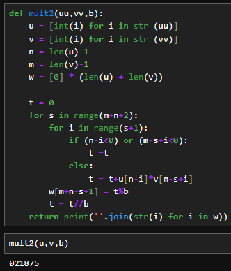
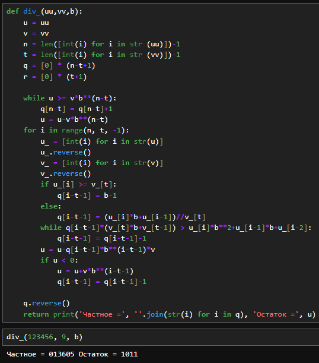

---
# Front matter
lang: ru-RU
title: "Лабораторная работа №8"
subtitle: "Дисциплина: Математические основы защиты информации и информационной безопасности"
author: "Аветисян Давид Артурович"

# Formatting
toc-title: "Содержание"
toc: true # Table of contents
toc_depth: 2
lof: true # Список рисунков
lot: true # Список таблиц
fontsize: 12pt
linestretch: 1.5
papersize: a4paper
documentclass: scrreprt
polyglossia-lang: russian
polyglossia-otherlangs: english
mainfont: PT Serif
romanfont: PT Serif
sansfont: PT Sans
monofont: PT Mono
mainfontoptions: Ligatures=TeX
romanfontoptions: Ligatures=TeX
sansfontoptions: Ligatures=TeX,Scale=MatchLowercase
monofontoptions: Scale=MatchLowercase
indent: true
pdf-engine: lualatex
header-includes:
  - \linepenalty=10 # the penalty added to the badness of each line within a paragraph (no associated penalty node) Increasing the value makes tex try to have fewer lines in the paragraph.
  - \interlinepenalty=0 # value of the penalty (node) added after each line of a paragraph.
  - \hyphenpenalty=50 # the penalty for line breaking at an automatically inserted hyphen
  - \exhyphenpenalty=50 # the penalty for line breaking at an explicit hyphen
  - \binoppenalty=700 # the penalty for breaking a line at a binary operator
  - \relpenalty=500 # the penalty for breaking a line at a relation
  - \clubpenalty=150 # extra penalty for breaking after first line of a paragraph
  - \widowpenalty=150 # extra penalty for breaking before last line of a paragraph
  - \displaywidowpenalty=50 # extra penalty for breaking before last line before a display math
  - \brokenpenalty=100 # extra penalty for page breaking after a hyphenated line
  - \predisplaypenalty=10000 # penalty for breaking before a display
  - \postdisplaypenalty=0 # penalty for breaking after a display
  - \floatingpenalty = 20000 # penalty for splitting an insertion (can only be split footnote in standard LaTeX)
  - \raggedbottom # or \flushbottom
  - \usepackage{float} # keep figures where there are in the text
  - \floatplacement{figure}{H} # keep figures where there are in the text
---

# Цель работы

Познакомиться с целочисленной арифметикой многократной точности.

# Задание

1. Реализовать алгоритм сложения неотрицательных целых чисел.
2. Реализовать алгоритм вычитания неотрицательных целых чисел.
3. Реализовать алгоритм умножения неотрицательных целых чисел столбиком.
4. Реализовать алгоритм быстрого столбика.
5. реализовать алгоритм деления многоразрядных целых чисел.

# Выполнение лабораторной работы

Для всех последующих алгоритмов были использованы числа u и v.

{ width=70% }

1) Для реализации алгоритма сложения неотрицательных целых чисел была написана следующая программа.

{ width=70% }

В данной программе:  
- 1-3 строки. Задаём функцию и начальные данные  
- 4-10 строки. Реализация алгоритма: отделяем от числа цифры, производим с ними вычисления при помощи формул из лабораторной и отсекаем цифру.  
- 13 строка. Запись цифры ответа в список.  

В данном случае я вычислил сумму 175 и 125. Вывод представлен на скриншоте выше.

2) Для реализации алгоритма вычитания неотрицательных целых чисел была написана следующая программа.

{ width=70% }

Програма реализована аналогично предыдущей, но со знаком минуса. Вывод представлен на скриншоте выше.

3) Для реализации алгоритма умножения неотрицательных целых чисел столбиком была написана следующая программа.

{ width=70% }

В данной программе:  
- 1-3 строки. Задаём функцию и подготавливаем переменные  
- 4-29 строки. Реализация алгоритма: присваиваем нулевые значения, отделяем цифры от числа и вычисляем новое значение по нескольким формулам, затем отсекаем цифру от числа и начинаем алгоритм заново.  

В данном случае я вычислил разность 175 и 125. Вывод представлен на скриншоте выше.

4) Для реализации алгоритма быстрого столбика была написана следующая программа.

{ width=70% }

Данная программа считает произведение более коротким образом. Вывод представлен на скриншоте выше. Он совпадает с предыдущим, но программа считает быстрее.

5) Для реализации алгоритма деления многоразрядных целых чисел была написана следующая программа.

{ width=70% }

Данный алгоритм аналогично путём отделения цифр от чисел считает их частное и записывает остаток. С каждой цифрой работаем отдельно и записываем, что мы взяли от других разрядов. В данном случае я вычислил частное и остаток при делении 123456 на 9. Вывод представлен на скриншоте выше.

# Выводы

Я познакомился с целочисленной арифметикой многократной точности.
