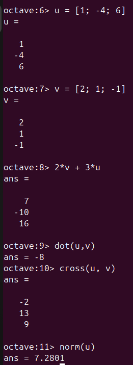
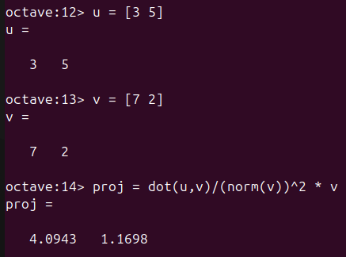
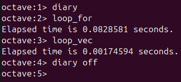

---
## Front matter
lang: ru-RU
title: Отчёт по лабораторной работе №3
author: Аветисян Давид Артурович
institute: РУДН, Москва, Россия

date: 12 октября 2024

## Formatting
toc: false
slide_level: 2
theme: metropolis
header-includes: 
 - \metroset{progressbar=frametitle,sectionpage=progressbar,numbering=fraction}
 - '\makeatletter'
 - '\beamer@ignorenonframefalse'
 - '\makeatother'
aspectratio: 43
section-titles: true
---

# Отчет по лабораторной работы №3

## Цель работы

- Познакомиться с Octave.

## Простейшие операции

- Первым делом я познакомился с простейшими операциями. Я научился журналировать сессию Octave, пользоваться калькулятором, задавать векторы и матрицы.

{ width=70% }

## Операции с векторами

- Затем я познакомился с операциями с векторами. Я задал два вектора, а затем сложил их, произвёл скалярное и векторное умножение, а также нашёл норму вектора.

{ width=70% }

## Вычисление проекции вектора u на вектор v

- Далее я посчитал проекцию вектора u на вектор v. Для этого я задал два вектора-строки, а затем посчитал проекцию прит помощи Octave.

{ width=70% }

## Матричные операции

- Потом я познакомился с матричными операциями. Я задал две матрицы A и B, затем перемножил их, научился транспонировать, узнал, как задаётся единичная матрица. После я нашёл определитель матрицы A, её собственные значения, ранг, а также обратную ей.

{ width=70% }

## Построение простейших графиков

- Затем я познакомился с построением простейших графиков. Я задал вектор значени x, задал вектор y = sin(x) и построил график. Далее я улучшил внешний вид графика: поменял цвет линии и сделал её толстой, подогнал диапазон осей, нарисовал сетку, подписал оси, задал заголовок и легенду.

{ width=70% }

## Два графика на одном чертеже

- Я построил два графика на одном чертеже. Сначала я задал два вектора и начертил точки, используя кружочки как маркеры. При помощи **hold on** я добавил к нашему текущему графику ещё один график регрессии. Затем я задал сеть, ось и легенду.

{ width=70% }

## Элементарное умножение и сохранение графиков

- После я попытался построить график y = x^2 sin(x). Сначала я попылатся сделать его помощи матричного умножения, но вылезла ошибка. Тогда я познакомился с элементарным умножением и использовал его. После я сохранил графики в виде файлов в двух разных форматах.

{ width=70% }

## Сравнение циклов и операций с векторами

- В конце я сравнил циклы и операции с векторами. Я создал два файла *loop_for.m* и *loop_vec.m*. В первом файле был задан цикл, а во втором элементарная операция. После чего я запустил оба файла в Octave и сравнил результаты. Функция с использованием элементарной операции завершилась намного быстрее, чем функция с использованием цикла.

{ width=70% }

## Выводы

- Я познакомился с Octave.
