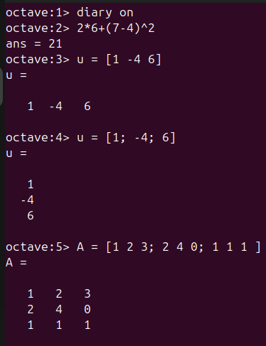
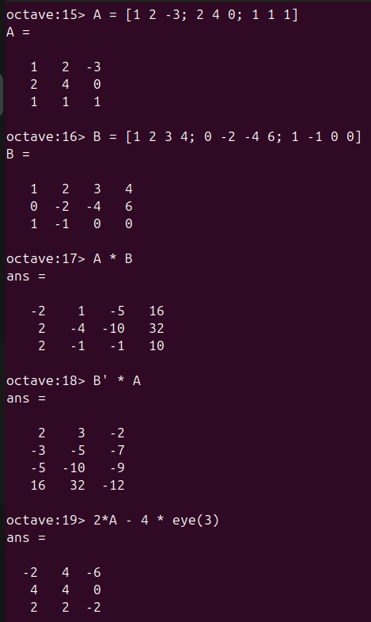
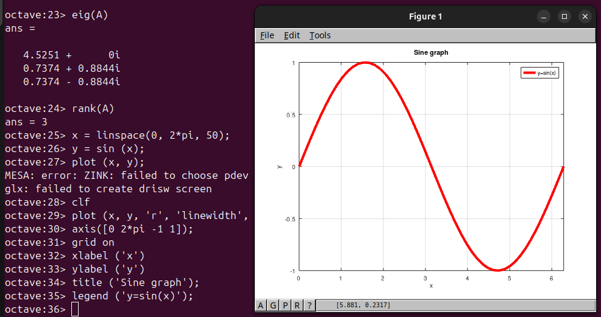
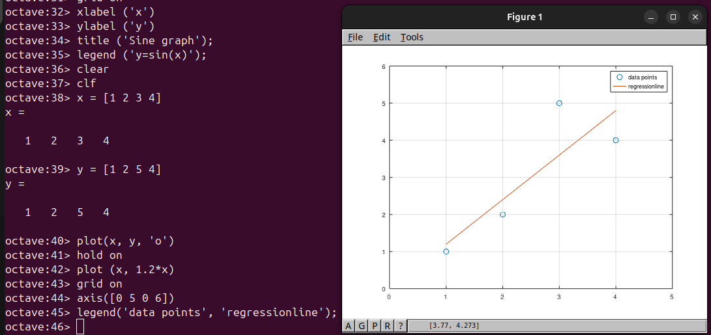
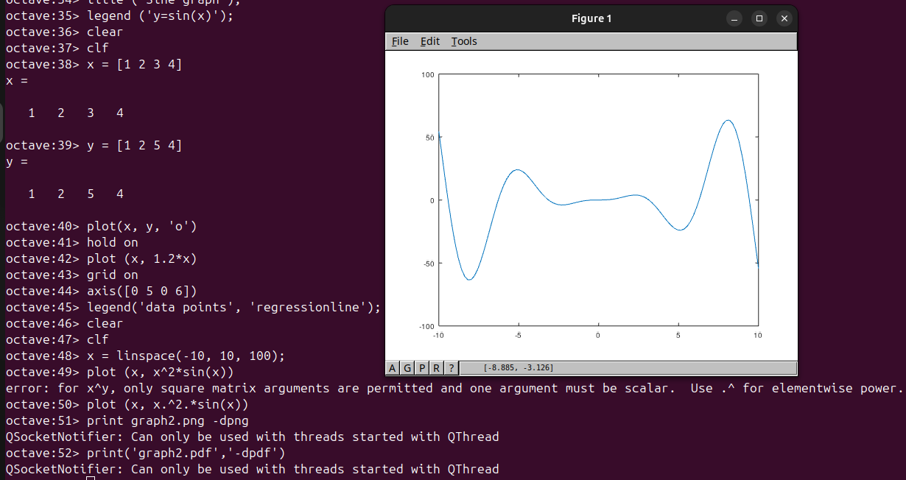
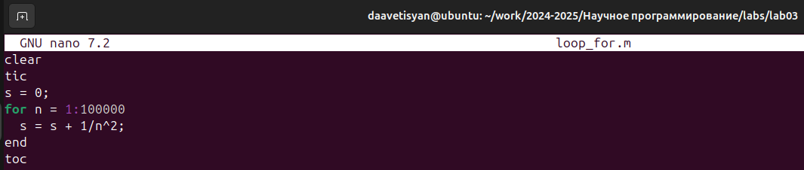
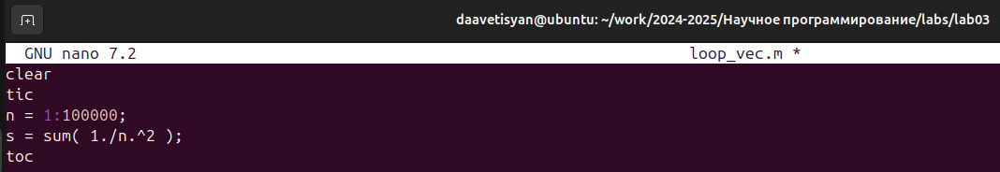

---
# Front matter
lang: ru-RU
title: "Лабораторная работа №3"
subtitle: "Дисциплина: Научное программирование"
author: "Аветисян Давид Артурович"

# Formatting
toc-title: "Содержание"
toc: true # Table of contents
toc_depth: 2
lof: true # Список рисунков
lot: true # Список таблиц
fontsize: 12pt
linestretch: 1.5
papersize: a4paper
documentclass: scrreprt
polyglossia-lang: russian
polyglossia-otherlangs: english
mainfont: PT Serif
romanfont: PT Serif
sansfont: PT Sans
monofont: PT Mono
mainfontoptions: Ligatures=TeX
romanfontoptions: Ligatures=TeX
sansfontoptions: Ligatures=TeX,Scale=MatchLowercase
monofontoptions: Scale=MatchLowercase
indent: true
pdf-engine: lualatex
header-includes:
  - \linepenalty=10 # the penalty added to the badness of each line within a paragraph (no associated penalty node) Increasing the value makes tex try to have fewer lines in the paragraph.
  - \interlinepenalty=0 # value of the penalty (node) added after each line of a paragraph.
  - \hyphenpenalty=50 # the penalty for line breaking at an automatically inserted hyphen
  - \exhyphenpenalty=50 # the penalty for line breaking at an explicit hyphen
  - \binoppenalty=700 # the penalty for breaking a line at a binary operator
  - \relpenalty=500 # the penalty for breaking a line at a relation
  - \clubpenalty=150 # extra penalty for breaking after first line of a paragraph
  - \widowpenalty=150 # extra penalty for breaking before last line of a paragraph
  - \displaywidowpenalty=50 # extra penalty for breaking before last line before a display math
  - \brokenpenalty=100 # extra penalty for page breaking after a hyphenated line
  - \predisplaypenalty=10000 # penalty for breaking before a display
  - \postdisplaypenalty=0 # penalty for breaking after a display
  - \floatingpenalty = 20000 # penalty for splitting an insertion (can only be split footnote in standard LaTeX)
  - \raggedbottom # or \flushbottom
  - \usepackage{float} # keep figures where there are in the text
  - \floatplacement{figure}{H} # keep figures where there are in the text
---

# Цель работы

Познакомиться с Octave.

# Задание

1. Познакомиться с реализацией простейших операций.
2. Познакомиться с реализацией операций с векторами.
3. Познакомиться с реализацией матричных операций.
4. Познакомиться с построением графиков. 
5. Познакомиться с построением нескольких графиков на одном чертеже. 
6. Сравнить циклы и операции с векторами.

# Выполнение лабораторной работы

1) Первым делом я познакомился с простейшими операциями. Я научился журналировать сессию Octave, пользоваться калькулятором, задавать векторы и матрицы.

{ width=70% }

2) Затем я познакомился с операциями с векторами. Я задал два вектора, а затем сложил их, произвёл скалярное и векторное умножение, а также нашёл норму вектора.

{ width=70% }

3) Далее я посчитал проекцию вектора u на вектор v. Для этого я задал два вектора-строки, а затем посчитал проекцию прит помощи Octave.

{ width=70% }

4) Потом я познакомился с матричными операциями. Я задал две матрицы A и B, затем перемножил их, научился транспонировать, узнал, как задаётся единичная матрица. После я нашёл определитель матрицы A, её собственные значения, ранг, а также обратную ей.

{ width=70% }

{ width=70% }

5) Затем я познакомился с построением простейших графиков. Я задал вектор значени x, задал вектор y = sin(x) и построил график.

{ width=70% }

Далее я улучшил внешний вид графика: поменял цвет линии и сделал её толстой, подогнал диапазон осей, нарисовал сетку, подписал оси, задал заголовок и легенду.

{ width=70% }

6) Я построил два графика на одном чертеже. Сначала я задал два вектора и начертил точки, используя кружочки как маркеры. При помощи **hold on** я добавил к нашему текущему графику ещё один график регрессии. Затем я задал сеть, ось и легенду.

{ width=70% }

7) После я попытался построить график y = x^2 sin(x). Сначала я попылатся сделать его помощи матричного умножения, но вылезла ошибка. Тогда я познакомился с элементарным умножением и использовал его. После я сохранил графики в виде файлов в двух разных форматах.

{ width=70% }

8) В конце я сравнил циклы и операции с векторами. Я создал два файла *loop_for.m* и *loop_vec.m*. В первом файле был задан цикл, а во втором элементарная операция. 

{ width=70% }

{ width=70% }

После чего я запустил оба файла в Octave и сравнил результаты. Функция с использованием элементарной операции завершилась намного быстрее, чем функция с использованием цикла.

{ width=70% }

# Выводы

Я познакомился с Octave.
