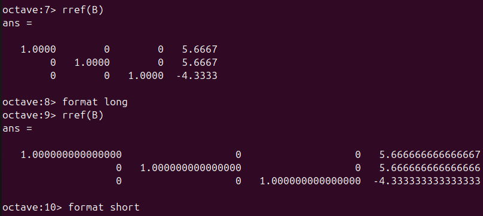

---
## Front matter
lang: ru-RU
title: Отчёт по лабораторной работе №4
author: Аветисян Давид Артурович
institute: РУДН, Москва, Россия

date: 26 октября 2024

## Formatting
toc: false
slide_level: 2
theme: metropolis
header-includes: 
 - \metroset{progressbar=frametitle,sectionpage=progressbar,numbering=fraction}
 - '\makeatletter'
 - '\beamer@ignorenonframefalse'
 - '\makeatother'
aspectratio: 43
section-titles: true
---

# Отчет по лабораторной работы №4

## Цель работы

- Познакомиться со сложными алгоритмами в Octave, которые были встроены для решения систем линейных уравнений.

## Метод Гаусса

- Первым делом я познакомился с реализацией метода Гаусса в Octave. Я задал расширенную матрицу $B = [A|b]$. Затем я научился просматривать её поэлементно. Далее я получил первый и второй ряды матрицы и с их помощью преобразовал третий ряд для приведения матрицы к треугольному виду. А потом очевидным образом я получил ответ. 

{ width=70% }

## Отображение матрицы с более высокой точностью

- После получения ответа я познакомился с встроенной в Octave командой для непосредственного поиска треугольной формы матрицы. Также я научился отображать переменные матрицы с более высокой точностью (больше десятичных разрядов).

{ width=70% }

## Левое деление

- Затем я познакомился с левым делением - это встроенная операция для решения линейных систем вида $Ax=b$. Я выделил из расширенной матрицы B матрицу $A$ и вектор $b$, а после нашёл вектор $x$.

{ width=70% }

## LU-разложение

- И наконец, я познакомился с LU-разложением в Octave. Оно выполняется простой командой $[L U P] = lu (A)$

{ width=70% }

## Выводы

- Я познакомился со сложными алгоритмами в Octave, которые были встроены для решения систем линейных уравнений.
