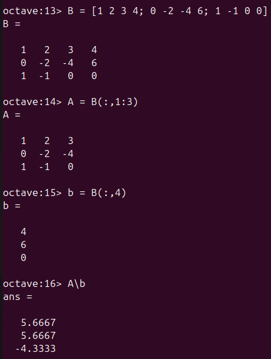
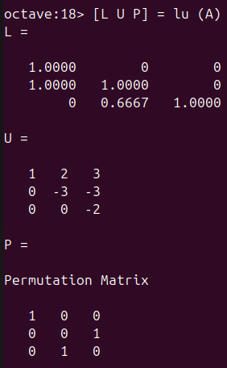

---
# Front matter
lang: ru-RU
title: "Лабораторная работа №4"
subtitle: "Дисциплина: Научное программирование"
author: "Аветисян Давид Артурович"

# Formatting
toc-title: "Содержание"
toc: true # Table of contents
toc_depth: 2
lof: true # Список рисунков
lot: true # Список таблиц
fontsize: 12pt
linestretch: 1.5
papersize: a4paper
documentclass: scrreprt
polyglossia-lang: russian
polyglossia-otherlangs: english
mainfont: PT Serif
romanfont: PT Serif
sansfont: PT Sans
monofont: PT Mono
mainfontoptions: Ligatures=TeX
romanfontoptions: Ligatures=TeX
sansfontoptions: Ligatures=TeX,Scale=MatchLowercase
monofontoptions: Scale=MatchLowercase
indent: true
pdf-engine: lualatex
header-includes:
  - \linepenalty=10 # the penalty added to the badness of each line within a paragraph (no associated penalty node) Increasing the value makes tex try to have fewer lines in the paragraph.
  - \interlinepenalty=0 # value of the penalty (node) added after each line of a paragraph.
  - \hyphenpenalty=50 # the penalty for line breaking at an automatically inserted hyphen
  - \exhyphenpenalty=50 # the penalty for line breaking at an explicit hyphen
  - \binoppenalty=700 # the penalty for breaking a line at a binary operator
  - \relpenalty=500 # the penalty for breaking a line at a relation
  - \clubpenalty=150 # extra penalty for breaking after first line of a paragraph
  - \widowpenalty=150 # extra penalty for breaking before last line of a paragraph
  - \displaywidowpenalty=50 # extra penalty for breaking before last line before a display math
  - \brokenpenalty=100 # extra penalty for page breaking after a hyphenated line
  - \predisplaypenalty=10000 # penalty for breaking before a display
  - \postdisplaypenalty=0 # penalty for breaking after a display
  - \floatingpenalty = 20000 # penalty for splitting an insertion (can only be split footnote in standard LaTeX)
  - \raggedbottom # or \flushbottom
  - \usepackage{float} # keep figures where there are in the text
  - \floatplacement{figure}{H} # keep figures where there are in the text
---

# Цель работы

Познакомиться со сложными алгоритмами в Octave, которые были встроены для решения систем линейных уравнений.

# Задание

1. Познакомиться с методом Гаусса.
2. Познакомиться с левым делением.
3. Познакомиться с LU-разложением.

# Выполнение лабораторной работы

1) Первым делом я познакомился с реализацией метода Гаусса в Octave. Я задал расширенную матрицу $B = [A|b]$. Затем я научился просматривать её поэлементно. Далее я получил первый и второй ряды матрицы и с их помощью преобразовал третий ряд для приведения матрицы к треугольному виду. А потом очевидным образом я получил ответ. 

{ width=70% }

После получения ответа я познакомился с встроенной в Octave командой для непосредственного поиска треугольной формы матрицы. Также я научился отображать переменные матрицы с более высокой точностью (больше десятичных разрядов).

{ width=70% }

2) Затем я познакомился с левым делением - это встроенная операция для решения линейных систем вида $Ax=b$. Я выделил из расширенной матрицы B матрицу $A$ и вектор $b$, а после нашёл вектор $x$.

{ width=70% }

3) И наконец, я познакомился с LU-разложением в Octave. Оно выполняется простой командой $[L U P] = lu (A)$

{ width=70% }

# Выводы

Я познакомился со сложными алгоритмами в Octave, которые были встроены для решения систем линейных уравнений.
