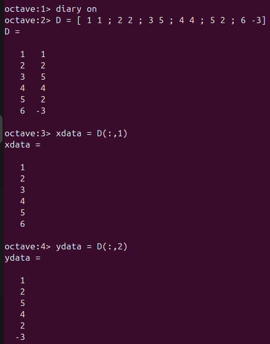
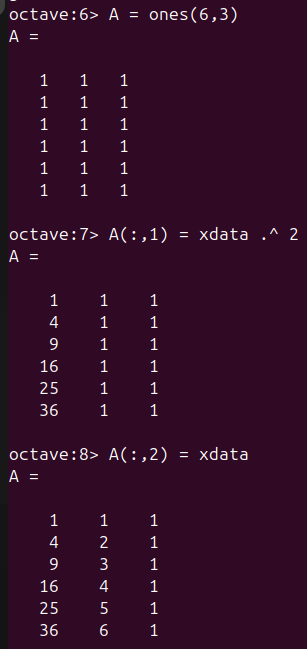
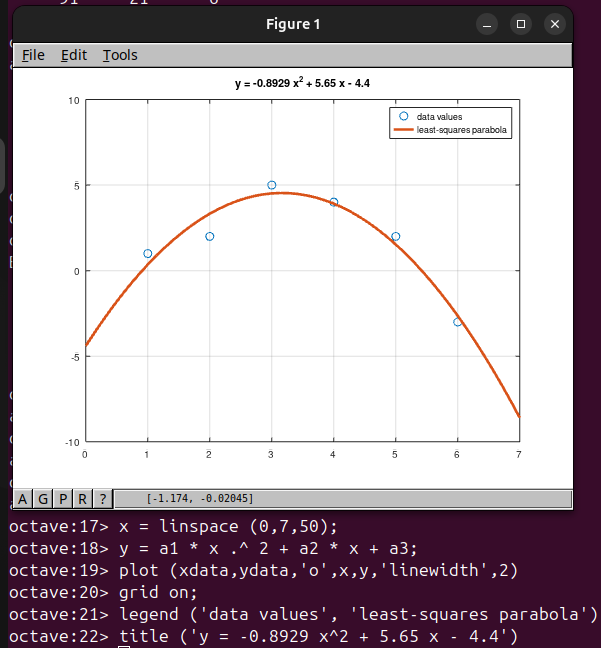
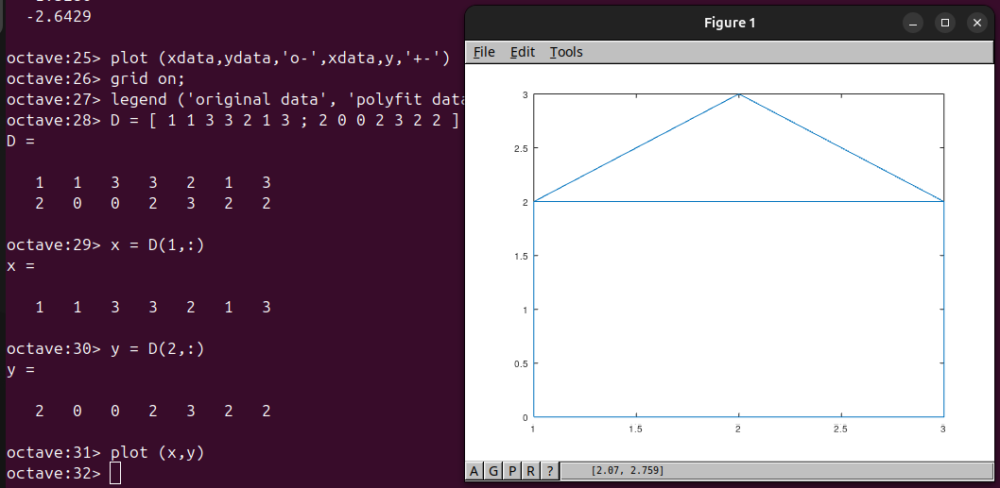
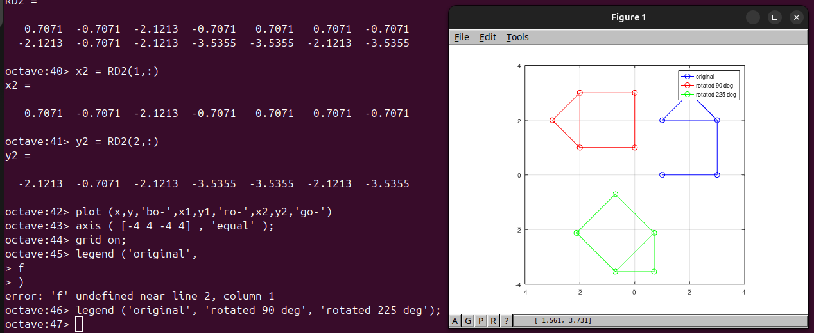
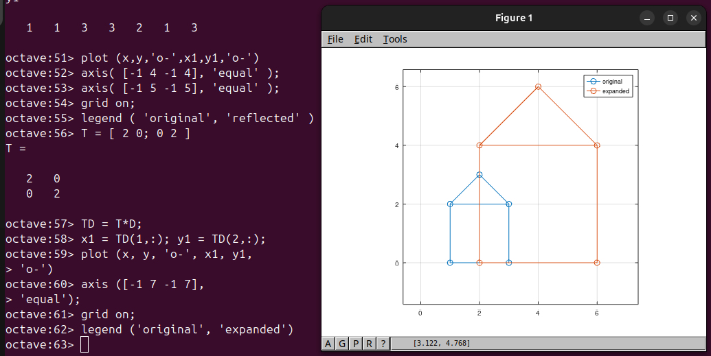

---
## Front matter
lang: ru-RU
title: Отчёт по лабораторной работе №5
author: Аветисян Давид Артурович
institute: РУДН, Москва, Россия

date: 9 ноября 2024

## Formatting
toc: false
slide_level: 2
theme: metropolis
header-includes: 
 - \metroset{progressbar=frametitle,sectionpage=progressbar,numbering=fraction}
 - '\makeatletter'
 - '\beamer@ignorenonframefalse'
 - '\makeatother'
aspectratio: 43
section-titles: true
---

## Цель работы

Познакомиться с подгонкой полиноминальной кривой и с матричными преобразованиями.

## Матрица D и вектор x и y

Первым делом я познакомился с подгонкой полиноминальной кривой. Сначала я задал матрицу $D$ с двумя столбцами, и извлёк из неё вектора $x$ и $y$.

{ width=70% }

## Матрица D и вектор x и y

Далее я нарисовал получившиеся точки на графике.

{ width=70% }

## Матрица коэффициентов A

Затем необходимо было построить уравнение вида $y = a * x^2 + b * x + c$. Я задал матрицу коэффициентов $A$.

{ width=70% }

## Решение по методу наименьших квадратов

После я нашёл решение по методу наименьших квадратов из решения уравнения $A' * A * b = A' * y$. Получилось квадратное уравнение вида $y = -0.8929 * x^2 + 5.65 * x - 4.4$.

{ width=70% }

## Решение по методу наименьших квадратов

Потом я построил соответствующий график параболы.

{ width=70% }

## Встроенная функция polyfit

Далее я познакомился с автоматизированной встроенной в Octave функцией подгонки - $polyfit (x, y, order)$. Я получил подгоночный полином, рассчитал значения полинома в точках и построил исходные и подгоночные данные.

{ width=70% }

## Матричные преобразования

Затем я познакомился с матричными преобразованиями. Для начала я задал матрицу $D$ и построил её граф. Получился домик.

{ width=70% }

## Вращение матрицы

После я познакомился с вращением матрицы на 90 и 225 градусов. Для этого я перевёл углы в радианы и использовал специальную матрицу, умножение на которую даёт эффект поворота матрицы $D$.

{ width=70% }

## Отражение матрицы

Потом я прознакомился с отражением матрицы. В данном случае отражение происходило относитель прямо $y = x$.

{ width=70% }

## Дилатация матрицы

И наконец я познакомился с дилатацией (расширением или сжатием) матрицы. В данном случае $k = 2$ и матрица $D$ увеличилась вдвое.

{ width=70% }

## Выводы

Я познакомился с подгонкой полиноминальной кривой и с матричными преобразованиями.
