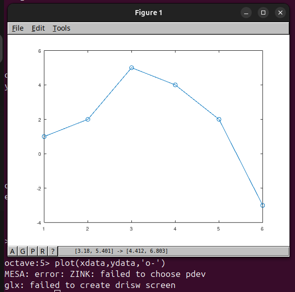
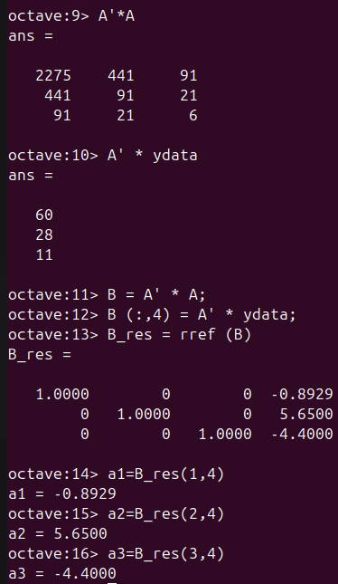
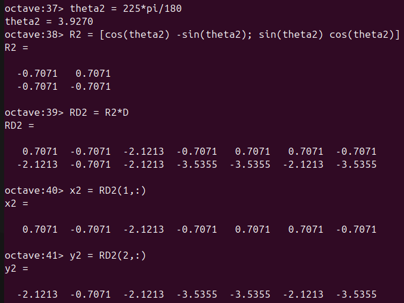
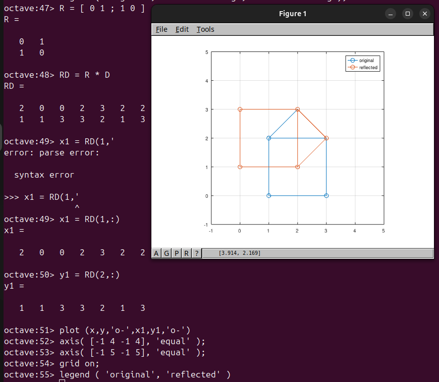

---
# Front matter
lang: ru-RU
title: "Лабораторная работа №5"
subtitle: "Дисциплина: Научное программирование"
author: "Аветисян Давид Артурович"

# Formatting
toc-title: "Содержание"
toc: true # Table of contents
toc_depth: 2
lof: true # Список рисунков
lot: true # Список таблиц
fontsize: 12pt
linestretch: 1.5
papersize: a4paper
documentclass: scrreprt
polyglossia-lang: russian
polyglossia-otherlangs: english
mainfont: PT Serif
romanfont: PT Serif
sansfont: PT Sans
monofont: PT Mono
mainfontoptions: Ligatures=TeX
romanfontoptions: Ligatures=TeX
sansfontoptions: Ligatures=TeX,Scale=MatchLowercase
monofontoptions: Scale=MatchLowercase
indent: true
pdf-engine: lualatex
header-includes:
  - \linepenalty=10 # the penalty added to the badness of each line within a paragraph (no associated penalty node) Increasing the value makes tex try to have fewer lines in the paragraph.
  - \interlinepenalty=0 # value of the penalty (node) added after each line of a paragraph.
  - \hyphenpenalty=50 # the penalty for line breaking at an automatically inserted hyphen
  - \exhyphenpenalty=50 # the penalty for line breaking at an explicit hyphen
  - \binoppenalty=700 # the penalty for breaking a line at a binary operator
  - \relpenalty=500 # the penalty for breaking a line at a relation
  - \clubpenalty=150 # extra penalty for breaking after first line of a paragraph
  - \widowpenalty=150 # extra penalty for breaking before last line of a paragraph
  - \displaywidowpenalty=50 # extra penalty for breaking before last line before a display math
  - \brokenpenalty=100 # extra penalty for page breaking after a hyphenated line
  - \predisplaypenalty=10000 # penalty for breaking before a display
  - \postdisplaypenalty=0 # penalty for breaking after a display
  - \floatingpenalty = 20000 # penalty for splitting an insertion (can only be split footnote in standard LaTeX)
  - \raggedbottom # or \flushbottom
  - \usepackage{float} # keep figures where there are in the text
  - \floatplacement{figure}{H} # keep figures where there are in the text
---

# Цель работы

Познакомиться с подгонкой полиноминальной кривой и с матричными преобразованиями.

# Задание

1. Познакомиться с подгонкой полиноминальной кривой.
2. Познакомиться с вращением матрицы.
3. Познакомиться с отражением матрицы.
4. Познакомиться с дилатацией матрицы.

# Выполнение лабораторной работы

1) Первым делом я познакомился с подгонкой полиноминальной кривой. Сначала я задал матрицу $D$ с двумя столбцами, и извлёк из неё вектора $x$ и $y$.

{ width=70% }

Далее я нарисовал получившиеся точки на графике.

{ width=70% }

Затем необходимо было построить уравнение вида $y = a * x^2 + b * x + c$. Я задал матрицу коэффициентов $A$.

{ width=70% }

После я нашёл решение по методу наименьших квадратов из решения уравнения $A' * A * b = A' * y$. Получилось квадратное уравнение вида $y = -0.8929 * x^2 + 5.65 * x - 4.4$.

{ width=70% }

Потом я построил соответствующий график параболы.

{ width=70% }

Далее я познакомился с автоматизированной встроенной в Octave функцией подгонки - $polyfit (x, y, order)$. Я получил подгоночный полином, рассчитал значения полинома в точках и построил исходные и подгоночные данные.

{ width=70% }

2) Затем я познакомился с матричными преобразованиями. Для начала я задал матрицу $D$ и построил её граф. Получился домик.

{ width=70% }

После я познакомился с вращением матрицы на 90 и 225 градусов. Для этого я перевёл углы в радианы и использовал специальную матрицу, умножение на которую даёт эффект поворота матрицы $D$.

{ width=70% }

{ width=70% }

{ width=70% }

Потом я прознакомился с отражением матрицы. Для этого необходимо основную матрицу $D$ умножить на специальную матрицу для отражения. В данном случае отражение происходило относитель прямо $y = x$.

{ width=70% }

И наконец я познакомился с дилатацией (расширением или сжатием) матрицы. Оно может быть выполнено путём умножения матрицы на едининую матрицу, где вместо единиц задан коэффициент $k$, который является множителем дилатации. В данном случае $k = 2$ и матрица $D$ увеличилась вдвое.

{ width=70% }

# Выводы

Я познакомился с подгонкой полиноминальной кривой и с матричными преобразованиями.
