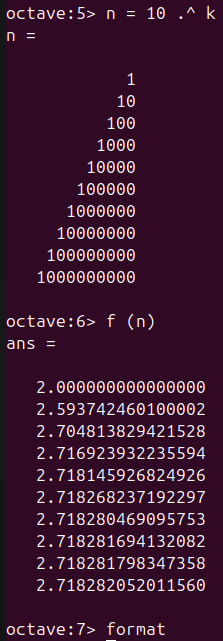
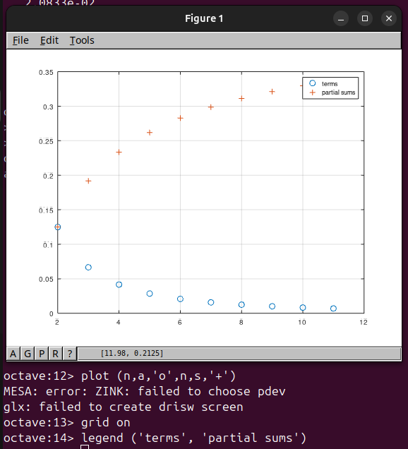
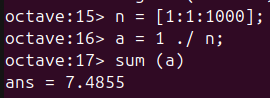
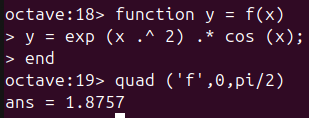

---
## Front matter
lang: ru-RU
title: Отчёт по лабораторной работе №6
author: Аветисян Давид Артурович
institute: РУДН, Москва, Россия

date: 23 ноября 2024

## Formatting
toc: false
slide_level: 2
theme: metropolis
header-includes: 
 - \metroset{progressbar=frametitle,sectionpage=progressbar,numbering=fraction}
 - '\makeatletter'
 - '\beamer@ignorenonframefalse'
 - '\makeatother'
aspectratio: 43
section-titles: true
---

## Цель работы

Познакомиться со сложными алгоритмами в Octave, которые были встроены для работы с пределами, последовательностями и рядами.

## Пределы

Первым делом я научился работать с пределами. Для это я рассмотрел предел функции $f(n) = (1+1/n)^n$ при $n->∞$.

{ width=70% }

## Пределы

После этого я взял степени числа $10$, которые стали удобным входным значением и оценил $f(n)$. Предел сходится к конечному значению, которое приблизительно равно $2,71828$.

{ width=70% }

## Частичные суммы

Далее я познакомился с частичными суммами. Для этого я рассмотрел сумму ряда $a$ от $n$ при $n$ от $2$ до $∞$, где $a = 1/(n*(n+2))$.

{ width=70% }

## Частичные суммы

И в конце я построил слагаемые и частичные суммы для $2<=n<=11$.

{ width=70% }

## Сумма ряда

После я познакомился с нахождением суммы первых $1000$ членов гармонического ряда $1/n$. Для этого я сгенерировал члены как вектор ряда, а затем взял их сумму.

{ width=70% }

## Вычисление интегралов

Потом я познакомился с вычислением интегралов. Для этого я взял интеграл от $0$ до $pi/2$ функции $f(x) = exp(x^2)*cos(x)$. Для вычисления я определил функцию и использовал команду _quad_.

{ width=70% }

## Аппроксимирование суммами

В конце лабораторой работы я научился аппроксимировать суммы. Сначала я написал скрипт чтобы вычислить предыдущий интеграл по правилу средней точки для $n = 100$ и запустил его.

{ width=70% }

## Аппроксимирование суммами

Далее я написал новый скрипт, но использовал векторизованный код, который не требует каких-либо циклов. После чего я его запустил.

{ width=70% }

В конце я сравнил результаты и время выполнения каждого скрипта. Результаты были одинаковыми, но традиционный код выполнял почти в $6,5$ раз медленнее, чем векторизованный код.

## Аппроксимирование суммами

{ width=70% }

## Выводы

Я познакомился со сложными алгоритмами в Octave, которые были встроены для работы с пределами, последовательностями и рядами.
