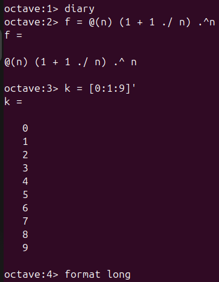
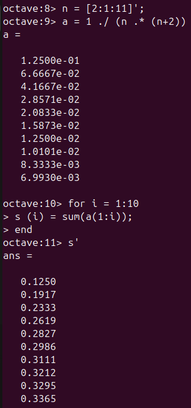
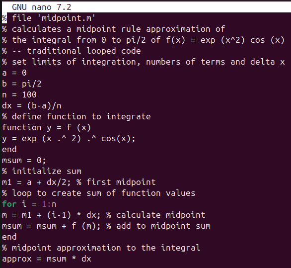

---
# Front matter
lang: ru-RU
title: "Лабораторная работа №6"
subtitle: "Дисциплина: Научное программирование"
author: "Аветисян Давид Артурович"

# Formatting
toc-title: "Содержание"
toc: true # Table of contents
toc_depth: 2
lof: true # Список рисунков
lot: true # Список таблиц
fontsize: 12pt
linestretch: 1.5
papersize: a4paper
documentclass: scrreprt
polyglossia-lang: russian
polyglossia-otherlangs: english
mainfont: PT Serif
romanfont: PT Serif
sansfont: PT Sans
monofont: PT Mono
mainfontoptions: Ligatures=TeX
romanfontoptions: Ligatures=TeX
sansfontoptions: Ligatures=TeX,Scale=MatchLowercase
monofontoptions: Scale=MatchLowercase
indent: true
pdf-engine: lualatex
header-includes:
  - \linepenalty=10 # the penalty added to the badness of each line within a paragraph (no associated penalty node) Increasing the value makes tex try to have fewer lines in the paragraph.
  - \interlinepenalty=0 # value of the penalty (node) added after each line of a paragraph.
  - \hyphenpenalty=50 # the penalty for line breaking at an automatically inserted hyphen
  - \exhyphenpenalty=50 # the penalty for line breaking at an explicit hyphen
  - \binoppenalty=700 # the penalty for breaking a line at a binary operator
  - \relpenalty=500 # the penalty for breaking a line at a relation
  - \clubpenalty=150 # extra penalty for breaking after first line of a paragraph
  - \widowpenalty=150 # extra penalty for breaking before last line of a paragraph
  - \displaywidowpenalty=50 # extra penalty for breaking before last line before a display math
  - \brokenpenalty=100 # extra penalty for page breaking after a hyphenated line
  - \predisplaypenalty=10000 # penalty for breaking before a display
  - \postdisplaypenalty=0 # penalty for breaking after a display
  - \floatingpenalty = 20000 # penalty for splitting an insertion (can only be split footnote in standard LaTeX)
  - \raggedbottom # or \flushbottom
  - \usepackage{float} # keep figures where there are in the text
  - \floatplacement{figure}{H} # keep figures where there are in the text
---

# Цель работы

Познакомиться со сложными алгоритмами в Octave, которые были встроены для работы с пределами, последовательностями и рядами.

# Задание

1. Познакомиться с пределами.
2. Познакомиться с частичными суммами.
3. Познакомиться с суммой ряда.
4. Познакомиться с вычислением интегралов.
5. Познакомиться с аппроксимированием суммами.

# Выполнение лабораторной работы

1) Первым делом я научился работать с пределами. Для это я рассмотрел предел функции $f(n) = (1+1/n)^n$ при $n->∞$. Сначала я определил данную функцию и создал индексную переменую, состоящую из целых чисел от $0$ до $9$. Затем я задал длинный формат чисел.

{ width=70% }

После этого я взял степени числа $10$, которые стали удобным входным значением и оценил $f(n)$. Предел сходится к конечному значению, которое приблизительно равно $2,71828$.

{ width=70% }

2) Далее я познакомился с частичными суммами. Для этого я рассмотрел сумму ряда $a$ от $n$ при $n$ от $2$ до $∞$, где $a = 1/(n*(n+2))$. Сначала я определил индексный вектор $n$ от $2$ до $11$. Затем я вычислил члены ряда $a$. После чего при помощи цикла я посчитал частичную сумму для каждого $i$ ряда $a$ от $n$ от первого слагаемого до $i$-го слагаемого.

{ width=70% }

И в конце я построил слагаемые и частичные суммы для $2<=n<=11$.

{ width=70% }

3) После я познакомился с нахождением суммы первых $1000$ членов гармонического ряда $1/n$. Для этого я сгенерировал члены как вектор ряда, а затем взял их сумму.

{ width=70% }

4) Потом я познакомился с вычислением интегралов. Для этого я взял интеграл от $0$ до $pi/2$ функции $f(x) = exp(x^2)*cos(x)$. Для вычисления я определил функцию и использовал команду _quad_.

{ width=70% }

5) В конце лабораторой работы я научился аппроксимировать суммы. Сначала я написал скрипт чтобы вычислить предыдущий интеграл по правилу средней точки для $n = 100$ и запустил его.

{ width=70% }

{ width=70% }

Далее я написал новый скрипт, но использовал векторизованный код, который не требует каких-либо циклов. После чего я его запустил.

{ width=70% }

{ width=70% }

В конце я сравнил результаты и время выполнения каждого скрипта. Результаты были одинаковыми, но традиционный код выполнял почти в $6,5$ раз медленнее, чем векторизованный код.

{ width=70% }

# Выводы

Я познакомился со сложными алгоритмами в Octave, которые были встроены для работы с пределами, последовательностями и рядами.

