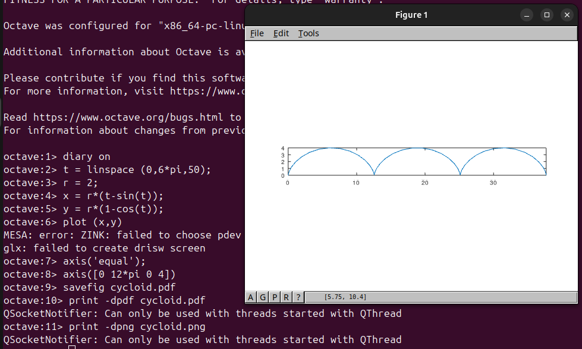
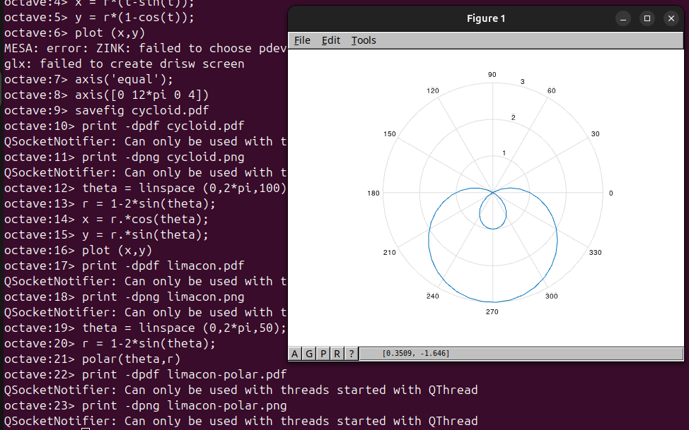
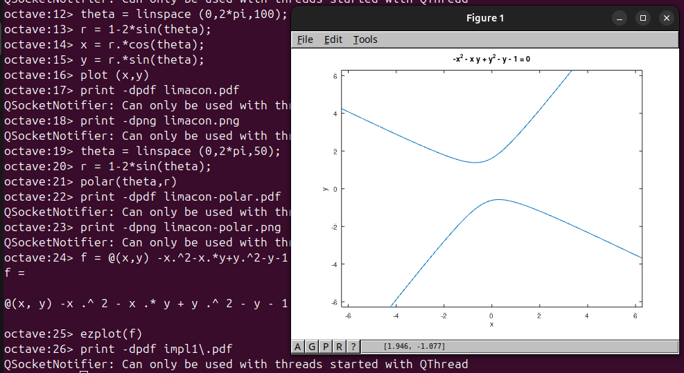
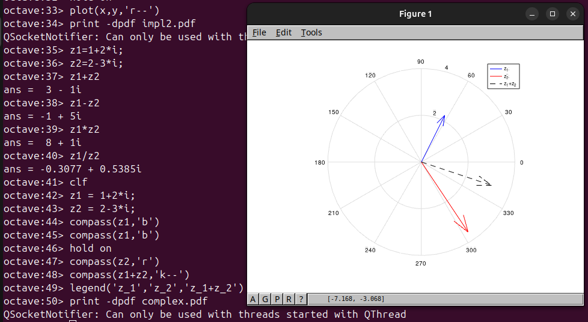
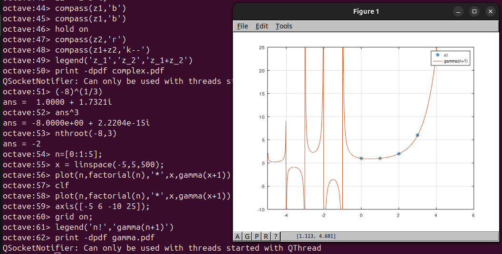
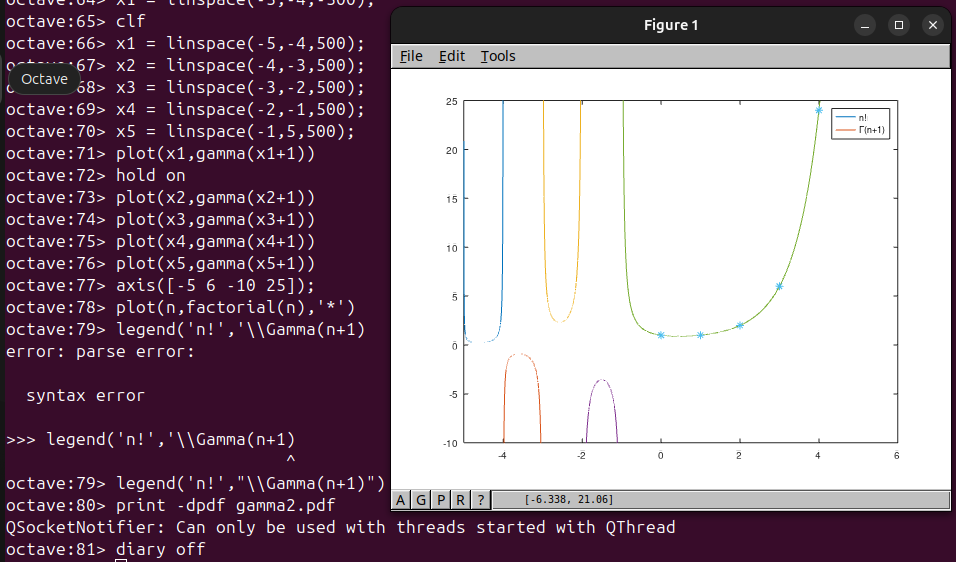

---
## Front matter
lang: ru-RU
title: Отчёт по лабораторной работе №7
author: Аветисян Давид Артурович
institute: РУДН, Москва, Россия

date: 7 декабря 2024

## Formatting
toc: false
slide_level: 2
theme: metropolis
header-includes: 
 - \metroset{progressbar=frametitle,sectionpage=progressbar,numbering=fraction}
 - '\makeatletter'
 - '\beamer@ignorenonframefalse'
 - '\makeatother'
aspectratio: 43
section-titles: true
---

## Цель работы

Познакомиться с построением графиков в Octave.

## Параметрические графики

Я построил график трёх периодов циклоиды радиуса 2. Сначал я определил параметр $t$ как вектор, а затем я вычислил $x$ и $y$.

{ width=70% }

## Полярные координаты

Я начал с определения независимой переменной $\theta$, а затем вычислил $r$. Чтобы построить график в осях $xy$, я вычислил $x$ и $y$, используя стандартное преобразование координат: $x=rcos(\theta)$, $y=rsin(\theta)$. 

{ width=70% }

## Полярные координаты

Также можно построить функцию $r=f(\theta)$ в полярных осях, используя команду **polar**.

{ width=70% }

## Графики неявных функций

Самый простой способ построить функцию, неявно определённую уравнением вида $f(x,y)=0$, с помощью команды **ezplot**. Я построил кривую $-x^2-xy+x+y^2-y=1$.

{ width=70% }

## Графики неявных функций

Потом я нашёл уравнение касательной к графику окружности $(x-2)^2+y^2=25$ в точке $(-1,4)$. Сначала я построил график окружности, а затем использую правило дифференцирования неявной функции, нашёл уравнение касательной и построил её на графике.

{ width=70% }

## Комлпексные числа

Я познакомился с основными арифметическими операциями с комплексными числами в Octave. Затем я научился строить графики в комплексной плоскости, используя команду **compass**. 

{ width=70% }

## Комлпексные числа

Далее я узнал о команде **nthroot**, с помощью которой можно легко находить действительные корни.

{ width=70% }

## Специальные функции

5) Я познакомился со специальными функциями, которые есть в Octave. Я простроил графики функций Г$(x+1)$ и $n!$.

{ width=70% }

## Специальные функции

Обратите внимание на вертикальные асимптоты на графике. Они не являются истинной частью графика. Это артефакты вычисления. Если мы хотим их устранить, мы должны разделить область значений на отдельный интервалы. Это даёт более точный график.

{ width=70% }

## Выводы

Я познакомился с построением графиков в Octave.
