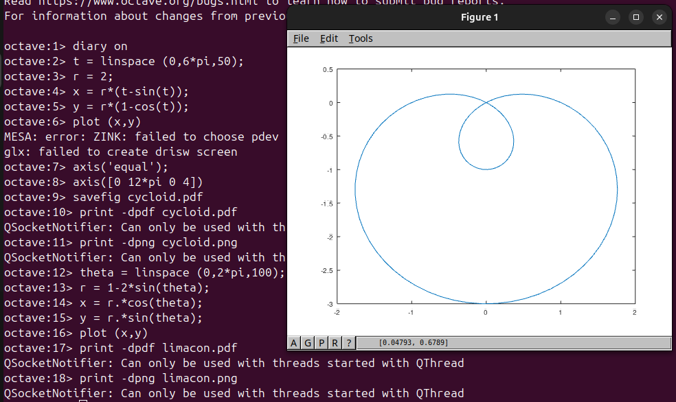
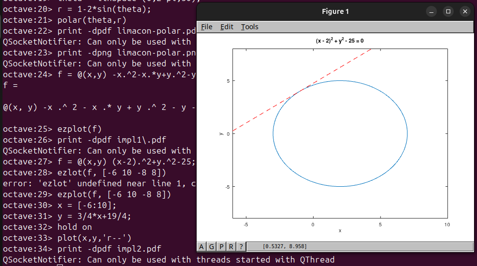
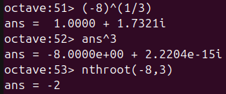

---
# Front matter
lang: ru-RU
title: "Лабораторная работа №7"
subtitle: "Дисциплина: Научное программирование"
author: "Аветисян Давид Артурович"

# Formatting
toc-title: "Содержание"
toc: true # Table of contents
toc_depth: 2
lof: true # Список рисунков
lot: true # Список таблиц
fontsize: 12pt
linestretch: 1.5
papersize: a4paper
documentclass: scrreprt
polyglossia-lang: russian
polyglossia-otherlangs: english
mainfont: PT Serif
romanfont: PT Serif
sansfont: PT Sans
monofont: PT Mono
mainfontoptions: Ligatures=TeX
romanfontoptions: Ligatures=TeX
sansfontoptions: Ligatures=TeX,Scale=MatchLowercase
monofontoptions: Scale=MatchLowercase
indent: true
pdf-engine: lualatex
header-includes:
  - \linepenalty=10 # the penalty added to the badness of each line within a paragraph (no associated penalty node) Increasing the value makes tex try to have fewer lines in the paragraph.
  - \interlinepenalty=0 # value of the penalty (node) added after each line of a paragraph.
  - \hyphenpenalty=50 # the penalty for line breaking at an automatically inserted hyphen
  - \exhyphenpenalty=50 # the penalty for line breaking at an explicit hyphen
  - \binoppenalty=700 # the penalty for breaking a line at a binary operator
  - \relpenalty=500 # the penalty for breaking a line at a relation
  - \clubpenalty=150 # extra penalty for breaking after first line of a paragraph
  - \widowpenalty=150 # extra penalty for breaking before last line of a paragraph
  - \displaywidowpenalty=50 # extra penalty for breaking before last line before a display math
  - \brokenpenalty=100 # extra penalty for page breaking after a hyphenated line
  - \predisplaypenalty=10000 # penalty for breaking before a display
  - \postdisplaypenalty=0 # penalty for breaking after a display
  - \floatingpenalty = 20000 # penalty for splitting an insertion (can only be split footnote in standard LaTeX)
  - \raggedbottom # or \flushbottom
  - \usepackage{float} # keep figures where there are in the text
  - \floatplacement{figure}{H} # keep figures where there are in the text
---

# Цель работы

Познакомиться с построением графиков в Octave.

# Задание

1. Познакомиться с параметрическими графиками.
2. Познакомиться с графиками в полярных координатах.
3. Познакомиться с графиками неявных функций.
4. Познакомиться с графиками комплексных чисел.
3. Познакомиться со специальными функциями.

# Выполнение лабораторной работы

1) Первым делом я познакомился с параметрическими графиками. Я построил график трёх периодов циклоиды радиуса 2. Сначал я определил параметр $t$ как вектор, а затем я вычислил $x$ и $y$.

{ width=70% }

2) Далее я познакомился с графиками в полярных координатах. Я начал с определения независимой переменной $\theta$, а затем вычислил $r$. Чтобы построить график в осях $xy$, я вычислил $x$ и $y$, используя стандартное преобразование координат: $x=rcos(\theta)$, $y=rsin(\theta)$. 

{ width=70% }

Также можно построить функцию $r=f(\theta)$ в полярных осях, используя команду **polar**.

{ width=70% }

3) Затем я познакомился с графиками неявных функций. Самый простой способ построить функцию, неявно определённую уравнением вида $f(x,y)=0$, с помощью команды **ezplot**. Я построил кривую $-x^2-xy+x+y^2-y=1$.

{ width=70% }

Потом я нашёл уравнение касательной к графику окружности $(x-2)^2+y^2=25$ в точке $(-1,4)$. Сначала я построил график окружности, а затем использую правило дифференцирования неявной функции, нашёл уравнение касательной и построил её на графике.

{ width=70% }

4) После я познакомился с основными арифметическими операциями с комплексными числами в Octave. Затем я научился строить графики в комплексной плоскости, используя команду **compass**. 

{ width=70% }

Далее я узнал о команде **nthroot**, с помощью которой можно легко находить действительные корни.

{ width=70% }

5) И в конце я познакомился со специальными функциями, которые есть в Octave. Я простроил графики функций Г$(x+1)$ и $n!$.

{ width=70% }

Обратите внимание на вертикальные асимптоты на графике. Они не являются истинной частью графика. Это артефакты вычисления. Если мы хотим их устранить, мы должны разделить область значений на отдельный интервалы. Это даёт более точный график.

{ width=70% }

# Выводы

Я познакомился с построением графиков в Octave.
