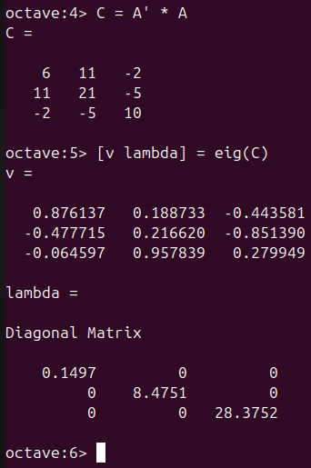
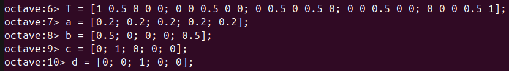
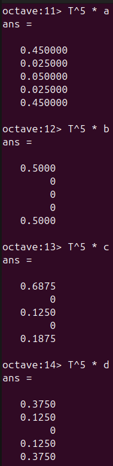
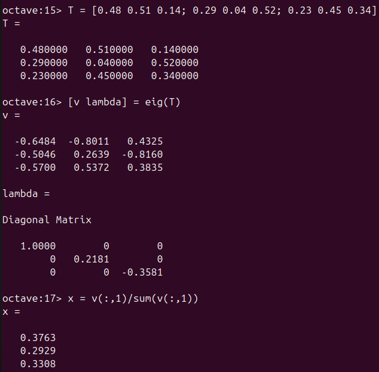

---
## Front matter
lang: ru-RU
title: Отчёт по лабораторной работе №8
author: Аветисян Давид Артурович
institute: РУДН, Москва, Россия

date: 14 декабря 2024

## Formatting
toc: false
slide_level: 2
theme: metropolis
header-includes: 
 - \metroset{progressbar=frametitle,sectionpage=progressbar,numbering=fraction}
 - '\makeatletter'
 - '\beamer@ignorenonframefalse'
 - '\makeatother'
aspectratio: 43
section-titles: true
---

## Цель работы

Изучения языка Octave, знакомство с задачей на собственные значения и марковскими цепями.

## Собственные векторы

Для начала работы с программой включим журналирование сессии командой **diary on**. Найдём собственные векторы матрицы $A$ с помощью команды **eig**.

{ width=70% }

## Собственные векторы

Теперь попробуем получить матрицу с действительным значениями. Для этого посчитаем матрицу $C$ и найдём её вектора.

{ width=70% }

## Марковские цепи

Теперь перейдём к теме марковских цепей. Построим таблицу переходов $T$ и векторов вероятности переходов. 

{ width=70% }

## Марковские цепи

Вычислим вероятности переходов через 5 шагов. Для этого нужно возвести матрицу $T$ в  5-ю степень и умножить на вектор.

{ width=70% }

## Марковские цепи

Теперь найдём вектор равновесного состояния $x$. Для этого найдём собственные значения матрицы и применим формулу.

{ width=70% }

## Марковские цепи

Проверим, является ли получившийся вектор равновесным. Как видим, разница между состояниями минимальная, а значит наши вычисления правильны.

{ width=70% }

## Выводы

Я познакомился с задачей на собственные значения и марковскими цепями.
