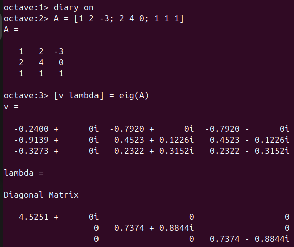
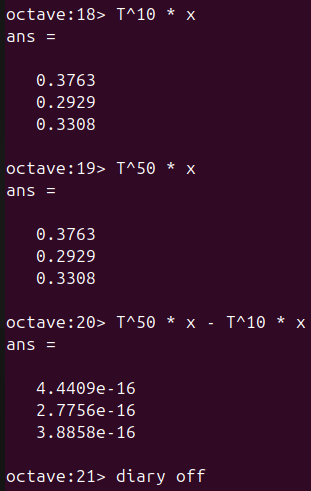

---
# Front matter
lang: ru-RU
title: "Лабораторная работа №8"
subtitle: "Дисциплина: Научное программирование"
author: "Аветисян Давид Артурович"

# Formatting
toc-title: "Содержание"
toc: true # Table of contents
toc_depth: 2
lof: true # Список рисунков
lot: true # Список таблиц
fontsize: 12pt
linestretch: 1.5
papersize: a4paper
documentclass: scrreprt
polyglossia-lang: russian
polyglossia-otherlangs: english
mainfont: PT Serif
romanfont: PT Serif
sansfont: PT Sans
monofont: PT Mono
mainfontoptions: Ligatures=TeX
romanfontoptions: Ligatures=TeX
sansfontoptions: Ligatures=TeX,Scale=MatchLowercase
monofontoptions: Scale=MatchLowercase
indent: true
pdf-engine: lualatex
header-includes:
  - \linepenalty=10 # the penalty added to the badness of each line within a paragraph (no associated penalty node) Increasing the value makes tex try to have fewer lines in the paragraph.
  - \interlinepenalty=0 # value of the penalty (node) added after each line of a paragraph.
  - \hyphenpenalty=50 # the penalty for line breaking at an automatically inserted hyphen
  - \exhyphenpenalty=50 # the penalty for line breaking at an explicit hyphen
  - \binoppenalty=700 # the penalty for breaking a line at a binary operator
  - \relpenalty=500 # the penalty for breaking a line at a relation
  - \clubpenalty=150 # extra penalty for breaking after first line of a paragraph
  - \widowpenalty=150 # extra penalty for breaking before last line of a paragraph
  - \displaywidowpenalty=50 # extra penalty for breaking before last line before a display math
  - \brokenpenalty=100 # extra penalty for page breaking after a hyphenated line
  - \predisplaypenalty=10000 # penalty for breaking before a display
  - \postdisplaypenalty=0 # penalty for breaking after a display
  - \floatingpenalty = 20000 # penalty for splitting an insertion (can only be split footnote in standard LaTeX)
  - \raggedbottom # or \flushbottom
  - \usepackage{float} # keep figures where there are in the text
  - \floatplacement{figure}{H} # keep figures where there are in the text
---

# Цель работы

Изучения языка Octave, знакомство с задачей на собственные значения и марковскими цепями.

# Задание

1. Познакомиться с собственными значениями и собственными векторами.
2. Познакомиться с марковскими цепями.

# Выполнение лабораторной работы

1) Для начала работы с программой включим журналирование сессии командой **diary on**. Найдём собственные векторы матрицы $A$ с помощью команды **eig**.

{ width=70% }

Теперь попробуем получить матрицу с действительным значениями. Для этого посчитаем матрицу $C$ и найдём её вектора.

{ width=70% }

2) Теперь перейдём к теме марковских цепей. Построим таблицу переходов $T$ и векторов вероятности переходов. 

{ width=70% }

Вычислим вероятности переходов через 5 шагов. Для этого нужно возвести матрицу $T$ в  5-ю степень и умножить на вектор.

{ width=70% }

Теперь найдём вектор равновесного состояния $x$. Для этого найдём собственные значения матрицы и применим формулу.

{ width=70% }

Проверим, является ли получившийся вектор равновесным.

{ width=70% }

Как видим, разница между состояниями минимальная, а значит наши вычисления правильны.

# Выводы

Я познакомился с задачей на собственные значения и марковскими цепями.
