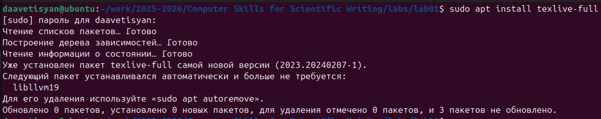
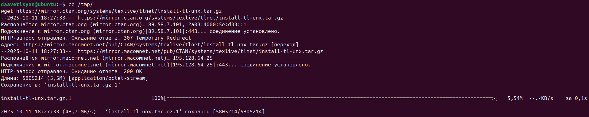
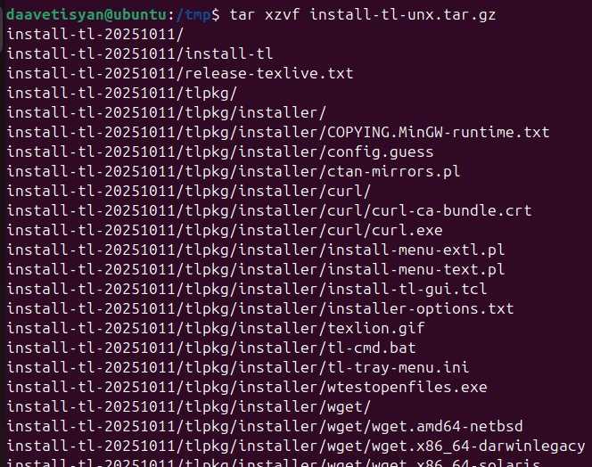
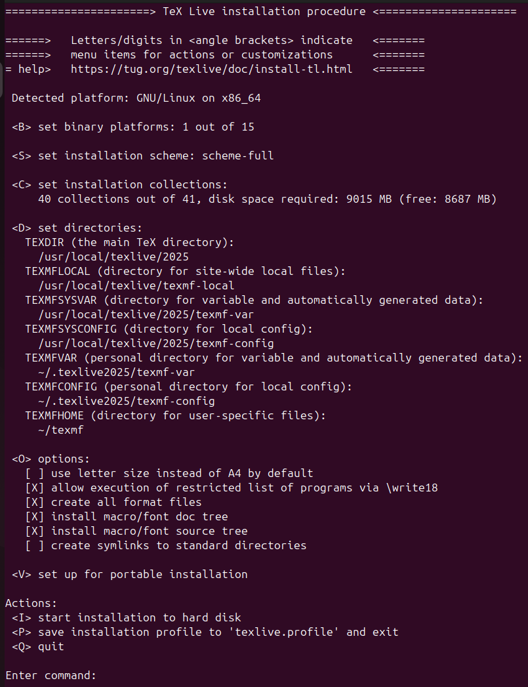

---
## Front matter
lang: ru-RU
title: Отчёт по лабораторной работе №1
author: Аветисян Давид Артурович
institute: РУДН, Москва, Россия

date: 14 Сентября 2024

## Formatting
toc: false
slide_level: 2
theme: metropolis
header-includes: 
 - \metroset{progressbar=frametitle,sectionpage=progressbar,numbering=fraction}
 - '\makeatletter'
 - '\beamer@ignorenonframefalse'
 - '\makeatother'
aspectratio: 43
section-titles: true
---

## Цель работы

- Познакомиться с шифрами Цезаря и Атбаш.
1. Реализовать шифр Цезаря с произвольным ключом k.
2. Реализовать шифр Атбаш.

## Шифр Цезаря на языке Python

- Сначала я реализовал шифр Цезаря на языке Python. Я использовал переменную k в качестве сдвига. При проверке слова берётся конкретный символ (char). Далее при помощи match-case я реализовал проверки на наличие выбранного символа в русском или английском алфавите. При этом я учёл регистр символа.

{ width=70% }

## Запрос текста и вывод результата шифра Цезаря

- Далее я реализовал запрос текста у пользователя и вывод результата алгоритма шифра Цезаря.

{ width=70% }

## Проверка метода шифра Цезаря

- После я вызвал написанный метод через командную строку и проверил все русские и английские буквы.

{ width=70% }

## Шифр Атбаш на языке Python

- Затем я реализовал шифр Атбаша. При проверке слова берётся конкретный символ (char). match-case я реализовал проверки на наличие выбранного символа в русском или английском алфавите. При этом я учёл регистр символа. 

{ width=70% }

## Вывод результата шифра Атбаш

- Далее я реализовал вывод результата алгоритма шифра Атбаш после вывода результата алгоритма шифра Цезаря.

{ width=70% }

## Проверка метода шифра Атбаш

- После я вызвал написанный метод через командную строку и проверил все русские и английские буквы.

{ width=70% }

## Итоговый код

- Итоговый код можно увидеть на картинке ниже.

{ width=70% }

## Выводы

- Я реализовал шифр Цезаря с произвольным ключом k и реализовал шифр Атбаш.
