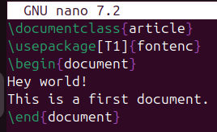

---
## Front matter
lang: ru-RU
title: Отчёт по лабораторной работе №2
author: Аветисян Давид Артурович
institute: РУДН, Москва, Россия

date: 11 Октября 2025

## Formatting
toc: false
slide_level: 2
theme: metropolis
header-includes: 
 - \metroset{progressbar=frametitle,sectionpage=progressbar,numbering=fraction}
 - '\makeatletter'
 - '\beamer@ignorenonframefalse'
 - '\makeatother'
aspectratio: 43
section-titles: true
---

## Цель работы

- This lesson shows the basic structure of a LaTeX document, and how to build it into a PDF file, as well as the main special characters used to control LaTeX.
1. LaTeX document structure.
2. What you’ve got & Running LaTeX.
3. Special characters & Exercise.

## Создание первого документа

- Сначала я создал файл first.tex и скопировал в него текст, приведённый в теории к лабораторной работе.

{ width=70% }

## Создание первого документа

- Далее я сохранил файл и запустил его.

{ width=70% }

## Создание первого документа

- После я открыл получившийся файл first.pdf. Всё получилось!

{ width=70% }

## Что ещё может LaTeX

- Затем я снова открыл файл first.tex добавил в него комментарии при помощи "%%", изменил текст документа, добавил сноску и разделил два предложения на абзацы.

{ width=70% }

## Что ещё может LaTeX

- После чего я сохранил файл и запустил его командой **pdflatex first** (без расширения).

{ width=70% }

## Что ещё может LaTeX

- Я получил результат: комментариев не видно, текст изменился и разделился на два абзаца, появилась сноска.

{ width=70% }

## Специальные символы

- Далее я попробовал использовать специальные символы в своём файле. Я добавил фигурные скобки, знак доллара, нарисовал символами лицо, а также разделил два предложения "твёрдым" пробелом.

{ width=70% }

## Специальные символы

После я сохранил файл, запустил его и открыт first.pdf. Результат отличный!

{ width=70% }

## Выводы

- Я сделал свой первый .pdf файл, используя TeXlive.
