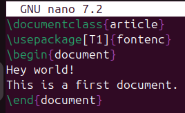
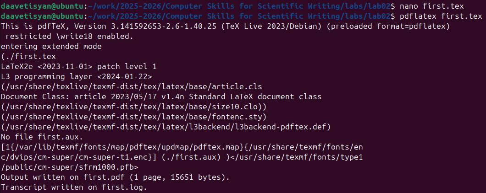
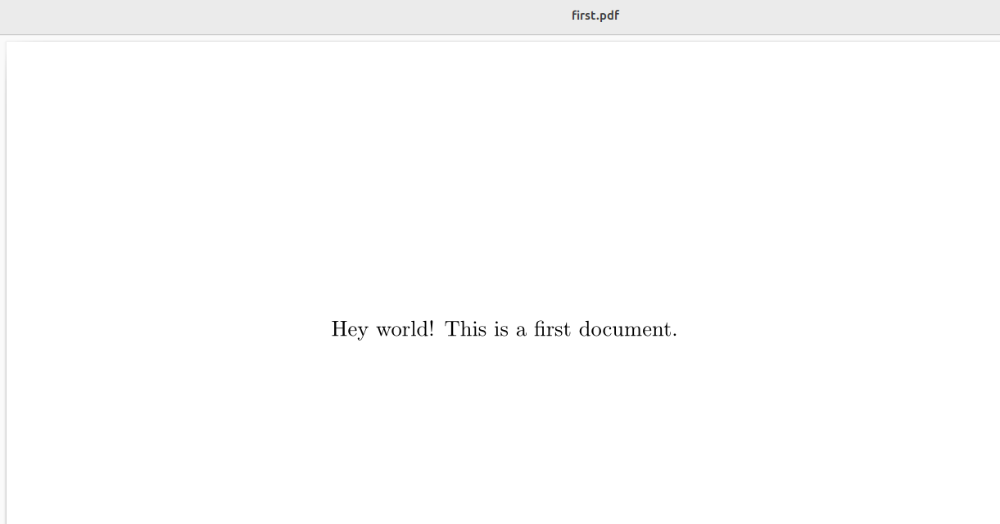
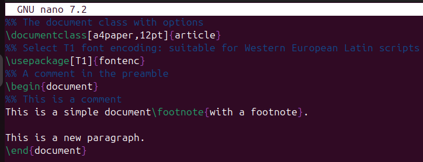
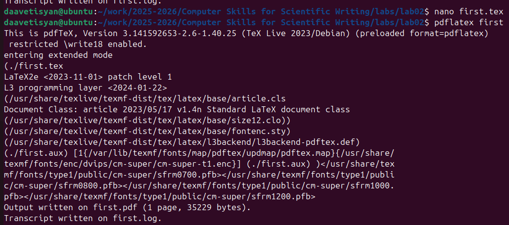
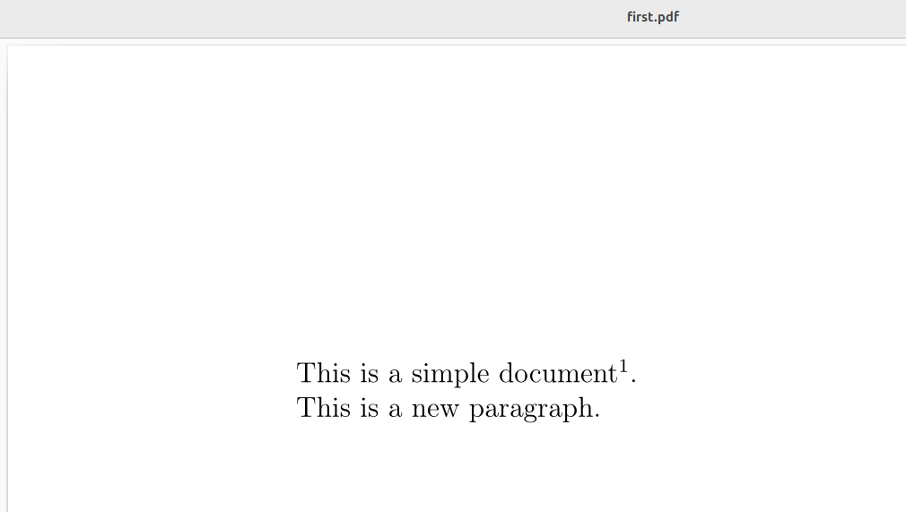
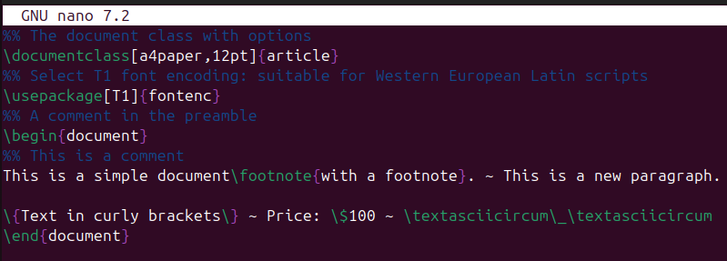
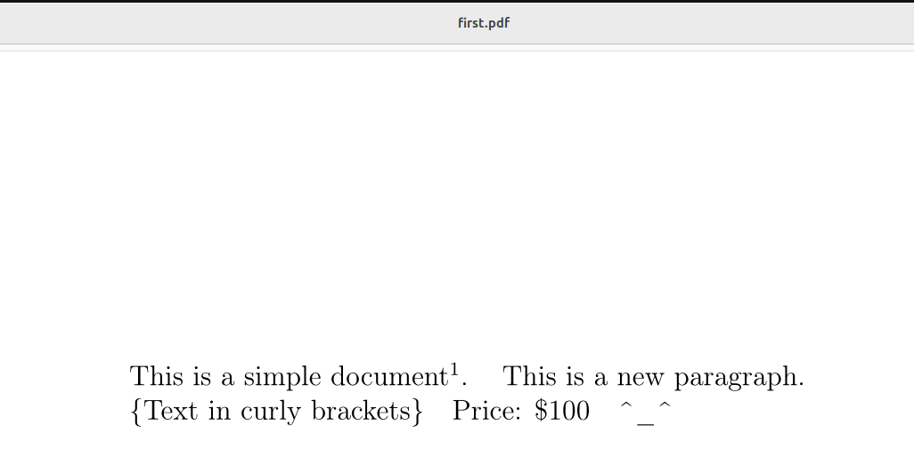

---
# Front matter
lang: ru-RU
title: "Лабораторная работа №2"
subtitle: "Дисциплина: Computer Skills for Scientific Writing"
author: "Аветисян Давид Артурович"

# Formatting
toc-title: "Содержание"
toc: true # Table of contents
toc_depth: 2
lof: true # Список рисунков
lot: true # Список таблиц
fontsize: 12pt
linestretch: 1.5
papersize: a4paper
documentclass: scrreprt
polyglossia-lang: russian
polyglossia-otherlangs: english
mainfont: PT Serif
romanfont: PT Serif
sansfont: PT Sans
monofont: PT Mono
mainfontoptions: Ligatures=TeX
romanfontoptions: Ligatures=TeX
sansfontoptions: Ligatures=TeX,Scale=MatchLowercase
monofontoptions: Scale=MatchLowercase
indent: true
pdf-engine: lualatex
header-includes:
  - \linepenalty=10 # the penalty added to the badness of each line within a paragraph (no associated penalty node) Increasing the value makes tex try to have fewer lines in the paragraph.
  - \interlinepenalty=0 # value of the penalty (node) added after each line of a paragraph.
  - \hyphenpenalty=50 # the penalty for line breaking at an automatically inserted hyphen
  - \exhyphenpenalty=50 # the penalty for line breaking at an explicit hyphen
  - \binoppenalty=700 # the penalty for breaking a line at a binary operator
  - \relpenalty=500 # the penalty for breaking a line at a relation
  - \clubpenalty=150 # extra penalty for breaking after first line of a paragraph
  - \widowpenalty=150 # extra penalty for breaking before last line of a paragraph
  - \displaywidowpenalty=50 # extra penalty for breaking before last line before a display math
  - \brokenpenalty=100 # extra penalty for page breaking after a hyphenated line
  - \predisplaypenalty=10000 # penalty for breaking before a display
  - \postdisplaypenalty=0 # penalty for breaking after a display
  - \floatingpenalty = 20000 # penalty for splitting an insertion (can only be split footnote in standard LaTeX)
  - \raggedbottom # or \flushbottom
  - \usepackage{float} # keep figures where there are in the text
  - \floatplacement{figure}{H} # keep figures where there are in the text
---

# Цель работы

This lesson shows the basic structure of a LaTeX document, and how to build it into a PDF file, as well as the main special characters used to control LaTeX.

# Задание

1. LaTeX document structure.
2. What you’ve got & Running LaTeX.
3. Special characters & Exercise.

# Выполнение лабораторной работы

1) Сначала я создал файл first.tex и скопировал в него текст, приведённый в теории к лабораторной работе.

{ width=70% }

Далее я сохранил файл и запустил его.

{ width=70% }

После я открыл получившийся файл first.pdf. Всё получилось!

{ width=70% }

2) Затем я снова открыл файл first.tex добавил в него комментарии при помощи "%%", изменил текст документа, добавил сноску и разделил два предложения на абзацы.

{ width=70% }

После чего я сохранил файл и запустил его командой **pdflatex first** (без расширения).

{ width=70% }

Я получил результат: комментариев не видно, текст изменился и разделился на два абзаца, появилась сноска.

{ width=70% }

3) Далее я попробовал использовать специальные символы в своём файле. Я добавил фигурные скобки, знак доллара, нарисовал символами лицо, а также разделил два предложения "твёрдым" пробелом.

{ width=70% }

После я сохранил файл, запустил его и открыт first.pdf. Результат отличный!

{ width=70% }

# Выводы

Я сделал свой первый .pdf файл, используя TeXlive.
