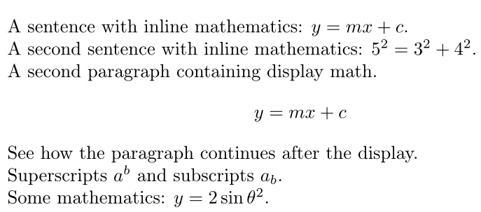
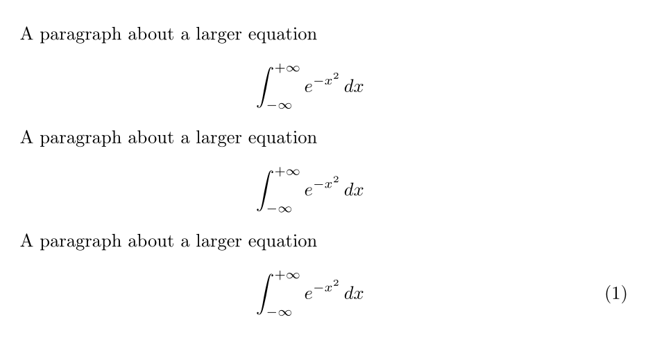
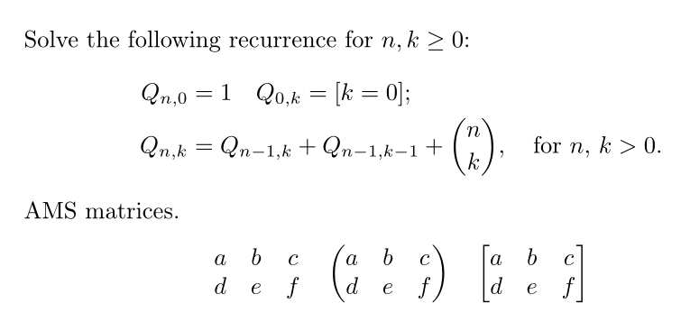
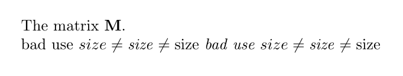
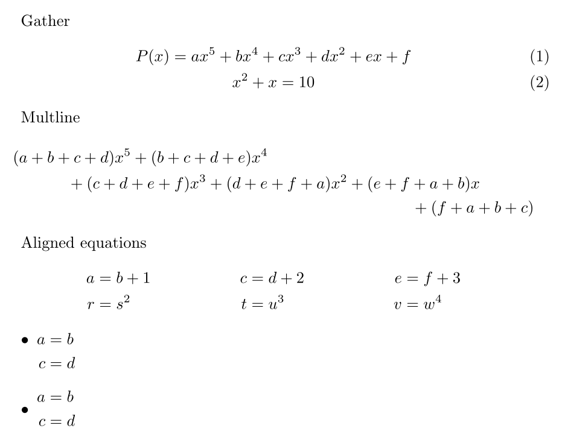
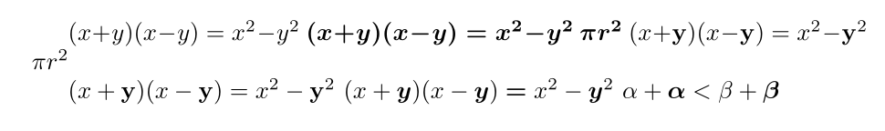
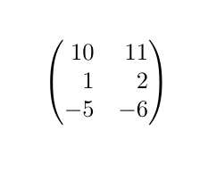
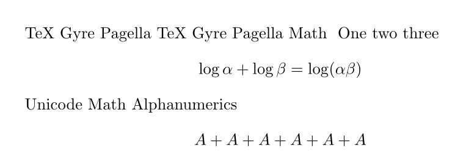

---
## Front matter
lang: ru-RU
title: Отчёт по лабораторной работе №3
author: Аветисян Давид Артурович
institute: РУДН, Москва, Россия

date: 11 Октября 2025

## Formatting
toc: false
slide_level: 2
theme: metropolis
header-includes: 
 - \metroset{progressbar=frametitle,sectionpage=progressbar,numbering=fraction}
 - '\makeatletter'
 - '\beamer@ignorenonframefalse'
 - '\makeatother'
aspectratio: 43
section-titles: true
---

## Цель работы

- This lesson presents LaTeX’s math mode and how you can type inline and display formulas, the extensions provided by the amsmath package, and how to change fonts in math.
1. Math mode.
2. Display mathematics.
3. The amsmath package.
4. Fonts in math mode.
5. Further amsmath alignments.
6. Bold Math.
7. Mathtools.
8. Unicode Math.

## Math mode.

- В данном разделе показано использование **математического режима**

{ width=70% }

## Display mathematics.

- В данном разделе показано использование **интегралов** и **нумерованных уравнений**.

{ width=70% }

## The amsmath package.

- Пакет **amsmath** предоставляет расширенные возможности для работы с формулами.

{ width=70% }

## Fonts in math mode.

- Показаны различные команды для изменения **шрифта**.

{ width=70% }

## Further amsmath alignments.

- Показаны **дополнительные выравнивания** и **столбцы**.

{ width=70% }

## Bold Math.

- **Жирный** математический шрифт.

{ width=70% }

## Mathtools.

- Пакет **mathtools** расширяет возможности ansmath. Например, окружение pmatrix* с параметром [r] выравнивает элементы по правому краю.

{ width=70% }

## Unicode Math.

- В данном разделе показано использование пакета **unicode-math** для работы с OpenType шрифтами.

{ width=70% }

## Выводы

- Я изучил основные принципы математического набора в LaTeX, включая использование различных пакетов, режимов, шрифтов и символов.
