---
# Front matter
lang: ru-RU
title: "Лабораторная работа №3"
subtitle: "Дисциплина: Computer Skills for Scientific Writing"
author: "Аветисян Давид Артурович"

# Formatting
toc-title: "Содержание"
toc: true # Table of contents
toc_depth: 2
lof: true # Список рисунков
lot: true # Список таблиц
fontsize: 12pt
linestretch: 1.5
papersize: a4paper
documentclass: scrreprt
polyglossia-lang: russian
polyglossia-otherlangs: english
mainfont: PT Serif
romanfont: PT Serif
sansfont: PT Sans
monofont: PT Mono
mainfontoptions: Ligatures=TeX
romanfontoptions: Ligatures=TeX
sansfontoptions: Ligatures=TeX,Scale=MatchLowercase
monofontoptions: Scale=MatchLowercase
indent: true
pdf-engine: lualatex
header-includes:
  - \linepenalty=10 # the penalty added to the badness of each line within a paragraph (no associated penalty node) Increasing the value makes tex try to have fewer lines in the paragraph.
  - \interlinepenalty=0 # value of the penalty (node) added after each line of a paragraph.
  - \hyphenpenalty=50 # the penalty for line breaking at an automatically inserted hyphen
  - \exhyphenpenalty=50 # the penalty for line breaking at an explicit hyphen
  - \binoppenalty=700 # the penalty for breaking a line at a binary operator
  - \relpenalty=500 # the penalty for breaking a line at a relation
  - \clubpenalty=150 # extra penalty for breaking after first line of a paragraph
  - \widowpenalty=150 # extra penalty for breaking before last line of a paragraph
  - \displaywidowpenalty=50 # extra penalty for breaking before last line before a display math
  - \brokenpenalty=100 # extra penalty for page breaking after a hyphenated line
  - \predisplaypenalty=10000 # penalty for breaking before a display
  - \postdisplaypenalty=0 # penalty for breaking after a display
  - \floatingpenalty = 20000 # penalty for splitting an insertion (can only be split footnote in standard LaTeX)
  - \raggedbottom # or \flushbottom
  - \usepackage{float} # keep figures where there are in the text
  - \floatplacement{figure}{H} # keep figures where there are in the text
---

# Цель работы

This lesson presents LaTeX’s math mode and how you can type inline and display formulas, the extensions provided by the amsmath package, and how to change fonts in math.

# Задание

1. Math mode.
2. Display mathematics.
3. The amsmath package.
4. Fonts in math mode.
5. Further amsmath alignments.
6. Bold Math.
7. Mathtools.
8. Unicode Math.

# Выполнение лабораторной работы

### Math mode.

В данном разделе показано использование **математического режима**:

- встроенный (inline) режим используется для коротких формул в тексте и обозначается \$...\$
- выведенный (display) режим обозначается \\[...\\] и размещает формулу по центру на отдельной строке
- используются верхние (^) и нижние (_) индексы, а также стандартные функции (\\sin, \\theta)

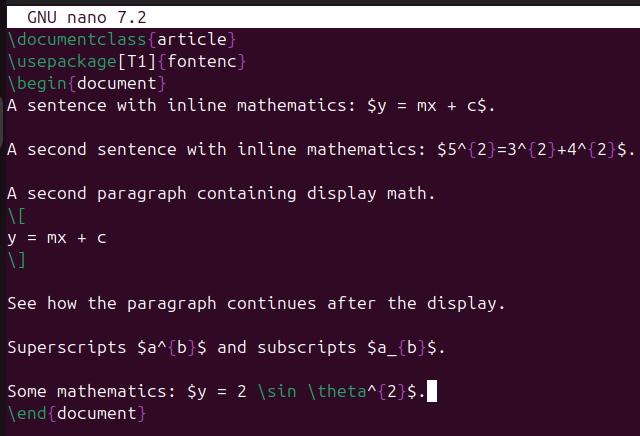{ width=70% }

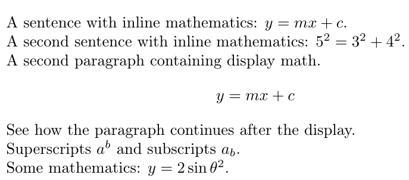{ width=70% }

### Display mathematics.

В данном разделе показано использование **интегралов** и **нумерованных уравнений**:

- символ интеграла (\\int) имеет пределы интегрирования, задаваемые через ^ и _
- определена новая команда \\diff и используется для корректного отображения диференциала
- окружение equation автоматически добавляет нумерацию формулы

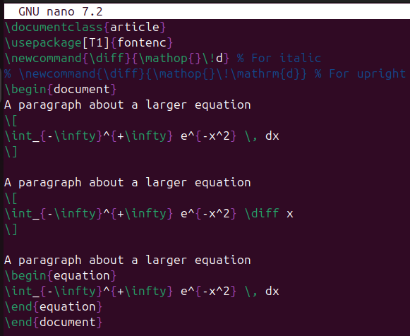{ width=70% }

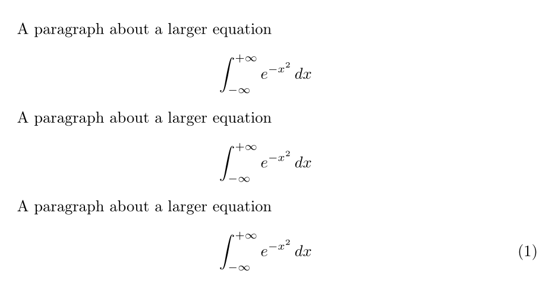{ width=70% }

### The amsmath package.

Пакет **amsmath** предоставляет расширенные возможности для работы с формулами:

- окружение align* выравнивает уравнение по символу &
- команда \\quad добавляет горизонтальный пробел
- \\text{} вставляет обычный текст внутри формулы
- \\binom{n}{k} создаёт биноминальные коэффициенты
- существуют различные виды матриц: matrix (без скобок), pmatrix (в круглых скобках), bmatrix (в квадратных скобках)

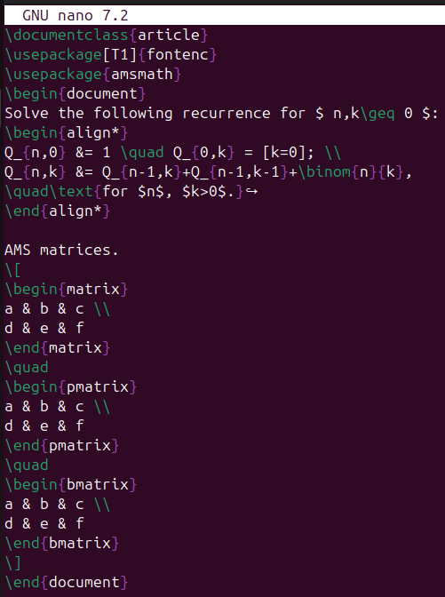{ width=70% }

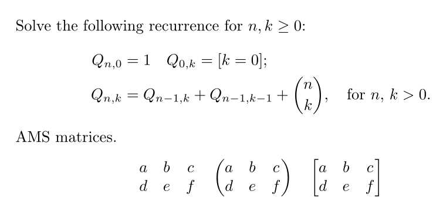{ width=70% }

### Fonts in math mode.

Показаны различные команды для изменения **шрифта**:

- \\mathrm: roman (upright)
- \\mathit: italic spaced as ‘text’
- \\mathbf: boldface
- \\mathsf: sans serif
- \\mathtt: monospaced (typewriter)
- \\mathbb: double-struck (blackboard bold) (provided by the amsfonts package)

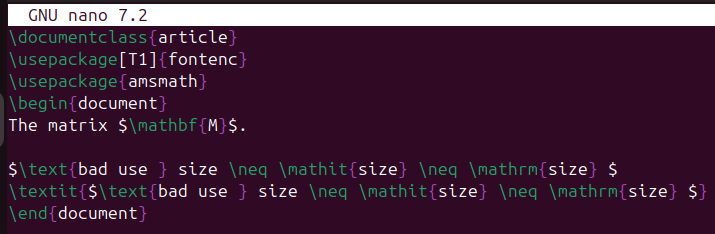{ width=70% }

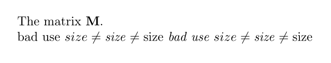{ width=70% }

### Further amsmath alignments.

Показаны **дополнительные выравнивания** и **столбцы**:

- gather выравнивает несколько строк по центру
- multline используется для длинных формул, переносимых на несколько строк
- align* создаёт таблицу уравнений, выравнивая их по знакам равенства
- aligned используется внутри других формул для небольших систем уравнений

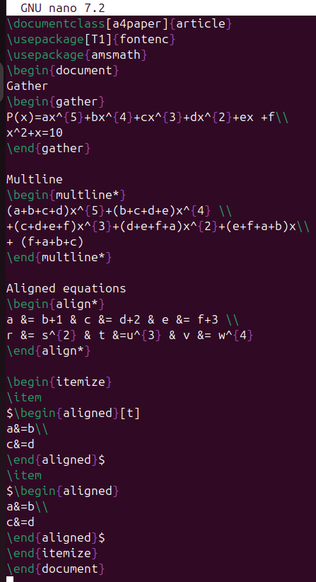{ width=70% }

{ width=70% }

### Bold Math.

**Жирный** математический шрифт:

- \\boldmath делает всю формулу жирной
- \\mathbf{} делает жирными только латинские буквы
- \\bm{} позволяет выделять жирными любые символы, включая греческие

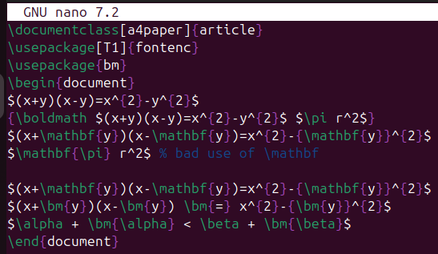{ width=70% }

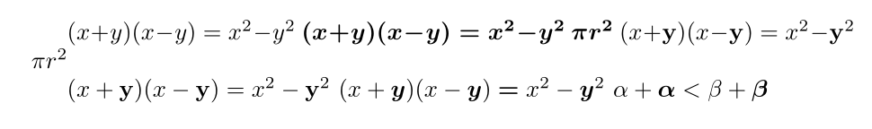{ width=70% }

### Mathtools.

Пакет **mathtools** расширяет возможности ansmath. Например, окружение pmatrix* с параметром [r] выравнивает элементы по правому краю.

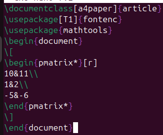{ width=70% }

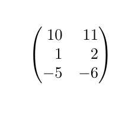{ width=70% }

### Unicode Math.

В данном разделе показано использование пакета **unicode-math** для работы с OpenType шрифтами:

- пакет позволяет использовать современные математические шрифты
- команды \\setmainfont и \\setmathfont задают основной и математический шрифты документа
- используются греческие буквы (\\alpha, \\beta) и различные начертания: \\symbf{A} - жирный, \\symscr{A} - рукописный

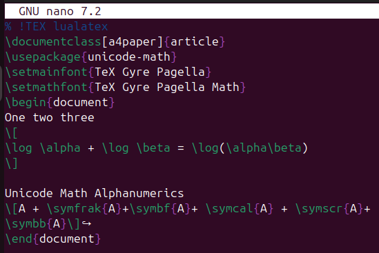{ width=70% }

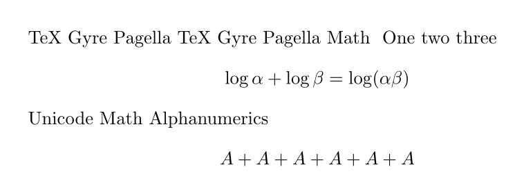{ width=70% }

# Выводы

Я изучил основные принципы математического набора в LaTeX, включая использование различных пакетов, режимов, шрифтов и символов.
