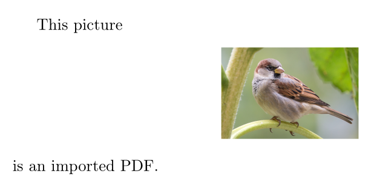
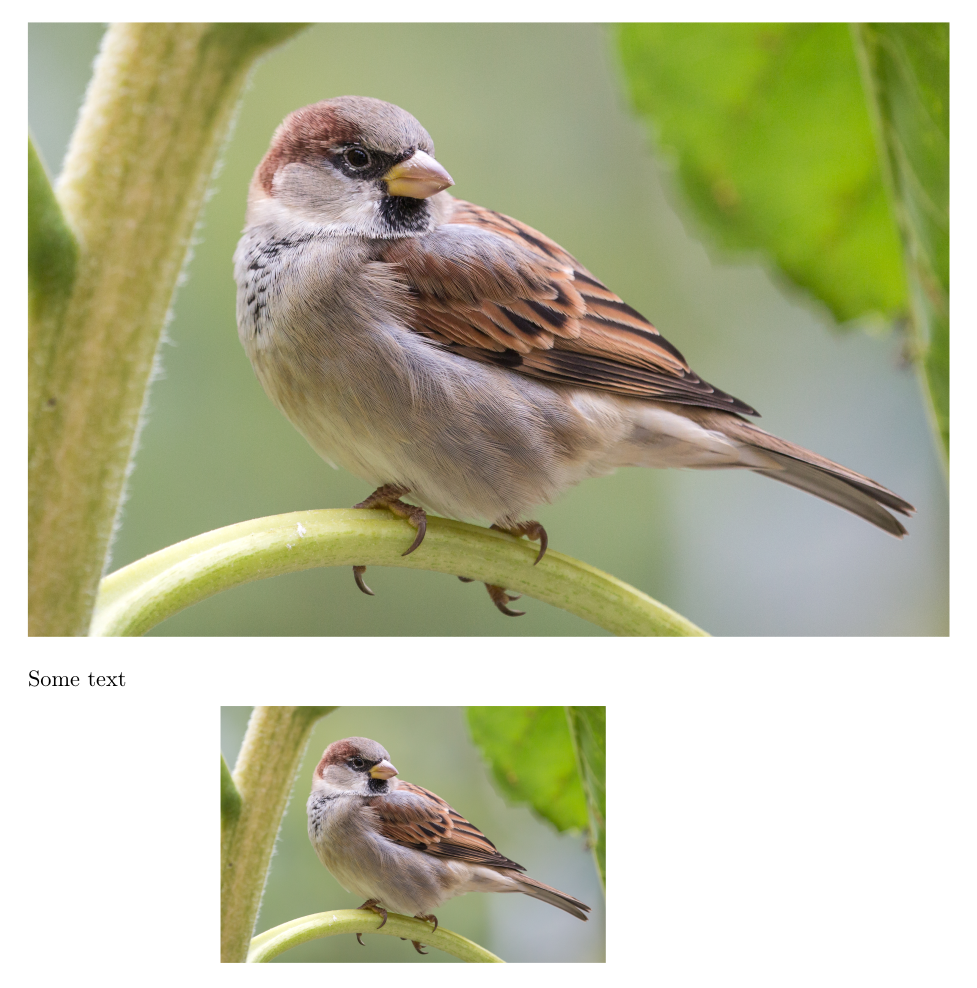
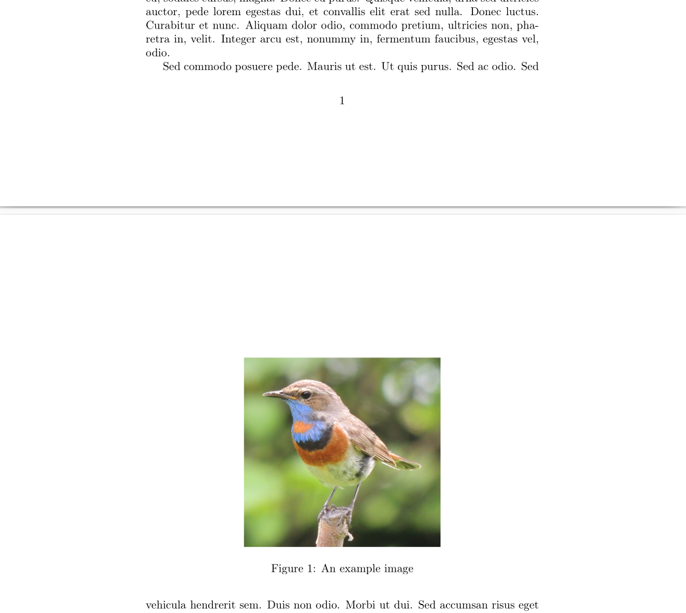
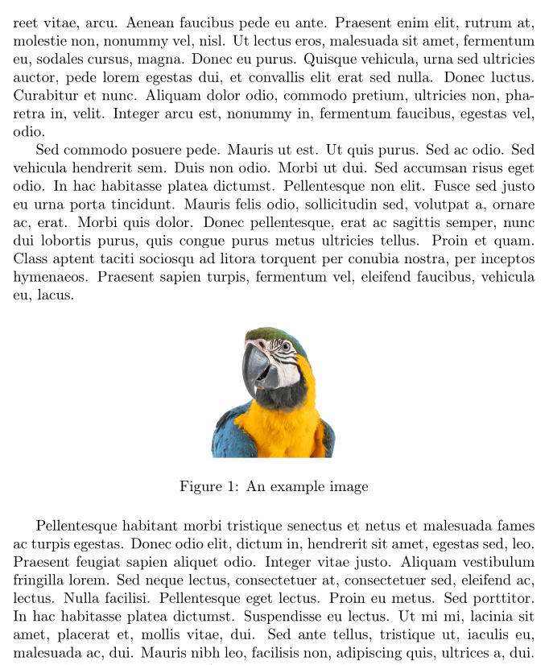
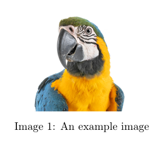
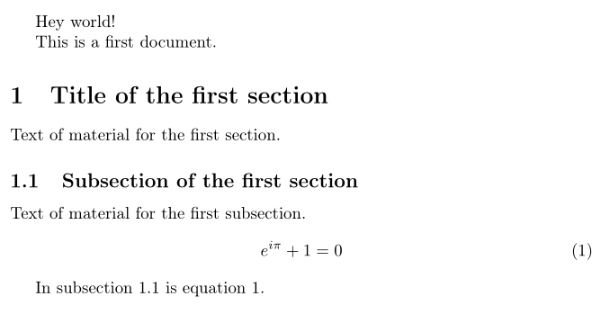
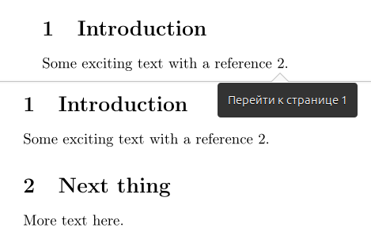

---
## Front matter
lang: ru-RU
title: Отчёт по лабораторной работе №4
author: Аветисян Давид Артурович
institute: РУДН, Москва, Россия

date: 25 Октября 2025

## Formatting
toc: false
slide_level: 2
theme: metropolis
header-includes: 
 - \metroset{progressbar=frametitle,sectionpage=progressbar,numbering=fraction}
 - '\makeatletter'
 - '\beamer@ignorenonframefalse'
 - '\makeatother'
aspectratio: 43
section-titles: true
---

## Цель работы

- Изучить возможности вставки, изменения и размещения графических изображений в LaTeX, а также освоить работу с плавающими объектами, подписями и перекрёстными ссылками.
1. Including Graphics.
2. Altering graphic appearance.
3. Making images float.
4. Placing floats.
5. Other types of float.
6. Cross-referencing.
7. Making cross-references into links.

## Including Graphics.

Чтобы добавить графику из внешнего источника в LaTeX, используем пакет **graphics** и команду **\\includegraphics**.

{ width=70% }

## Altering graphic appearance.

Команда **\\includegraphics** имеет множество параметров для управления размером и формой включаемых изображений, а также для обрезки материала. Ширину и высоту задавали командами **\\textwidth** и **\\textheight**. Обрезали параметрами **clip, trim**.

{ width=70% }

## Making images float.

Для демонстрации размещения изображений применялось окружение **figure** с разными параметрами. Здесь LaTeX самостоятельно подбирает оптимальное место для рисунка. Также были использованы другие спецификаторы.

{ width=70% }

## Placing floats.

В данном случае использовался параметр **[H]** из пакета **float**. В этом случае изображение вставляется строго в том месте, где прописана команда. Также я решил упорядочить файлы, поместив все графические файлы в подкаталог **figs** и указал изображение как **figs/example-image**.

{ width=70% }

## Other types of float.

Для демонстрации использовался пакет **trivfloat**, позволяющий создавать новые типы плавающих окружений. Это окружение работает аналогично **figure**, но с собственным названием и счётчиком.

{ width=70% }

## Cross-referencing.

Для демонстрации работы перекрёстных ссылок использовались команды **\\label** и **\\ref**. После двойной компиляции ссылки корректно отображаются.

{ width=70% }

## Making cross-references into links.

Мы можем превратить перекрёстные ссылки в гиперссылки с помощью пакет **hyperref**. Опять же после двойной компиляции ссылки корректно отображаются.

{ width=70% }

## Выводы

- Я изучил возможности вставки, изменения и размещения графических изображений в LaTeX, а также освоил работу с плавающими объектами, подписями и перекрёстными ссылками.
