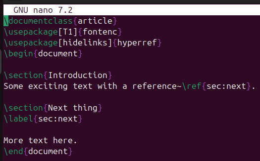

---
# Front matter
lang: ru-RU
title: "Лабораторная работа №4"
subtitle: "Дисциплина: Computer Skills for Scientific Writing"
author: "Аветисян Давид Артурович"

# Formatting
toc-title: "Содержание"
toc: true # Table of contents
toc_depth: 2
lof: true # Список рисунков
lot: true # Список таблиц
fontsize: 12pt
linestretch: 1.5
papersize: a4paper
documentclass: scrreprt
polyglossia-lang: russian
polyglossia-otherlangs: english
mainfont: PT Serif
romanfont: PT Serif
sansfont: PT Sans
monofont: PT Mono
mainfontoptions: Ligatures=TeX
romanfontoptions: Ligatures=TeX
sansfontoptions: Ligatures=TeX,Scale=MatchLowercase
monofontoptions: Scale=MatchLowercase
indent: true
pdf-engine: lualatex
header-includes:
  - \linepenalty=10 # the penalty added to the badness of each line within a paragraph (no associated penalty node) Increasing the value makes tex try to have fewer lines in the paragraph.
  - \interlinepenalty=0 # value of the penalty (node) added after each line of a paragraph.
  - \hyphenpenalty=50 # the penalty for line breaking at an automatically inserted hyphen
  - \exhyphenpenalty=50 # the penalty for line breaking at an explicit hyphen
  - \binoppenalty=700 # the penalty for breaking a line at a binary operator
  - \relpenalty=500 # the penalty for breaking a line at a relation
  - \clubpenalty=150 # extra penalty for breaking after first line of a paragraph
  - \widowpenalty=150 # extra penalty for breaking before last line of a paragraph
  - \displaywidowpenalty=50 # extra penalty for breaking before last line before a display math
  - \brokenpenalty=100 # extra penalty for page breaking after a hyphenated line
  - \predisplaypenalty=10000 # penalty for breaking before a display
  - \postdisplaypenalty=0 # penalty for breaking after a display
  - \floatingpenalty = 20000 # penalty for splitting an insertion (can only be split footnote in standard LaTeX)
  - \raggedbottom # or \flushbottom
  - \usepackage{float} # keep figures where there are in the text
  - \floatplacement{figure}{H} # keep figures where there are in the text
---

# Цель работы

Изучить возможности вставки, изменения и размещения графических изображений в LaTeX, а также освоить работу с плавающими объектами, подписями и перекрёстными ссылками.

# Задание

1. Including Graphics.
2. Altering graphic appearance.
3. Making images float.
4. Placing floats.
5. Other types of float.
6. Cross-referencing.
7. Making cross-references into links.

# Выполнение лабораторной работы

### Including Graphics.

Чтобы добавить графику из внешнего источника в LaTeX, используем пакет **graphics** и команду **\\includegraphics**.

{ width=70% }

{ width=70% }

### Altering graphic appearance.

Команда **\\includegraphics** имеет множество параметров для управления размером и формой включаемых изображений, а также для обрезки материала. Ширину и высоту задавали командами **\\textwidth** и **\\textheight**. Обрезали параметрами **clip, trim**.

{ width=70% }

{ width=70% }

{ width=70% }

### Making images float.

Для демонстрации размещения изображений применялось окружение **figure** с разными параметрами. Здесь LaTeX самостоятельно подбирает оптимальное место для рисунка. Также были использованы другие спецификаторы: 

- h: Здесь (если возможно)
- t: Верхняя часть страницы
- b: Нижняя часть страницы 
- p: Специальная страница только для плавающих элементов

{ width=70% }

{ width=70% }

### Placing floats.

В данном случае использовался параметр **[H]** из пакета **float**. В этом случае изображение вставляется строго в том месте, где прописана команда. Также я решил упорядочить файлы, поместив все графические файлы в подкаталог **figs** и указал изображение как **figs/example-image**.

{ width=70% }

{ width=70% }

### Other types of float.

Для демонстрации использовался пакет **trivfloat**, позволяющий создавать новые типы плавающих окружений. Это окружение работает аналогично **figure**, но с собственным названием и счётчиком.

{ width=70% }

{ width=70% }

### Cross-referencing.

Для демонстрации работы перекрёстных ссылок использовались команды **\\label** и **\\ref**. После двойной компиляции ссылки корректно отображаются.

{ width=70% }

{ width=70% }

{ width=70% }

### Making cross-references into links.

Мы можем превратить перекрёстные ссылки в гиперссылки с помощью пакет **hyperref**. Опять же после двойной компиляции ссылки корректно отображаются.

{ width=70% }

{ width=70% }

{ width=70% }

# Выводы

Я изучил возможности вставки, изменения и размещения графических изображений в LaTeX, а также освоил работу с плавающими объектами, подписями и перекрёстными ссылками.
