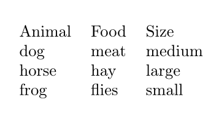
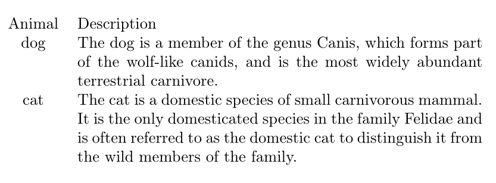
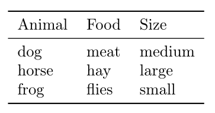
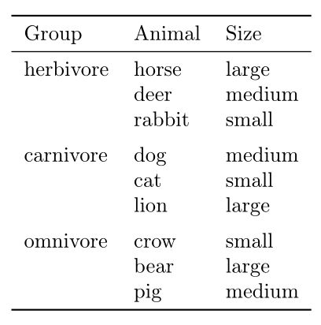
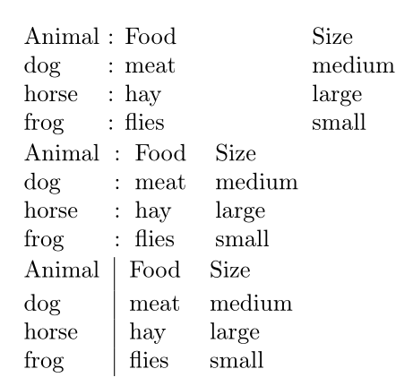
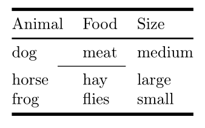
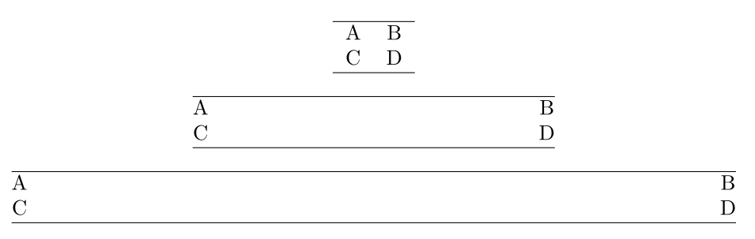
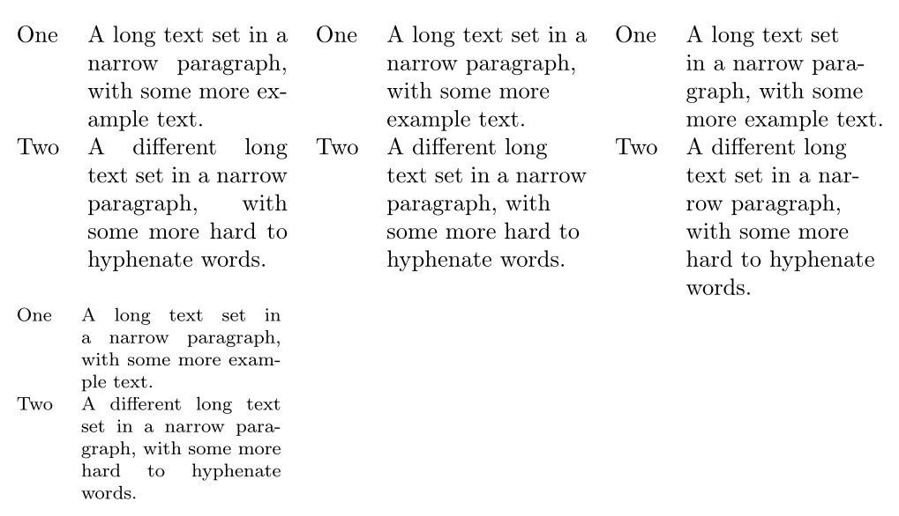
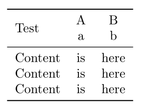
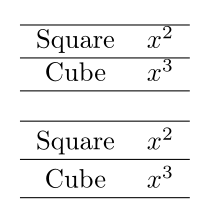

---
## Front matter
lang: ru-RU
title: Отчёт по лабораторной работе №5
author: Аветисян Давид Артурович
institute: РУДН, Москва, Россия

date: 8 Ноября 2025

## Formatting
toc: false
slide_level: 2
theme: metropolis
header-includes: 
 - \metroset{progressbar=frametitle,sectionpage=progressbar,numbering=fraction}
 - '\makeatletter'
 - '\beamer@ignorenonframefalse'
 - '\makeatother'
aspectratio: 43
section-titles: true
---

## Цель работы

- Изучить создание и оформление таблиц в системе LaTeX. Освоить пакеты *array*, *booktabs*, *tabularx*, *longtable*, *threeparttable*, *siunitx* и приёмы, позволяющие делать таблицы профессионального вида.

1. The array package.
2. Adding rules (lines).
3. Merging cells.
4. The other preamble contents.
5. Customizing booktabs rules.
6. Numeric alignment in columns.
7. Specifying the total table width.
8. Multi-page tables.
9. Table notes.
10. Typesetting in narrow columns.
11. Vertical tricks.
12. Line spacing in tables.

## The array package

В начале создаётся минимальная таблица из трёх колонок. Каждая ячейка отделяется знаком &, строка завершается \\\\.

{ width=70% }

## The array package

Для длинных колонок применяют тип колонки p{} с указанием ширины, что позволяет переносить текст внутри ячейки.

{ width=70% }

## Adding rules (lines)

Для профессионального оформления использован пакет *booktabs*. Он заменяет *hline* на типографские аккуратные линии.

{ width=70% }

## Adding rules (lines)

Линии *toprule*, *midrule* и *bottomrule* формируют верхнюю, среднюю и нижнюю границы таблицы. Команда *cmidrule* даёт возможность проводить линии только под некоторыми колонками, что удобно при группировке данных. 

{ width=70% }

## Adding rules (lines)

Чтобы улучшить читаемость таблицы используется *addlinespace*, добавляющая небольшой промежуток между строками.

{ width=70% }

## Merging cells

Команда *multicolumn* используется для объединения нескольких колонок в одной ячейке (например, для заголовков).

{ width=70% }

## Merging cells

Группировка данных в таблице. Первая колонка содержит названия групп. Пустые ячейки оставлены для визуального объединения строк внутри группы.

{ width=70% }

## The other preamble contents

С помощью >{} и <{} можно добавлять оформление отдельным колонкам. 

{ width=70% }

## The other preamble contents

Межколоночные отступы и границы. Различные варианты показывают, как можно управлять расстоянием между колонками и вставлять дополнительные разделители внутри таблицы.

{ width=70% }

## Customizing booktabs rules

Команды *toprule[2pt]*, *midrule[1pt]* и *cmidrule[0.5pt]* меняют толщину линий, что позволяет визуально разделять части таблицы. \

{ width=70% }

## Numeric alignment in columns

Пакет *siunitx* автоматически выравнивает числа по десятичной точке, делая таблицу читабельной для сравнения значений.

{ width=70% }

## Specifying the total table width

*tabular*\* растягивает таблицу на заданную долю ширины страницы, а *tabularx* автоматически подбирает ширину последней колонки для равномерного заполнения пространства.

{ width=70% }

## Multi-page tables

Окружение *longtable* позволяет таблице автоматически переноситься на новую страницу, сохраняя заголовки. 

{ width=70% }

## Table notes

Пакет *threeparttable* добавляет сноски к таблицам в виде пронумерованных заметок под основным содержимым.

{ width=70% }

## Typesetting in narrow columns

Показано сравнение разных способов выравнивания текста в узких колонках (left, raggedright, RaggedRight)

{ width=70% }

## Vertical tricks

Комбинированные таблицы в ячейках (@{}c@{}) используются для вертикального совмещения текста и подписей.

{ width=70% }

## Line spacing in tables

Команда *setlength* изменяет высоту строк, что повышает читабельность таблицы.

{ width=70% }

## Выводы

- Я изучил основные возможности LaTeX для создания и форматирования таблиц. Получены практические навыки использования пакетов *array*, *booktabs*, *tabularx*, *longtable*, *threeparttable* и *siunitx*. 
