---
# Front matter
lang: ru-RU
title: "Лабораторная работа №5"
subtitle: "Дисциплина: Computer Skills for Scientific Writing"
author: "Аветисян Давид Артурович"

# Formatting
toc-title: "Содержание"
toc: true # Table of contents
toc_depth: 2
lof: true # Список рисунков
lot: true # Список таблиц
fontsize: 12pt
linestretch: 1.5
papersize: a4paper
documentclass: scrreprt
polyglossia-lang: russian
polyglossia-otherlangs: english
mainfont: PT Serif
romanfont: PT Serif
sansfont: PT Sans
monofont: PT Mono
mainfontoptions: Ligatures=TeX
romanfontoptions: Ligatures=TeX
sansfontoptions: Ligatures=TeX,Scale=MatchLowercase
monofontoptions: Scale=MatchLowercase
indent: true
pdf-engine: lualatex
header-includes:
  - \linepenalty=10 # the penalty added to the badness of each line within a paragraph (no associated penalty node) Increasing the value makes tex try to have fewer lines in the paragraph.
  - \interlinepenalty=0 # value of the penalty (node) added after each line of a paragraph.
  - \hyphenpenalty=50 # the penalty for line breaking at an automatically inserted hyphen
  - \exhyphenpenalty=50 # the penalty for line breaking at an explicit hyphen
  - \binoppenalty=700 # the penalty for breaking a line at a binary operator
  - \relpenalty=500 # the penalty for breaking a line at a relation
  - \clubpenalty=150 # extra penalty for breaking after first line of a paragraph
  - \widowpenalty=150 # extra penalty for breaking before last line of a paragraph
  - \displaywidowpenalty=50 # extra penalty for breaking before last line before a display math
  - \brokenpenalty=100 # extra penalty for page breaking after a hyphenated line
  - \predisplaypenalty=10000 # penalty for breaking before a display
  - \postdisplaypenalty=0 # penalty for breaking after a display
  - \floatingpenalty = 20000 # penalty for splitting an insertion (can only be split footnote in standard LaTeX)
  - \raggedbottom # or \flushbottom
  - \usepackage{float} # keep figures where there are in the text
  - \floatplacement{figure}{H} # keep figures where there are in the text
---

# Цель работы

Изучить создание и оформление таблиц в системе LaTeX. Освоить пакеты *array*, *booktabs*, *tabularx*, *longtable*, *threeparttable*, *siunitx* и приёмы, позволяющие делать таблицы профессионального вида.

# Задание

1. The array package.
2. Adding rules (lines).
3. Merging cells.
4. The other preamble contents.
5. Customizing booktabs rules.
6. Numeric alignment in columns.
7. Specifying the total table width.
8. Multi-page tables.
9. Table notes.
10. Typesetting in narrow columns.
11. Vertical tricks.
12. Line spacing in tables.

# Выполнение лабораторной работы

### The array package

В начале создаётся минимальная таблица из трёх колонок. Каждая ячейка отделяется знаком &, строка завершается \\\\.

{ width=70% }

{ width=70% }

Для длинных колонок применяют тип колонки p{} с указанием ширины, что позволяет переносить текст внутри ячейки.

{ width=70% }

{ width=70% }

### Adding rules (lines)

Для профессионального оформления использован пакет *booktabs*. Он заменяет *hline* на типографские аккуратные линии.

{ width=70% }

{ width=70% }

Линии *toprule*, *midrule* и *bottomrule* формируют верхнюю, среднюю и нижнюю границы таблицы. Команда *cmidrule* даёт возможность проводить линии только под некоторыми колонками, что удобно при группировке данных. 

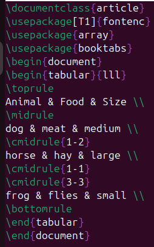{ width=70% }

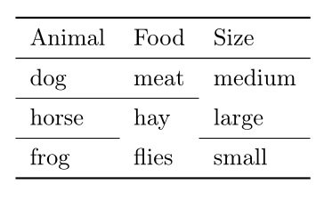{ width=70% }

Чтобы улучшить читаемость таблицы используется *addlinespace*, добавляющая небольшой промежуток между строками.

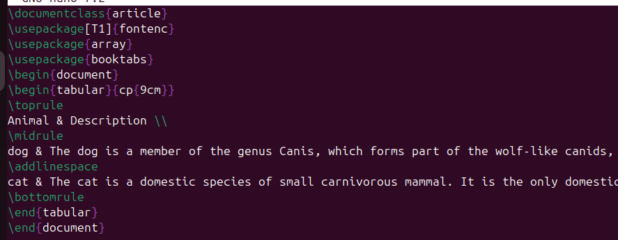{ width=70% }

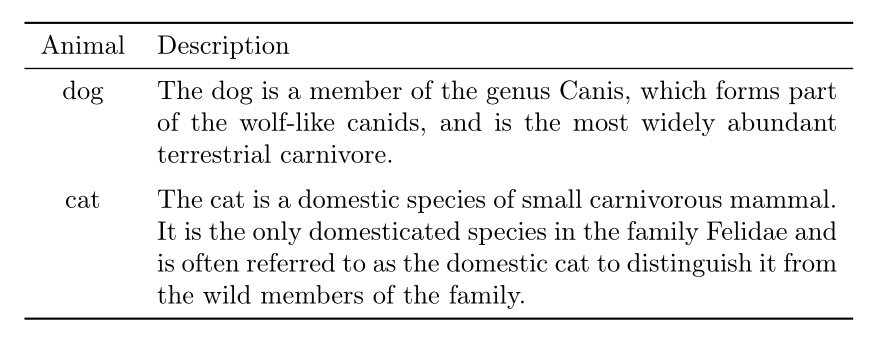{ width=70% }

### Merging cells

Команда *multicolumn* используется для объединения нескольких колонок в одной ячейке (например, для заголовков).

{ width=70% }

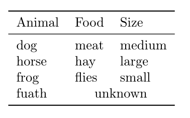{ width=70% }

Группировка данных в таблице. Первая колонка содержит названия групп. Пустые ячейки оставлены для визуального объединения строк внутри группы.

{ width=70% }

{ width=70% }

### The other preamble contents

С помощью >{} и <{} можно добавлять оформление отдельным колонкам. 

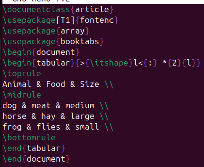{ width=70% }

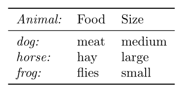{ width=70% }

Межколоночные отступы и границы. Различные варианты показывают, как можно управлять расстоянием между колонками и вставлять дополнительные разделители внутри таблицы.

{ width=70% }

{ width=70% }

### Customizing booktabs rules

Команды *toprule[2pt]*, *midrule[1pt]* и *cmidrule[0.5pt]* меняют толщину линий, что позволяет визуально разделять части таблицы. \

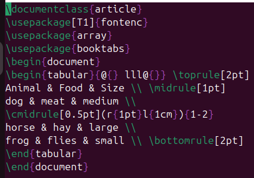{ width=70% }

{ width=70% }

### Numeric alignment in columns

Пакет *siunitx* автоматически выравнивает числа по десятичной точке, делая таблицу читабельной для сравнения значений.

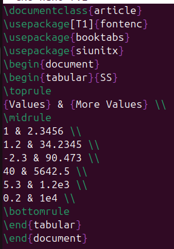{ width=70% }

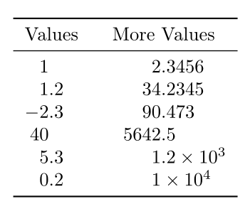{ width=70% }

### Specifying the total table width

*tabular*\* растягивает таблицу на заданную долю ширины страницы, а *tabularx* автоматически подбирает ширину последней колонки для равномерного заполнения пространства.

{ width=70% }

{ width=70% }

### Multi-page tables

Окружение *longtable* позволяет таблице автоматически переноситься на новую страницу, сохраняя заголовки. 

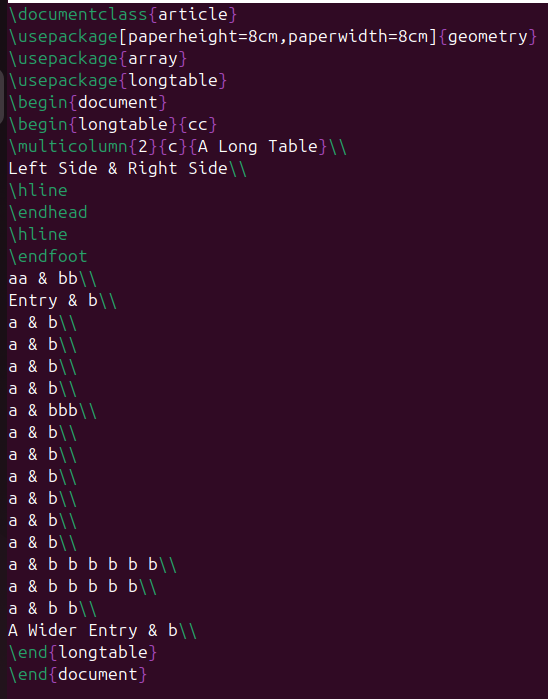{ width=70% }

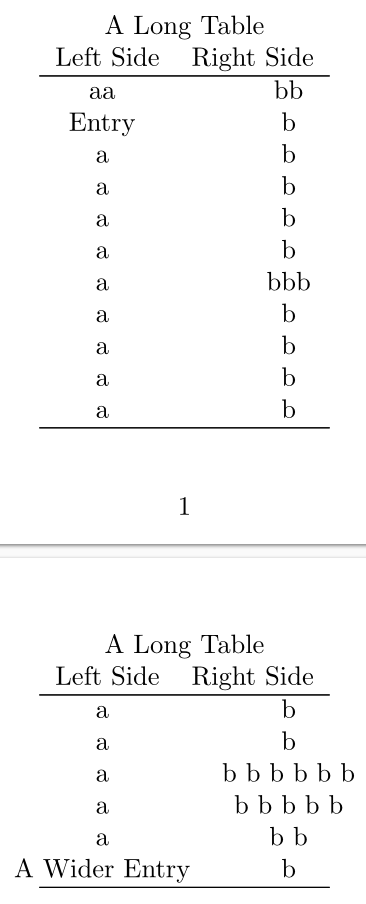{ width=70% }

### Table notes

Пакет *threeparttable* добавляет сноски к таблицам в виде пронумерованных заметок под основным содержимым.

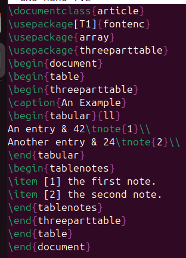{ width=70% }

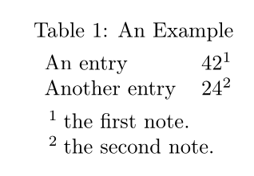{ width=70% }

### Typesetting in narrow columns

Показано сравнение разных способов выравнивания текста в узких колонках (left, raggedright, RaggedRight)

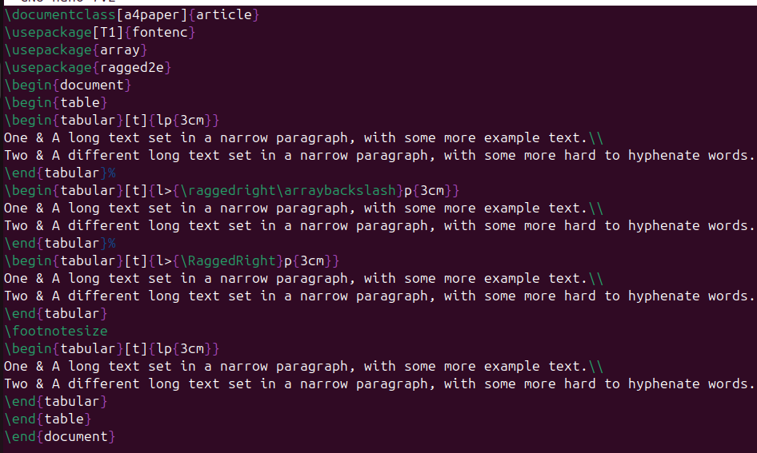{ width=70% }

{ width=70% }

### Vertical tricks

Комбинированные таблицы в ячейках (@{}c@{}) используются для вертикального совмещения текста и подписей.

{ width=70% }

{ width=70% }

### Line spacing in tables

Команда *setlength* изменяет высоту строк, что повышает читабельность таблицы.

{ width=70% }

{ width=70% }

# Выводы

Я изучил основные возможности LaTeX для создания и форматирования таблиц. Получены практические навыки использования пакетов *array*, *booktabs*, *tabularx*, *longtable*, *threeparttable* и *siunitx*. 
