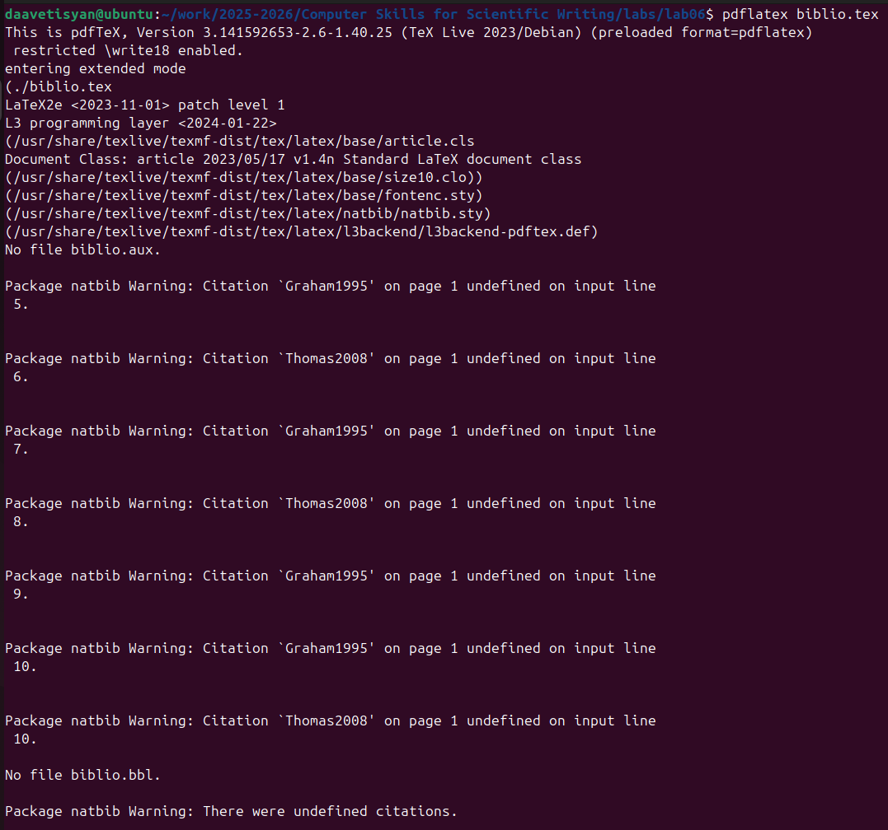
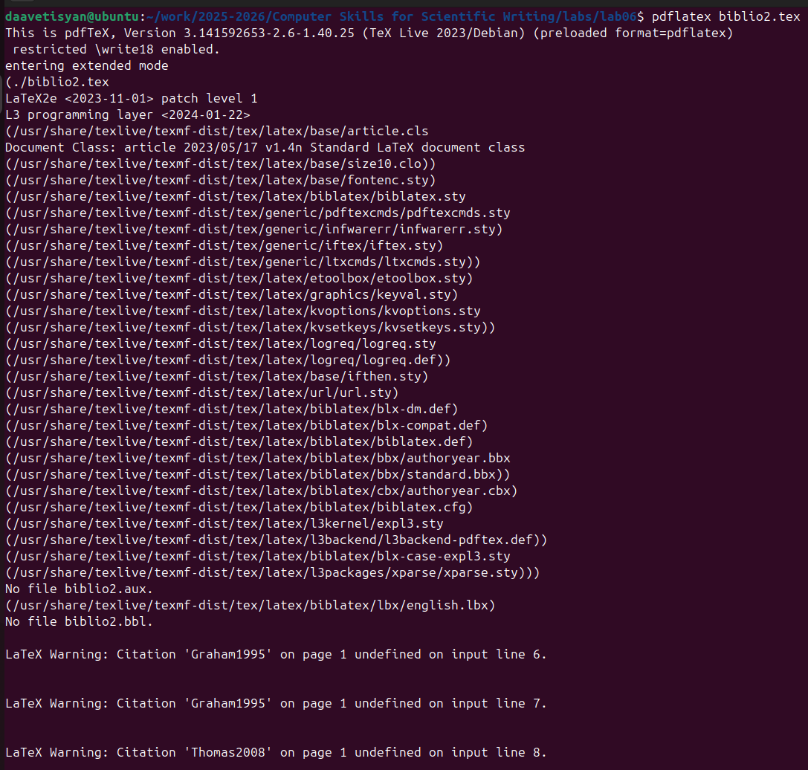

---
## Front matter
lang: ru-RU
title: Отчёт по лабораторной работе №6
author: Аветисян Давид Артурович
institute: РУДН, Москва, Россия

date: 22 Ноября 2025

## Formatting
toc: false
slide_level: 2
theme: metropolis
header-includes: 
 - \metroset{progressbar=frametitle,sectionpage=progressbar,numbering=fraction}
 - '\makeatletter'
 - '\beamer@ignorenonframefalse'
 - '\makeatother'
aspectratio: 43
section-titles: true
---

## Цель работы

- Изучить работу с библиографией. Освоить пакеты *natbib*, *biblatex* и инструменты *bibtex*, *biber*.

1. Reference databases.
2. The BibTeX workflow with natbib.
3. The biblatex workflow.

## Reference databases

- Первым делом мы создали файл *learnlatex.bib*, который является справочной базой данных. Он содержит несколько записей, по одной на каждую ссылку, и в каждой записи есть несколько полей.

{ width=70% }

## The BibTeX workflow with natbib

- Далее мы использовали нашу справочную базу данных с помощью пакета *natbib*.

{ width=70% }

## The BibTeX workflow with natbib

- После первой компиляции появились ошибки отсутствия библиографии.

{ width=70% }

## The BibTeX workflow with natbib

- Для созданий библиографии мы использовали инструмент *bibtex*.

{ width=70% }

## The BibTeX workflow with natbib

- После повторной компиляции pdf-файл создался безошибочно. 

{ width=70% }

## The biblatex workflow

- Затем мы использовали нашу справочную базу данных с помощью другого пакета - *biblatex*.

{ width=70% }

## The biblatex workflow

- Аналогично после первой компиляции появились ошибки отсутствия библиографии.

{ width=70% }

## The biblatex workflow

- Для созданий библиографии мы использовали другой инструмент *biber*.

{ width=70% }

## The biblatex workflow

- После повторной компиляции pdf-файл создался безошибочно. 

{ width=70% }

## Выводы

- Я изучил работу с библиографией. Освоил пакеты *natbib*, *biblatex* и инструменты *bibtex*, *biber*.
