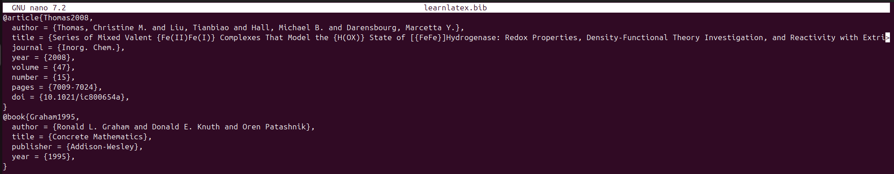
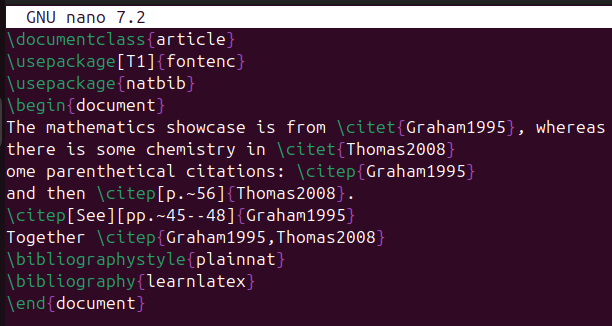
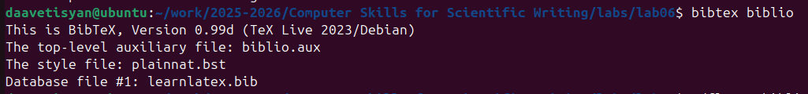
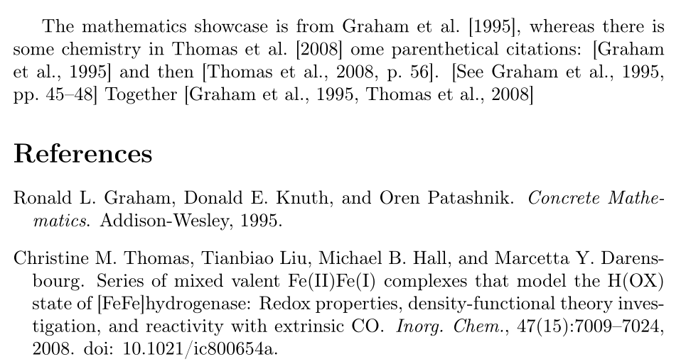
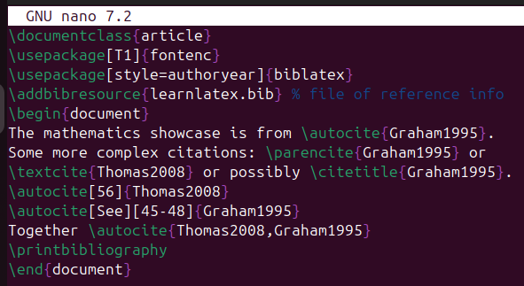
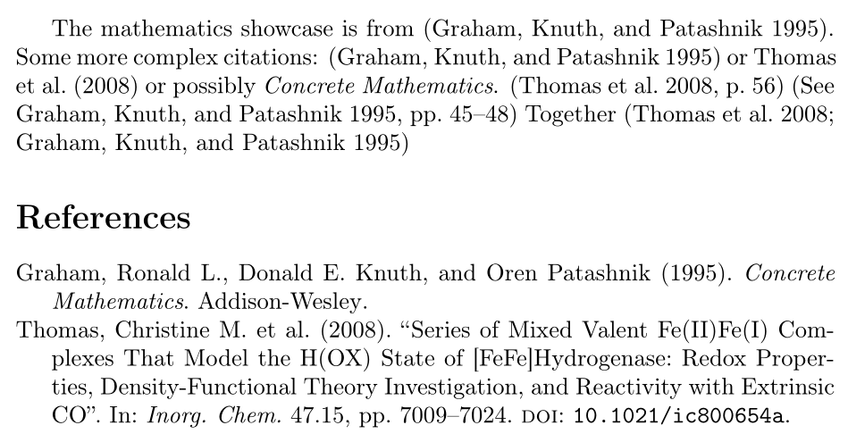

---
# Front matter
lang: ru-RU
title: "Лабораторная работа №6"
subtitle: "Дисциплина: Computer Skills for Scientific Writing"
author: "Аветисян Давид Артурович"

# Formatting
toc-title: "Содержание"
toc: true # Table of contents
toc_depth: 2
lof: true # Список рисунков
lot: true # Список таблиц
fontsize: 12pt
linestretch: 1.5
papersize: a4paper
documentclass: scrreprt
polyglossia-lang: russian
polyglossia-otherlangs: english
mainfont: PT Serif
romanfont: PT Serif
sansfont: PT Sans
monofont: PT Mono
mainfontoptions: Ligatures=TeX
romanfontoptions: Ligatures=TeX
sansfontoptions: Ligatures=TeX,Scale=MatchLowercase
monofontoptions: Scale=MatchLowercase
indent: true
pdf-engine: lualatex
header-includes:
  - \linepenalty=10 # the penalty added to the badness of each line within a paragraph (no associated penalty node) Increasing the value makes tex try to have fewer lines in the paragraph.
  - \interlinepenalty=0 # value of the penalty (node) added after each line of a paragraph.
  - \hyphenpenalty=50 # the penalty for line breaking at an automatically inserted hyphen
  - \exhyphenpenalty=50 # the penalty for line breaking at an explicit hyphen
  - \binoppenalty=700 # the penalty for breaking a line at a binary operator
  - \relpenalty=500 # the penalty for breaking a line at a relation
  - \clubpenalty=150 # extra penalty for breaking after first line of a paragraph
  - \widowpenalty=150 # extra penalty for breaking before last line of a paragraph
  - \displaywidowpenalty=50 # extra penalty for breaking before last line before a display math
  - \brokenpenalty=100 # extra penalty for page breaking after a hyphenated line
  - \predisplaypenalty=10000 # penalty for breaking before a display
  - \postdisplaypenalty=0 # penalty for breaking after a display
  - \floatingpenalty = 20000 # penalty for splitting an insertion (can only be split footnote in standard LaTeX)
  - \raggedbottom # or \flushbottom
  - \usepackage{float} # keep figures where there are in the text
  - \floatplacement{figure}{H} # keep figures where there are in the text
---

# Цель работы

Изучить работу с библиографией. Освоить пакеты *natbib*, *biblatex* и инструменты *bibtex*, *biber*.

# Задание

1. Reference databases.
2. The BibTeX workflow with natbib.
3. The biblatex workflow.

# Выполнение лабораторной работы

### Reference databases

Первым делом мы создали файл *learnlatex.bib*, который является справочной базой данных. Он содержит несколько записей, по одной на каждую ссылку, и в каждой записи есть несколько полей.

{ width=70% }

### The BibTeX workflow with natbib

Далее мы использовали нашу справочную базу данных с помощью пакета *natbib*.

{ width=70% }

После первой компиляции появились ошибки отсутствия библиографии.

{ width=70% }

Для созданий библиографии мы использовали инструмент *bibtex*.

{ width=70% }

После повторной компиляции pdf-файл создался безошибочно. 

{ width=70% }

{ width=70% }

### The biblatex workflow

Затем мы использовали нашу справочную базу данных с помощью другого пакета - *biblatex*.

{ width=70% }

Аналогично после первой компиляции появились ошибки отсутствия библиографии.

{ width=70% }

Для созданий библиографии мы использовали другой инструмент *biber*.

{ width=70% }

После повторной компиляции pdf-файл создался безошибочно. 

{ width=70% }

{ width=70% }

# Выводы

Я изучил работу с библиографией. Освоил пакеты *natbib*, *biblatex* и инструменты *bibtex*, *biber*.
