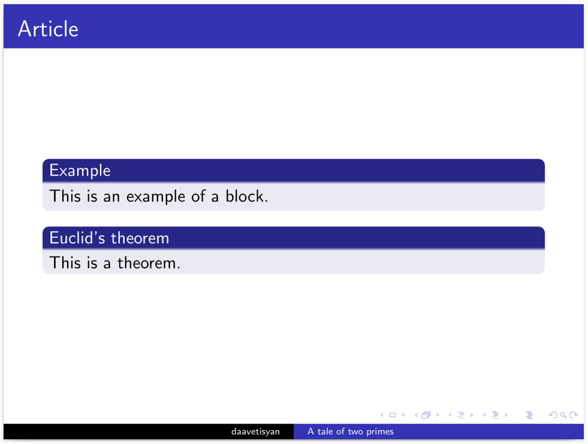
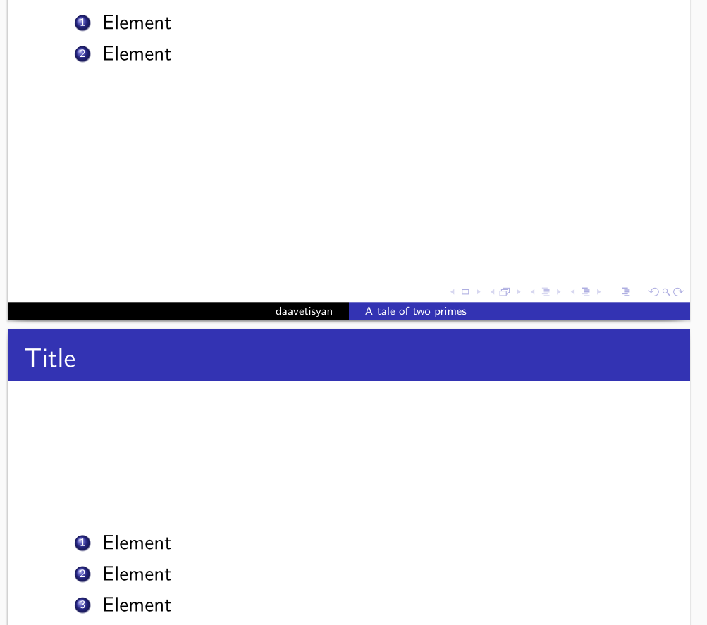
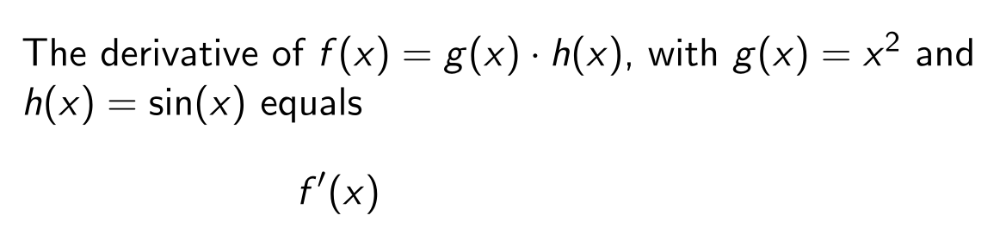
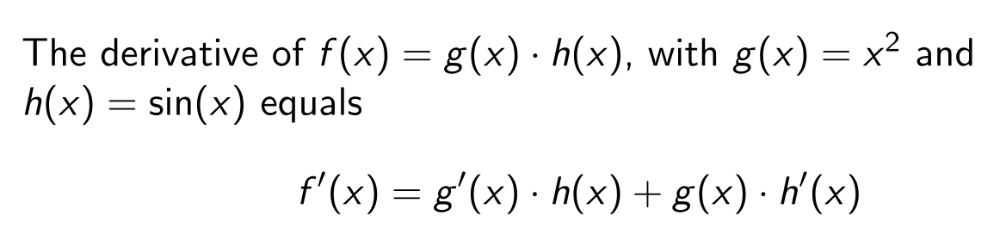
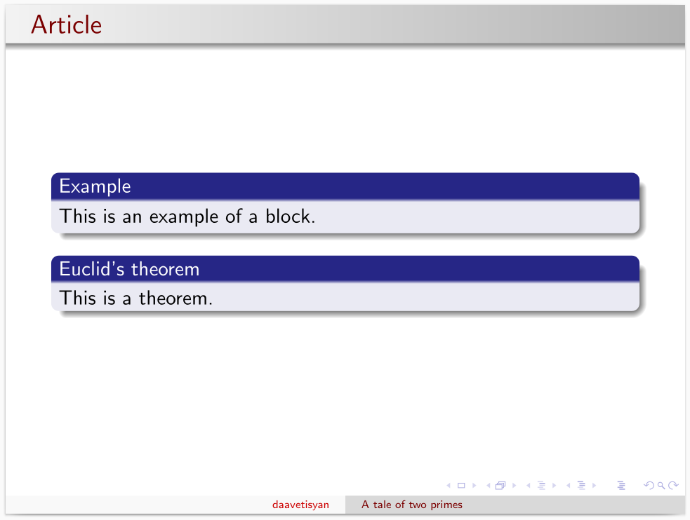
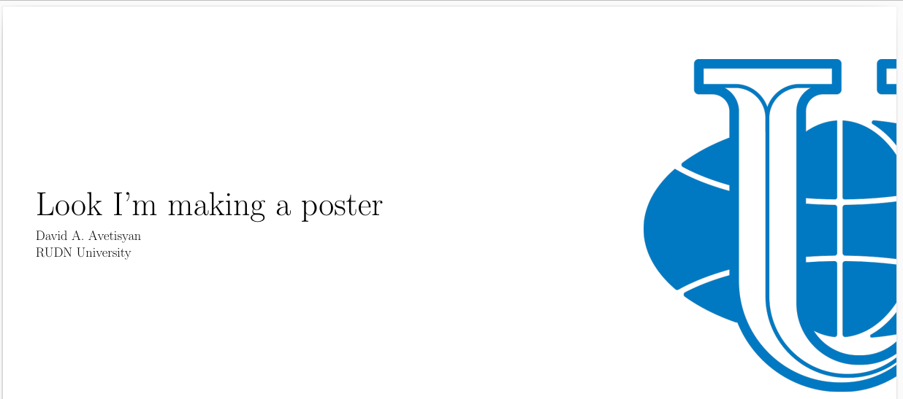

---
## Front matter
lang: ru-RU
title: Отчёт по лабораторной работе №7
author: Аветисян Давид Артурович
institute: РУДН, Москва, Россия

date: 4 Декабря 2025

## Formatting
toc: false
slide_level: 2
theme: metropolis
header-includes: 
 - \metroset{progressbar=frametitle,sectionpage=progressbar,numbering=fraction}
 - '\makeatletter'
 - '\beamer@ignorenonframefalse'
 - '\makeatother'
aspectratio: 43
section-titles: true
---

## Цель работы

- Научиться создавать презентации в LaTeX с помощью класса документа *beamer*, а также постеры с помощью методов *a0poster*, *beamerposter* и *tikzposter*.

1. Structure of a presentation.
2. Pauses.
3. Uncover.
4. Layout.
5. The a0poster documentclass.
6. The beamerposter package for the beamer documentclass.
7. The tikzposter documentclass.

## Structure of a presentation.

- В начале мы создали минимальную презентацию с двумя слайдами при помощи *frame*. 

{ width=70% }

## Structure of a presentation.

- Для разделения смысловых частей внутри одного слайда мы использовали *block*.

{ width=70% }

## Pauses.

- Для разделения блоков на несколько слайдов мы использовали команду *\\pause*. 

{ width=70% }

## Pauses.

- Для нумерованных блоков можно использовать *enumerate*.

{ width=70% }

## Uncover.

- С помощью команды *\\uncover* можно точно определить, когда будет отображаться каждая часть слайда. 

{ width=70% }

## Uncover.

- С помощью команды *\\uncover* можно точно определить, когда будет отображаться каждая часть слайда. 

{ width=70% }

## Uncover.

- С помощью команды *\\uncover* можно точно определить, когда будет отображаться каждая часть слайда. 

{ width=70% }

## Uncover.

- Также можно использовать *\\uncover* в среде *align*.

{ width=70% }

## Uncover.

- Также можно использовать *\\uncover* в среде *align*.

{ width=70% }

## Uncover.

- Также можно использовать *\\uncover* в среде *align*.

{ width=70% }

## Layout.

- В презентации можно менять тему и цвета.

{ width=70% }

## The a0poster documentclass.

- Для создания постеров мы использовали три класса документа. Первый класс *a0poster* очень похож на уже известный нам *article*. Для работы прописывается класс документа, загружается пакет *multicol* для работы со столбцами. В начале мы создали мини-страницу с названием и лого университета. 

{ width=70% }

## The a0poster documentclass.

- Также мы можем размещать на постер различные изображения, таблицы и рисунки. Но для этого мы не используем *figure*, а используем *center*. 

{ width=70% }

## The beamerposter package for the beamer documentclass.

- Постер, созданный с помощью пакет *beamerposter*, должен быть создан в документе *beamer*. Для работы прописывается класс документа, а также можно поменять тему и цвета, как мы это делали для презентаций. Обязательно необходимо прописать исполользование пакета *beamerposter*. Задаём название, автора и университет. 

{ width=70% }

## The tikzposter documentclass.

- И последний метод - использование класса *tikzposter*. Аналогично остальным прописывается класс документа, может быт ьиспользована тема, задаётся название, автор и университет. 

{ width=70% }

## The tikzposter documentclass.

- Любой контент, который мы хотим разместить на постере, должен быть заключён в команду *\\block*. Аналогично классу *a0poster* для размещения различных изображений, таблиц и рисунков мы используем *center*. 

{ width=70% }

## Выводы

- Я научился создавать презентации в LaTeX с помощью класса документа *beamer*, а также постеры с помощью методов *a0poster*, *beamerposter* и *tikzposter*.
