---
# Front matter
lang: ru-RU
title: "Лабораторная работа №7"
subtitle: "Дисциплина: Computer Skills for Scientific Writing"
author: "Аветисян Давид Артурович"

# Formatting
toc-title: "Содержание"
toc: true # Table of contents
toc_depth: 2
lof: true # Список рисунков
lot: true # Список таблиц
fontsize: 12pt
linestretch: 1.5
papersize: a4paper
documentclass: scrreprt
polyglossia-lang: russian
polyglossia-otherlangs: english
mainfont: PT Serif
romanfont: PT Serif
sansfont: PT Sans
monofont: PT Mono
mainfontoptions: Ligatures=TeX
romanfontoptions: Ligatures=TeX
sansfontoptions: Ligatures=TeX,Scale=MatchLowercase
monofontoptions: Scale=MatchLowercase
indent: true
pdf-engine: lualatex
header-includes:
  - \linepenalty=10 # the penalty added to the badness of each line within a paragraph (no associated penalty node) Increasing the value makes tex try to have fewer lines in the paragraph.
  - \interlinepenalty=0 # value of the penalty (node) added after each line of a paragraph.
  - \hyphenpenalty=50 # the penalty for line breaking at an automatically inserted hyphen
  - \exhyphenpenalty=50 # the penalty for line breaking at an explicit hyphen
  - \binoppenalty=700 # the penalty for breaking a line at a binary operator
  - \relpenalty=500 # the penalty for breaking a line at a relation
  - \clubpenalty=150 # extra penalty for breaking after first line of a paragraph
  - \widowpenalty=150 # extra penalty for breaking before last line of a paragraph
  - \displaywidowpenalty=50 # extra penalty for breaking before last line before a display math
  - \brokenpenalty=100 # extra penalty for page breaking after a hyphenated line
  - \predisplaypenalty=10000 # penalty for breaking before a display
  - \postdisplaypenalty=0 # penalty for breaking after a display
  - \floatingpenalty = 20000 # penalty for splitting an insertion (can only be split footnote in standard LaTeX)
  - \raggedbottom # or \flushbottom
  - \usepackage{float} # keep figures where there are in the text
  - \floatplacement{figure}{H} # keep figures where there are in the text
---

# Цель работы

Научиться создавать презентации в LaTeX с помощью класса документа *beamer*, а также постеры с помощью методов *a0poster*, *beamerposter* и *tikzposter*.

# Задание

1. Structure of a presentation.
2. Pauses.
3. Uncover.
4. Layout.
5. The a0poster documentclass.
6. The beamerposter package for the beamer documentclass.
7. The tikzposter documentclass.

# Выполнение лабораторной работы

### Structure of a presentation.

В начале мы создали минимальную презентацию с двумя слайдами при помощи *frame*. 

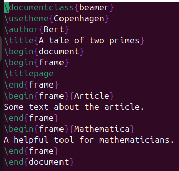{ width=70% }

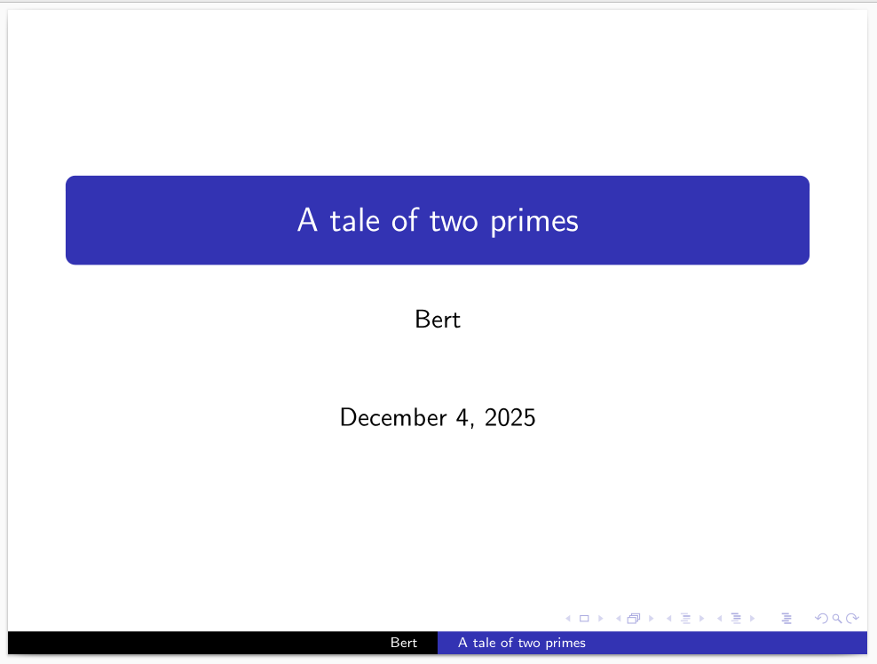{ width=70% }

Для разделения смысловых частей внутри одного слайда мы использовали *block*.

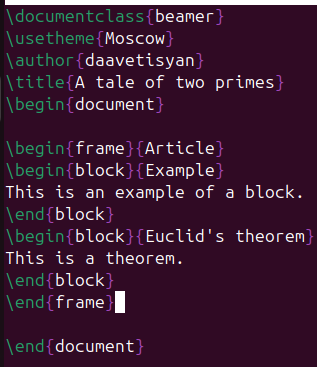{ width=70% }

{ width=70% }

### Pauses.

Для разделения блоков на несколько слайдов мы использовали команду *\\pause*. Это сделано для того, чтобы информация на слайде появлялась постепенно, а не вся сразу.

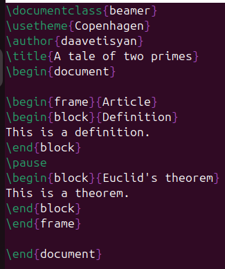{ width=70% }

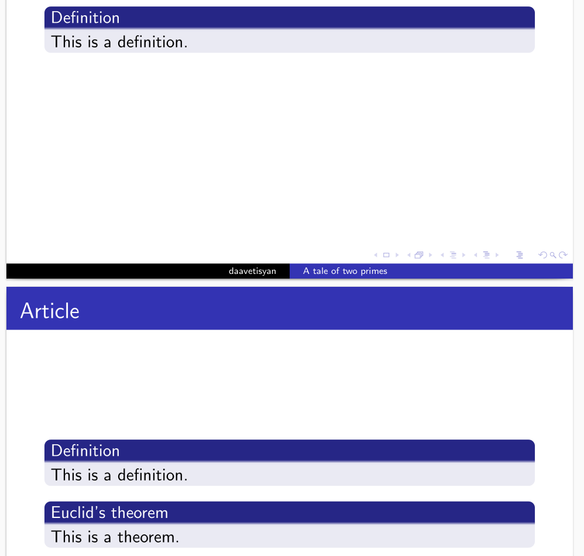{ width=70% }

Для нумерованных блоков можно использовать *enumerate*.

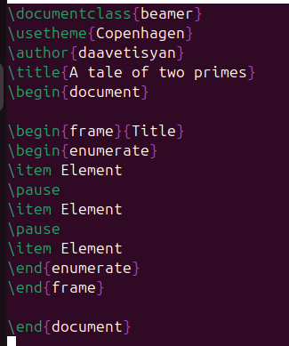{ width=70% }

{ width=70% }

### Uncover.

С помощью команды *\\uncover* можно точно определить, когда будет отображаться каждая часть слайда. На скриншотах видно, как информация на слайде появляется постепенно.

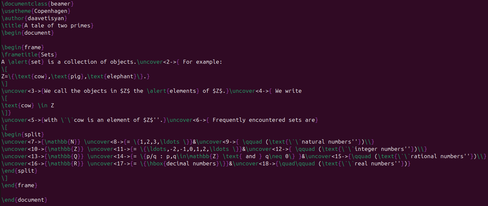{ width=70% }

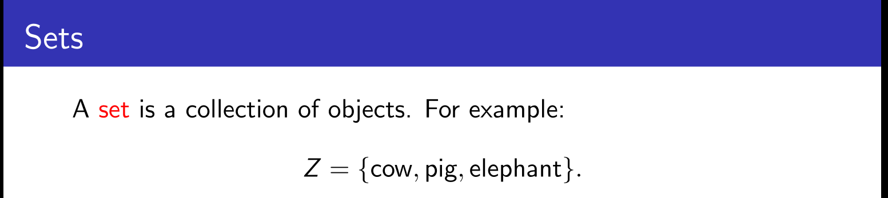{ width=70% }

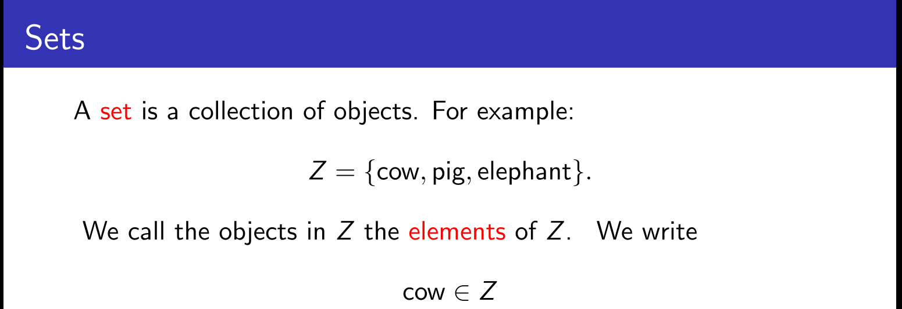{ width=70% }

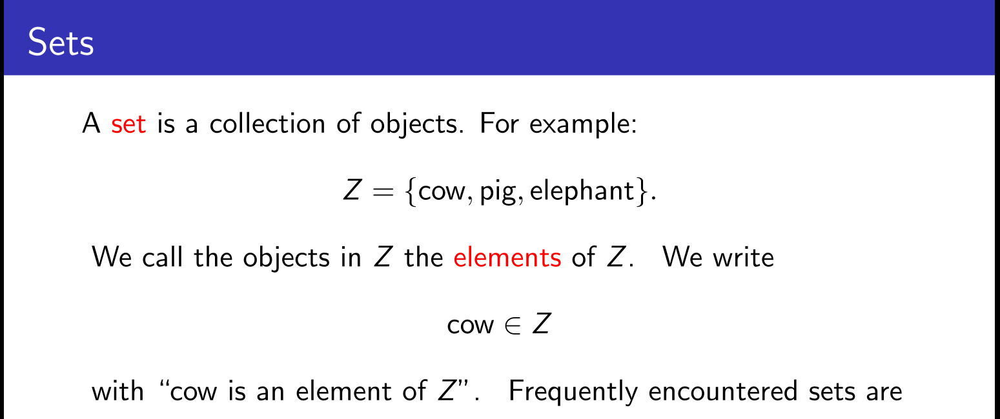{ width=70% }

Также можно использовать *\\uncover* в среде *align*.

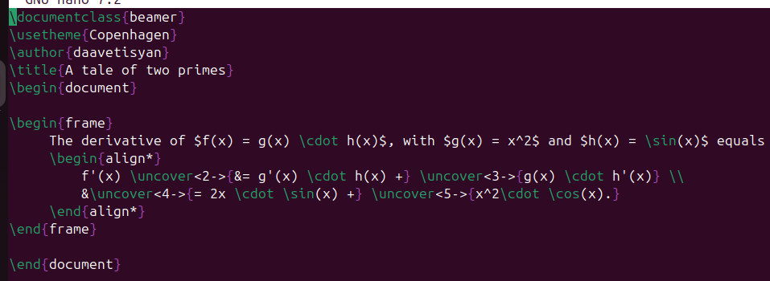{ width=70% }

{ width=70% }

{ width=70% }

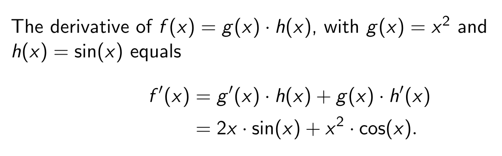{ width=70% }

### Layout.

В презентации можно менять тему и цвета.

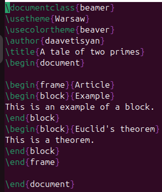{ width=70% }

{ width=70% }

### The a0poster documentclass.

Для создания постеров мы использовали три класса документа. Первый класс *a0poster* очень похож на уже известный нам *article*. Для работы прописывается класс документа, загружается пакет *multicol* для работы со столбцами. В начале мы создали мини-страницу с названием и лого университета. 

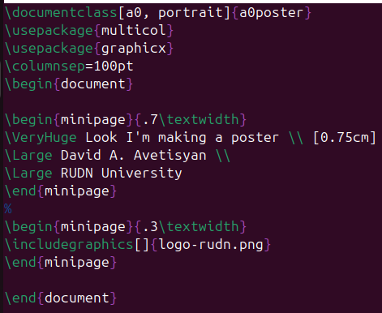{ width=70% }

{ width=70% }

Также мы можем размещать на постер различные изображения, таблицы и рисунки. Но для этого мы не используем *figure*, а используем *center*. 

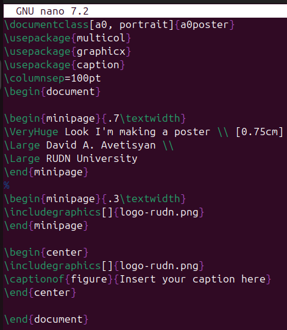{ width=70% }

{ width=70% }

### The beamerposter package for the beamer documentclass.

Постер, созданный с помощью пакет *beamerposter*, должен быть создан в документе *beamer*. Для работы прописывается класс документа, а также можно поменять тему и цвета, как мы это делали для презентаций. Обязательно необходимо прописать исполользование пакета *beamerposter*. Задаём название, автора и университет. 

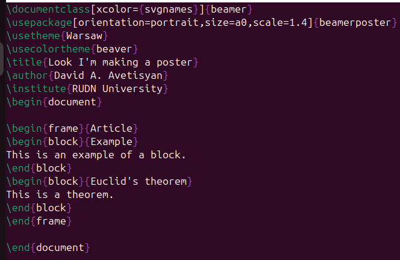{ width=70% }

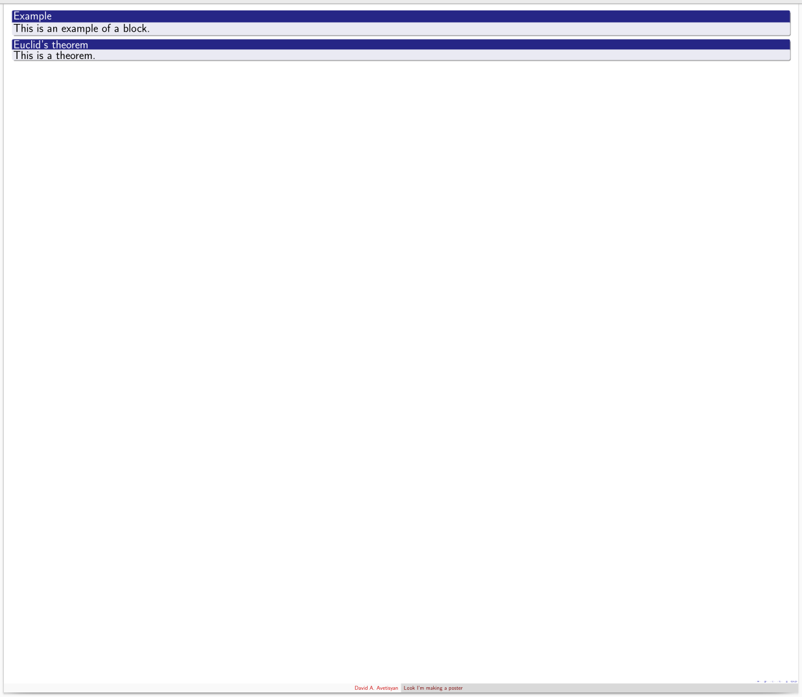{ width=70% }

### The tikzposter documentclass.

И последний метод - использование класса *tikzposter*. Аналогично остальным прописывается класс документа, может быт ьиспользована тема, задаётся название, автор и университет. 

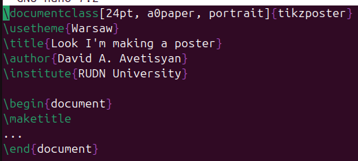{ width=70% }

{ width=70% }

Любой контент, который мы хотим разместить на постере, должен быть заключён в команду *\\block*. Аналогично классу *a0poster* для размещения различных изображений, таблиц и рисунков мы используем *center*. 

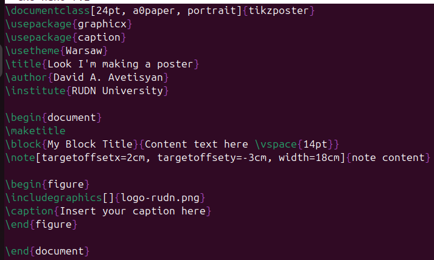{ width=70% }

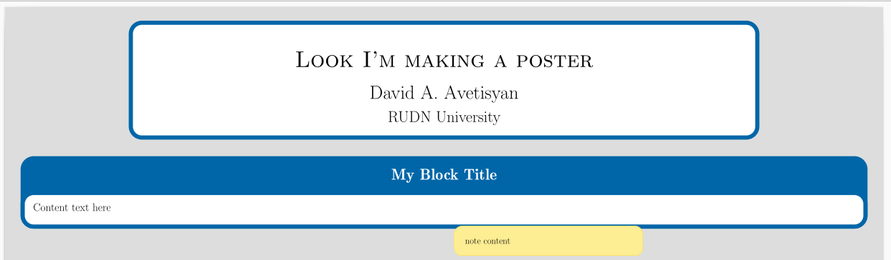{ width=70% }

# Выводы

Я научился создавать презентации в LaTeX с помощью класса документа *beamer*, а также постеры с помощью методов *a0poster*, *beamerposter* и *tikzposter*.
