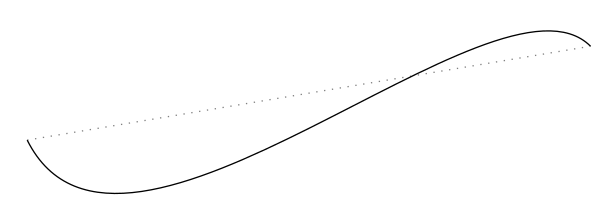
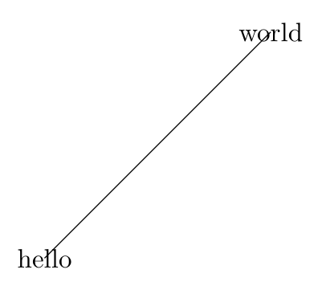
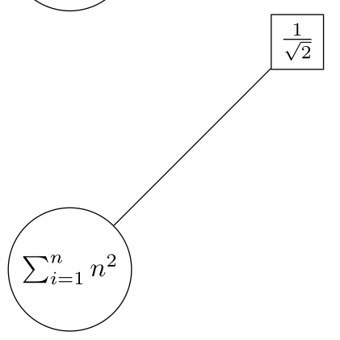

---
## Front matter
lang: ru-RU
title: Отчёт по лабораторной работе №8
author: Аветисян Давид Артурович
institute: РУДН, Москва, Россия

date: 20 Декабря 2025

## Formatting
toc: false
slide_level: 2
theme: metropolis
header-includes: 
 - \metroset{progressbar=frametitle,sectionpage=progressbar,numbering=fraction}
 - '\makeatletter'
 - '\beamer@ignorenonframefalse'
 - '\makeatother'
aspectratio: 43
section-titles: true
---

## Цель работы

- Изучить основы построения графиков в LaTeX с помощью *tikz*, освоить задание путей, узлов, подписей и стилей, а также реализовать примеры и упражнения с использованием циклов и рекурсивных функций (*tikzmath*).
1. Drawing lines.
2. Nodes.
3. Plotting curves.
4. Working with loops.

## Drawing lines.

- В начале мы построили ломаную с использованием декартовых и полярных координат.

{ width=70% }

## Drawing lines.

- Далее мы использовали угловое соединения угловые соединения -| и стрелки.

{ width=70% }

## Drawing lines.

- После мы сравнили прямое соединение и кривые Безье.

{ width=70% }

## Drawing lines.

- Затем мы построили кривую с двумя контрольным точками.

{ width=70% }

## Nodes.

- Потом мы перешли к узлам. Мы сделали подписи в начале и в конце линии.

{ width=70% }

## Nodes.

- Далее мы поработали с позиционированием подписей.

{ width=70% }

## Nodes.

- Затем мы использовали математические формулы внутри узлов.

{ width=70% }

## Nodes.

- В конце мы использовали всё изученное: узлы, стрелки и стили линий.

{ width=70% }

## Plotting curves.

- После мы попробовали построить графики функций. Парабола:

{ width=70% }

## Plotting curves.

- График косинуса:

{ width=70% }

## Working with loops.

- Затем мы использовали циклы для генерации серии окружностей.

{ width=70% }

## Working with loops.

- А также различные итеративные треугольники.

{ width=70% }

## Выводы

- Я изучил основы построения графиков в LaTeX с помощью *tikz*, освоил задание путей, узлов, подписей и стилей, а также реализовал примеры и упражнения с использованием циклов и рекурсивных функций (*tikzmath*).
