---
# Front matter
lang: ru-RU
title: "Лабораторная работа №8"
subtitle: "Дисциплина: Computer Skills for Scientific Writing"
author: "Аветисян Давид Артурович"

# Formatting
toc-title: "Содержание"
toc: true # Table of contents
toc_depth: 2
lof: true # Список рисунков
lot: true # Список таблиц
fontsize: 12pt
linestretch: 1.5
papersize: a4paper
documentclass: scrreprt
polyglossia-lang: russian
polyglossia-otherlangs: english
mainfont: PT Serif
romanfont: PT Serif
sansfont: PT Sans
monofont: PT Mono
mainfontoptions: Ligatures=TeX
romanfontoptions: Ligatures=TeX
sansfontoptions: Ligatures=TeX,Scale=MatchLowercase
monofontoptions: Scale=MatchLowercase
indent: true
pdf-engine: lualatex
header-includes:
  - \linepenalty=10 # the penalty added to the badness of each line within a paragraph (no associated penalty node) Increasing the value makes tex try to have fewer lines in the paragraph.
  - \interlinepenalty=0 # value of the penalty (node) added after each line of a paragraph.
  - \hyphenpenalty=50 # the penalty for line breaking at an automatically inserted hyphen
  - \exhyphenpenalty=50 # the penalty for line breaking at an explicit hyphen
  - \binoppenalty=700 # the penalty for breaking a line at a binary operator
  - \relpenalty=500 # the penalty for breaking a line at a relation
  - \clubpenalty=150 # extra penalty for breaking after first line of a paragraph
  - \widowpenalty=150 # extra penalty for breaking before last line of a paragraph
  - \displaywidowpenalty=50 # extra penalty for breaking before last line before a display math
  - \brokenpenalty=100 # extra penalty for page breaking after a hyphenated line
  - \predisplaypenalty=10000 # penalty for breaking before a display
  - \postdisplaypenalty=0 # penalty for breaking after a display
  - \floatingpenalty = 20000 # penalty for splitting an insertion (can only be split footnote in standard LaTeX)
  - \raggedbottom # or \flushbottom
  - \usepackage{float} # keep figures where there are in the text
  - \floatplacement{figure}{H} # keep figures where there are in the text
---

# Цель работы

Изучить основы построения графиков в LaTeX с помощью *tikz*, освоить задание путей, узлов, подписей и стилей, а также реализовать примеры и упражнения с использованием циклов и рекурсивных функций (*tikzmath*).

# Задание

1. Drawing lines.
2. Nodes.
3. Plotting curves.
4. Working with loops.

# Выполнение лабораторной работы

### Drawing lines.

В начале мы построили ломаную с использованием декартовых и полярных координат.

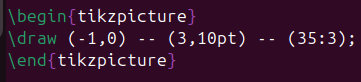{ width=70% }

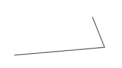{ width=70% }

Далее мы использовали угловое соединения угловые соединения -| и стрелки.

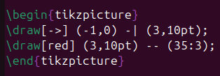{ width=70% }

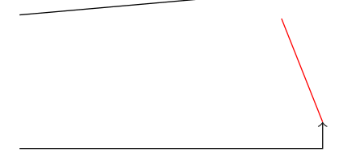{ width=70% }

После мы сравнили прямое соединение и кривые Безье.

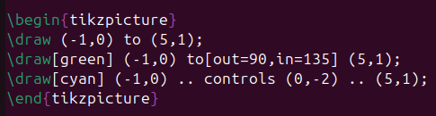{ width=70% }

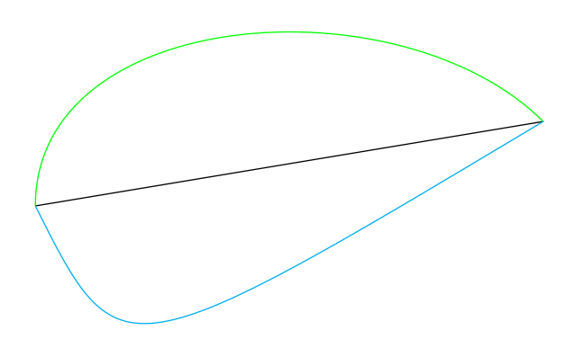{ width=70% }

Затем мы построили кривую с двумя контрольным точками.

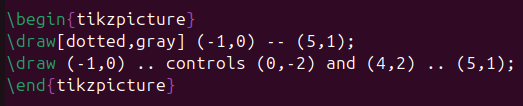{ width=70% }

{ width=70% }

### Nodes.

Потом мы перешли к узлам. Мы сделали подписи в начале и в конце линии.

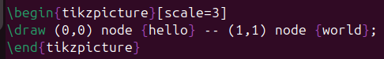{ width=70% }

{ width=70% }

Далее мы поработали с позиционированием подписей.

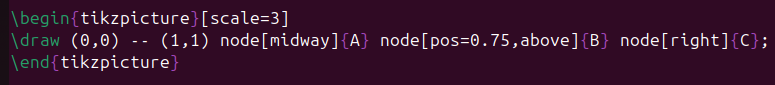{ width=70% }

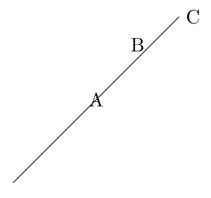{ width=70% }

Затем мы использовали математические формулы внутри узлов.

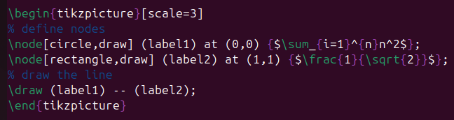{ width=70% }

{ width=70% }

В конце мы использовали всё изученное: узлы, стрелки и стили линий.

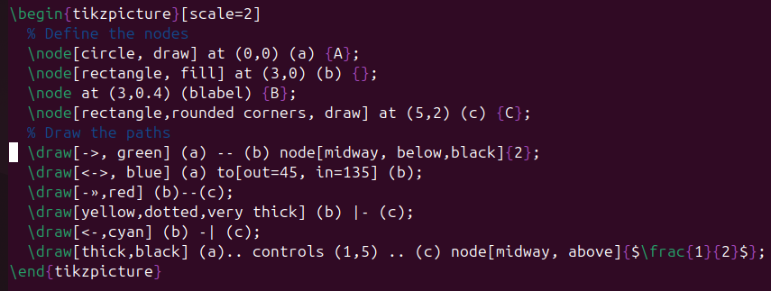{ width=70% }

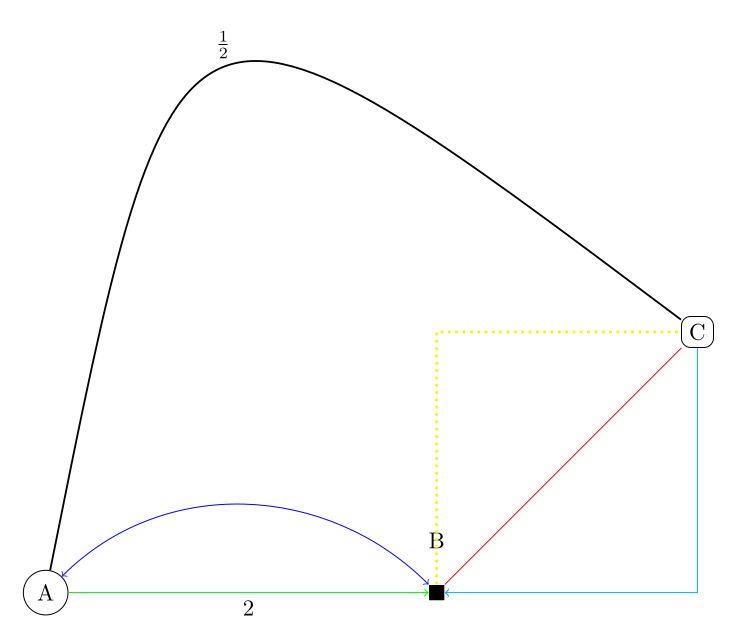{ width=70% }

### Plotting curves.

После мы попробовали построить графики функций. Парабола:

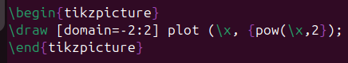{ width=70% }

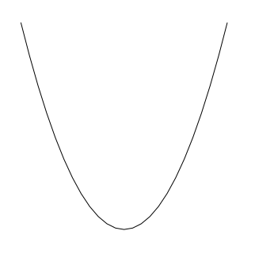{ width=70% }

График косинуса:

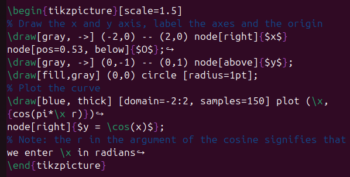{ width=70% }

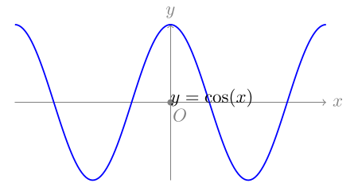{ width=70% }

### Working with loops.

Затем мы использовали циклы для генерации серии окружностей.

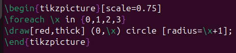{ width=70% }

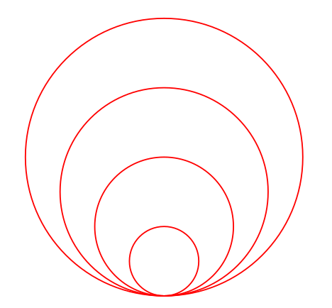{ width=70% }

А также различные итеративные треугольники.

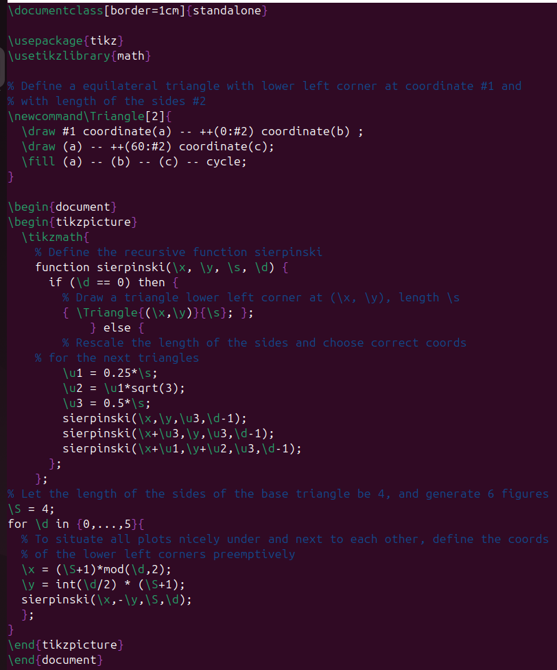{ width=70% }

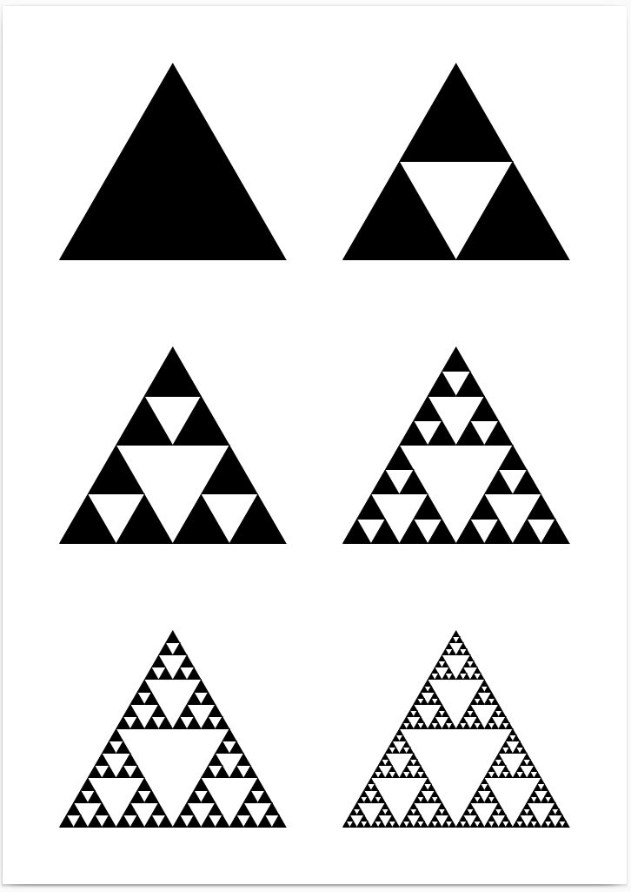{ width=70% }

# Выводы

Я изучил основы построения графиков в LaTeX с помощью *tikz*, освоил задание путей, узлов, подписей и стилей, а также реализовал примеры и упражнения с использованием циклов и рекурсивных функций (*tikzmath*).
