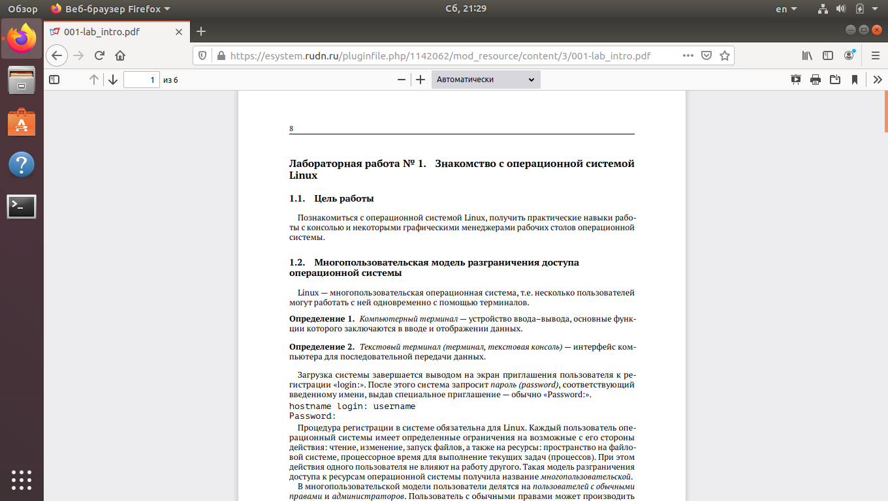

---
## Front matter
lang: ru-RU
title: Отчёт по лабораторной работе №4
author: Аветисян Давид Артурович
institute: РУДН, Москва, Россия
date: 15 мая 2021

## Formatting
toc: false
slide_level: 2
theme: metropolis
header-includes: 
 - \metroset{progressbar=frametitle,sectionpage=progressbar,numbering=fraction}
 - '\makeatletter'
 - '\beamer@ignorenonframefalse'
 - '\makeatother'
aspectratio: 43
section-titles: true
---

## Цель работы

Познакомиться с операционной системой Linux, получить практические навыки работы с консолью и некоторыми графическими менеджерами рабочих столов операционной системы.

## Ознакомление с теоретическим материалом

Ознакомился с теоретическим материалом, представленном в лабораторной работе №4 на ТУИСе (рис. -@fig:001).

{ #fig:001 width=70% }

## Выполнение заданий 2-7 лабораторной работы

- Загрузил компьютер. 
- Перешёл на текстовую консоль. На моём компьютере доступно 6 текстовых консолей. 
- Научился перемещаться между текстовыми консолями. 
- Зарегистрировался в текстовой консоли операционной системы. 
- Завершил консольный сеанс. 
- Переключился на графический интерфейс. 

## Ознакомиление с менеджером графических столов

Ознакомился с менеджером графических столов. Менеджер, запускаемый по умолчанию - Ubuntu (рис. -@fig:002).

{ #fig:002 width=70% }

## Регистрация в разных графических менеджерах рабочих столов

Поочерёдно зарегистрировался в разных графических менеджерах рабочих столов: GNOME, KDE, XFCE (рис. -@fig:003). Так же зарегистрировалась в оконном менеджере Openbox. В данном оконном менеджере нельзя сделать скриншот (разница с остальными графическими менеджерами состоит в том, что в самом начале сеанса открывается "Чёрный экран"). 

{ #fig:003 width=70% }

## Графические менеджеры на моём компьютере

На моём компьютере установлены следующие графические менеджеры: 
- GNOME;
- GNOME на Xorg;
- Openbox;
- Ubuntu;
- Plasma;
- Plasma (Wayland);
- Сеанс.
- Сеанс Xfce.

## Изучение списка установленных программ

Изучил список установленных программ. Обратил внимание на предпочтительные программы для разных применений (рис. -@fig:004).

{ #fig:004 }

## Вывод

В ходе выполнения данной лабораторной работы я познакомился с операционной системой Linux, получил практические навыки работы с консолью и некоторыми графическими менеджерами рабочих столов операционной системы.

## {.standout}

Спасибо за внимание!
