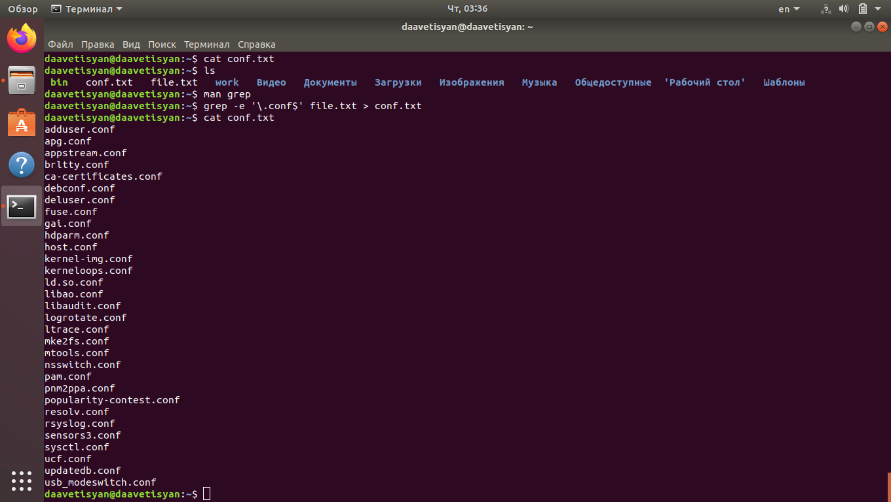

---
## Front matter
lang: ru-RU
title: Отчёт по лабораторной работе №7
author: Аветисян Давид Артурович
institute: РУДН, Москва, Россия
date: 14 мая 2021

## Formatting
toc: false
slide_level: 2
theme: metropolis
header-includes: 
 - \metroset{progressbar=frametitle,sectionpage=progressbar,numbering=fraction}
 - '\makeatletter'
 - '\beamer@ignorenonframefalse'
 - '\makeatother'
aspectratio: 43
section-titles: true
---

## Цель работы

Ознакомление с инструментами поиска файлов и фильтрации текстовых данных. Приобретение практических навыков: по управлению процессами (и заданиями), по проверке использования диска и обслуживанию файловых систем.

## Записываем названия файлов, содержащихся в каталоге /etc

Для того, чтобы записать в файл file.txt названия файлов, содержащихся в каталоге /etc, использую команду «ls –a /etc > file.txt» (рис. -@fig:001).

{ #fig:001 width=70% }

## Вывожу имена файлов, имеющих расширение .conf

Вывожу имена всех файлов из file.txt, имеющих расширение .conf и записываю их в новый текстовой файл conf.txt с помощью команды «grep -e ‘\.conf$’ file.txt > conf.txt» (рис. -@fig:002).

{ #fig:002 width=70% }

## Определем, какие файлы начинаются с символа c

Определить, какие файлы в моем домашнем каталоге имеют имена, начинающиеся с символа c, можно несколькими командами, например: «find ~ -maxdepth 1 -name “c*” -print» (рис. -@fig:003).

{ #fig:003 width=70% }

## Вывод на экран (постранично) файлы, начинающиеся с символа h

Чтобы вывести на экран (постранично) имена файлов из каталога /etc, начинающиеся с символа h, воспользуемся командой «find /etc –maxdepth 1 –name “h*” | less» (рис. -@fig:004).

{ #fig:004 width=70% }

## Запускаем в фоновом режиме процесс, который запишет файлы, начинающиеся с log

Запускаю в фоновом режиме процесс, который будет записывать в файл ~/logfile файлы, имена которых начинаются с log, используя команду «find / -name “log*” > logfile &» (рис. -@fig:005).

{ #fig:005 width=70% }

## Запускаю редактор gedit в фоновом режиме

Запускаю редактор gedit в фоновом режиме командой «gedit &» (рис. -@fig:006). После этого на экране появляется окно редактора.

{ #fig:006 width=70% }

## Определяем идентификатор процесса gedit

Чтобы определить идентификатор процесса gedit, использую команду «ps | grep -i “gedit”». Наш процесс имеет PID 518 (рис. -@fig:007).

{ #fig:007 width=70% }

## Используем kill для завершения процесса gedit

Прочитав информацию о команде kill с помощью команды «man kill», использую её для завершения процесса gedit (команда «kill 518») (рис. -@fig:008).

{ #fig:008 width=70% }

## Используем df и du

C помощью команд «man df» и «man du» узнаю информацию по необходимым командам и далее использую их (рис. -@fig:009).

{ #fig:009 width=70% }

## Вывод имен всех директорий, имеющихся в домашнем каталоге

Получаем информацию с помощью команды «man find» и выводим имена всех директорий, имеющихся в домашнем каталоге с помощью команды «find ~ -type d» (рис. -@fig:010).

{ #fig:010 width=70% }

## Вывод

В ходе выполнения данной лабораторной работы я изучил инструменты поиска файлов и фильтрации текстовых данных, а также
приобрёл практические навыки: по управлению процессами (и заданиями), по проверке использования диска и обслуживанию файловых систем.

## {.standout}

Спасибо за внимание!
