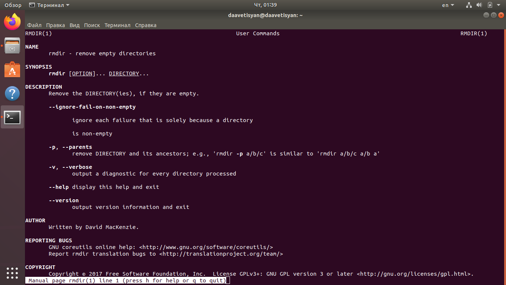
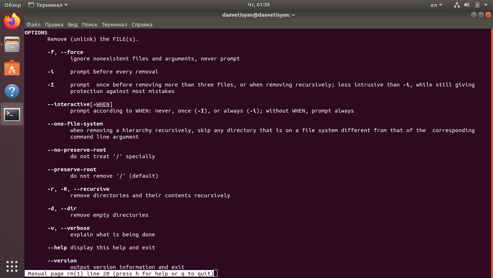

---
## Front matter
lang: ru-RU
title: Отчёт по лабораторной работе №5
author: Аветисян Давид Артурович
institute: РУДН, Москва, Россия
date: 14 мая 2021

## Formatting
toc: false
slide_level: 2
theme: metropolis
header-includes: 
 - \metroset{progressbar=frametitle,sectionpage=progressbar,numbering=fraction}
 - '\makeatletter'
 - '\beamer@ignorenonframefalse'
 - '\makeatother'
aspectratio: 43
section-titles: true
---

## Цель работы

Приобретение практических навыков взаимодействия пользователя с системой посредством командной строки.

## Определяем полное имя домашнего каталога

Используем команду «pwd» (рис. -@fig:001).

{ #fig:001 width=70% }

## Переход в каталог /tmp

«ls» − выводится список каталогов и файлов, которые можно увидеть,«вручную» открыв каталог tmp  
«ls -a» − к списку, описанному в предыдущем пункте, добавляются скрытые каталоги и файлы (их имена начинаются с точки)  
«ls -F» − с помощью этой команды получаем информацию о типах файлов  
«ls -l» − получаем список каталогов и файлов, но уже с более подробной информацией о них  
«ls -aFl» − данная команда отобразит список всех каталогов и файлов, в том числе и скрытых, с подробной информацией о них.

## Есть ли в каталоге /var/spool подкаталог с именем cron?

   Перейдем в указанный каталог с помощью команды «cd /var/spool», просмотрим его содержимое, используя команду «ls» (рис. -@fig:002).

{ #fig:002 width=70% }

## Вывод на экран содержимого домашнего каталога

   Далее перехожу в свой домашний каталог с помощью команды «cd ~» и, используя команду «ls -aFl», вывожу на экран его содержимое (рис. -@fig:003).

{ #fig:003 width=70% }

## 3 пункт задания

Создаем новый каталог newdir. Cоздаем каталог morefun. Cоздаем каталоги letters, memos и misk (рис. -@fig:004). Пробуем удалить каталог newdir. Удаляем каталог newdir/morefun.

{ #fig:004 width=70% }

## Используем команду «man ls»

Определяем, какую опцию команды ls необходимо использовать, чтобы просмотреть содержимое не тольк указанного каталога, но и подкаталогов, входящих в него (рис. -@fig:005).

{ #fig:005 width=70% }

## Используем команду man для других команд

Используя команды «man cd», «man pwd», «man mkdir», «man rmdir», «man rm», просматриваю описание соответствующих команд. Команда cd не имеет дополнительных опций.

## Команда pwd

Описание команды pwd (рис. -@fig:006).

{ #fig:006 width=70% }

## Команда mkdir

Описание команды mkdir (рис. -@fig:007).

{ #fig:007 width=70% }

## Команда rmdir

Описание команды rmdir (рис. -@fig:008).

{ #fig:008 width=70% }

## Команда rm 

Описание команды rm (рис. -@fig:009).

{ #fig:009 width=70% }

## История команд

Выведем историю команд с помощью команды «history» (рис. -@fig:010).

{ #fig:010 width=70% }

## Вывод

В ходе выполнения данной лабораторной работы я приобрёл практические навыки взаимодействия с системой посредством командной строки.

## {.standout}

Спасибо за внимание!
