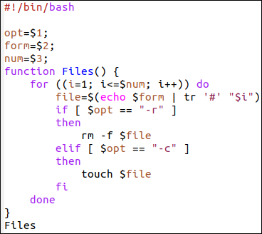
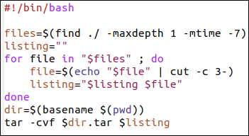

---
## Front matter
lang: ru-RU
title: Отчёт по лабораторной работе №12
author: Аветисян Давид Артурович
institute: РУДН, Москва, Россия
date: 29 мая 2021

## Formatting
toc: false
slide_level: 2
theme: metropolis
header-includes: 
 - \metroset{progressbar=frametitle,sectionpage=progressbar,numbering=fraction}
 - '\makeatletter'
 - '\beamer@ignorenonframefalse'
 - '\makeatother'
aspectratio: 43
section-titles: true
---

## Цель работы

Изучить основы программирования в оболочке ОС UNIX. Научится писать более сложные командные файлы с использованием логических управляющих конструкций и циклов.

## Написал первый скрипт

Используя команды getopts grep, написал командный файл, который анализирует командную строку с заданными ключами. Для данной задачи я создал файл prog1.sh и написал соответствующие скрипты (рис. -@fig:001)

{ #fig:001 width=70% }

## Написал второй скрипт

Написал на языке Си программу, которая вводит число и определяет, является ли оно больше нуля, меньше нуля или равно нулю. Затем программа завершается с помощью функции exit(n), передавая информацию в о коде завершения в оболочку. Командный файл должен вызывать эту программу и, проанализировав с помощью команды $?, выдать сообщение о том, какое число было введено. Для данной задачи я создал 2 файла: prog2.c и prog2.sh и написал соответствующие скрипты (рис. -@fig:002).

{ #fig:002 width=70% }

## Написал третий скрипт

Написал командный файл, создающий указанное число файлов, пронумерованных последовательно от 1 до N (например 1.tmp, 2.tmp, 3.tmp, 4.tmp и т.д.). Число файлов, которые необходимо создать, передаётся в аргументы командной строки. Этот же командный файл должен уметь удалять все созданные им файлы (если они существуют). Для данной задачи я создал файл: prog3.sh и написал соответствующий скрипт (рис. -@fig:003).

{ #fig:003 width=70% }

## Написал четвёртый скрипт

Написал командный файл, который с помощью команды tar запаковывает в архив все файлы в указанной директории. Модифицировала его так, чтобы запаковывались только те файлы, которые были изменены менее недели тому назад (использовать команду find). Для данной задачи я создал файл: prog4.sh и написал соответствующий скрипт (рис. -@fig:004).

{ #fig:004 width=70% }

## Вывод

В ходе выполнения данной лабораторной работы я изучил основы программирования в оболочке ОС UNIX и научился писать более сложные командные файлы с использованием логических управляющих конструкций и циклов.

## {.standout}

Спасибо за внимание!
