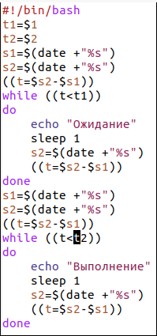
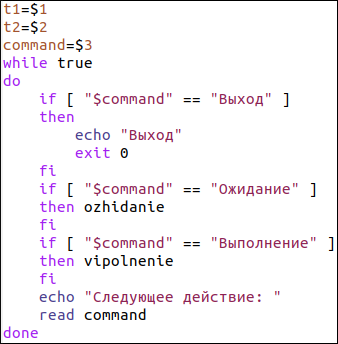

---
## Front matter
lang: ru-RU
title: Отчёт по лабораторной работе №13
author: Аветисян Давид Артурович
institute: РУДН, Москва, Россия
date: 5 июня 2021

## Formatting
toc: false
slide_level: 2
theme: metropolis
header-includes: 
 - \metroset{progressbar=frametitle,sectionpage=progressbar,numbering=fraction}
 - '\makeatletter'
 - '\beamer@ignorenonframefalse'
 - '\makeatother'
aspectratio: 43
section-titles: true
---

## Цель работы

Изучить основы программирования в оболочке ОС UNIX. Научиться писать более сложные командные файлы с использованием логических управляющих конструкций и циклов.

## Написал первый скрипт

Написал командный файл, реализующий упрощённый механизм семафоров. Командный файл должен в течение некоторого времени t1 дожидаться освобождения ресурса, выдавая об этом сообщение, а дождавшись его освобождения, использовать его в течение некоторого времени t2<>t1, также выдавая информацию о том, что ресурс используется соответствующим командным файлом (процессом) (рис. -@fig:001).

{ #fig:001 width=70% }

## Изменил первый скрипт

После этого я изменил скрипт так, чтобы его можно было выполнять в нескольких терминалах (рис. -@fig:002) и проверил его работу (например, команда «./semafor.sh 2 4 Ожидание > /dev/pts/1 &»).

{ #fig:002 width=70% }

## Написал второй скрипт

Реализовал команду man с помощью командного файла. Изучил содержимое каталога /usr/share/man/man1. В нем находятся архивы текстовых файлов, содержащих справку по большинству установленных в системе программ и команд. Каждый архив можно открыть командой less сразу же просмотрев содержимое справки. Командный файл должен получать в виде аргумента командной строки название команды и в виде результата выдавать справку об этой команде или сообщение об отсутствии справки, если соответствующего файла нет в каталоге man1 (рис. -@fig:003).

{ #fig:003 width=70% }

## Написал третий скрипт

Используя встроенную переменную $RANDOM, написал командный файл, генерирующий случайную последовательность букв латинского алфавита. Для данной задачи я создал файл: random.sh и написал соответствующий скрипт (рис. -@fig:004).

{ #fig:004 width=70% }

## Вывод

В ходе выполнения данной лабораторной работы я изучил основы программирования в оболочке ОС UNIX, а также научился писать более сложные командные файлы с использованием логических управляющих конструкций и циклов.

## {.standout}

Спасибо за внимание!
