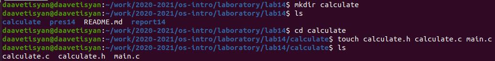
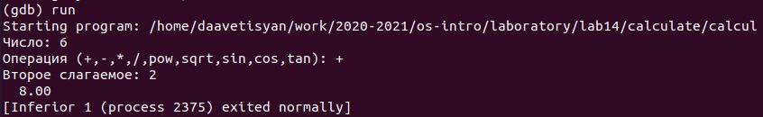
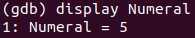
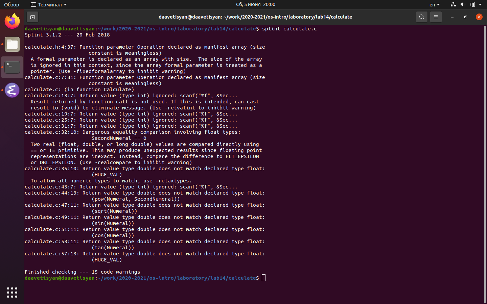

---
# Front matter
lang: ru-RU
title: "Отчёт по лабораторной работе №14"
subtitle: "Дисциплина: Операционные системы"
author: "Аветисян Давид Артурович"

# Formatting
toc-title: "Содержание"
toc: true # Table of contents
toc_depth: 2
lof: true # List of figures
lot: true # List of tables
fontsize: 12pt
linestretch: 1.5
papersize: a4paper
documentclass: scrreprt
polyglossia-lang: russian
polyglossia-otherlangs: english
mainfont: PT Serif
romanfont: PT Serif
sansfont: PT Sans
monofont: PT Mono
mainfontoptions: Ligatures=TeX
romanfontoptions: Ligatures=TeX
sansfontoptions: Ligatures=TeX,Scale=MatchLowercase
monofontoptions: Scale=MatchLowercase
indent: true
pdf-engine: lualatex
header-includes:
  - \linepenalty=10 # the penalty added to the badness of each line within a paragraph (no associated penalty node) Increasing the value makes tex try to have fewer lines in the paragraph.
  - \interlinepenalty=0 # value of the penalty (node) added after each line of a paragraph.
  - \hyphenpenalty=50 # the penalty for line breaking at an automatically inserted hyphen
  - \exhyphenpenalty=50 # the penalty for line breaking at an explicit hyphen
  - \binoppenalty=700 # the penalty for breaking a line at a binary operator
  - \relpenalty=500 # the penalty for breaking a line at a relation
  - \clubpenalty=150 # extra penalty for breaking after first line of a paragraph
  - \widowpenalty=150 # extra penalty for breaking before last line of a paragraph
  - \displaywidowpenalty=50 # extra penalty for breaking before last line before a display math
  - \brokenpenalty=100 # extra penalty for page breaking after a hyphenated line
  - \predisplaypenalty=10000 # penalty for breaking before a display
  - \postdisplaypenalty=0 # penalty for breaking after a display
  - \floatingpenalty = 20000 # penalty for splitting an insertion (can only be split footnote in standard LaTeX)
  - \raggedbottom # or \flushbottom
  - \usepackage{float} # keep figures where there are in the text
  - \floatplacement{figure}{H} # keep figures where there are in the text
---

# Цель работы

Приобрести простейшие навыки разработки, анализа, тестирования и отладки приложений в ОС типа UNIX/Linux на примере создания на языке программирования С калькулятора с простейшими функциями.

# Задание

1. В домашнем каталоге создайте подкаталог ~/work/os/lab_prog.
2. Создайте в нём файлы: calculate.h, calculate.c, main.c. Это будет примитивнейший калькулятор, способный складывать, вычитать, умножать и делить, возводить число в степень, брать квадратный корень, вычислять sin, cos, tan. При запуске он будет запрашивать первое число, операцию, второе число. После этого программа выведет результат и остановится.
3. Выполните компиляцию программы посредством gcc:  
gcc -c calculate.c  
gcc -c main.c  
gcc calculate.o main.o -o calcul -lm
4. При необходимости исправьте синтаксические ошибки.
5. Создайте Makefile. Поясните в отчёте его содержание.
6. С помощью gdb выполните отладку программы calcul (перед использованием gdb исправьте Makefile ):
- Запустите отладчик GDB, загрузив в него программу для отладки
- Для запуска программы внутри отладчика введите команду run
- Для постраничного (по 10 строк) просмотра исходного код используйте команду list
- Для просмотра строк с 12 по 15 основного файла используйте list с параметрами
- Для просмотра определённых строк не основного файла используйте list с параметрами
- Установите точку останова в файле calculate.c на строке номер 21
- Выведите информацию об имеющихся в проекте точка останова
- Запустите программу внутри отладчика и убедитесь, что программа остановится в момент прохождения точки останова
- Отладчик выдаст информацию, а команда backtrace покажет весь стек вызываемых функций от начала программы до текущего места
- Посмотрите, чему равно на этом этапе значение переменной Numeral. На экран должно быть выведено число 5
- Сравните с результатом вывода на экран после использования команды
- Уберите точки останова
7. С помощью утилиты splint попробуйте проанализировать коды файлов calculate.c и main.c.

# Выполнение лабораторной работы

1. В домашнем каталоге создаю подкаталог calculate с помощью команды «mkdir calculate».
2. Создал в каталоге файлы: calculate.h, calculate.c, main.c, используя команды «cd calculate» и «touch calculate.h calculate.c main.c» (рис. -@fig:001).

{ #fig:001 }

Это будет примитивнейший калькулятор, способный складывать, вычитать, умножать и делить, возводить число в степень, брать квадратный корень, вычислять sin, cos, tan. При запуске он будет запрашивать первое число, операцию, второе число. После этого программа выведет результат и остановится.  
Открыв редактор Emacs, приступил к редактированию созданных файлов.  
Реализация функций калькулятора в файле calculate.с (рис. -@fig:002) (рис. -@fig:003).

{ #fig:002 }

{ #fig:003 }

Интерфейсный файл calculate.h, описывающий формат вызова функции калькулятора (рис. -@fig:004).

{ #fig:004 }

Основной файл main.c, реализующий интерфейс пользователя к калькулятору (рис. -@fig:005).

{ #fig:005 }

3. Выполнил компиляцию программы посредством gcc, используя команды «gcc -c calculate.c», «gcc -c main.c» и «gcc calculate.o main.o -o calcul -lm» (рис. -@fig:006).

{ #fig:006 }

4. В ходе компиляции программы никаких ошибок выявлено не было.
5. Создал Makefile с необходимым содержанием (рис. -@fig:007). Данный файл необходим для автоматической компиляции файлов calculate.c (цель calculate.o), main.c (цель main.o), а также их объединения в один исполняемый файл calcul (цель calcul). Цель clean нужна для автоматического удаления файлов. Переменная CC отвечает за утилиту для компиляции. Переменная CFLAGS отвечает за опции в данной утилите. Переменная LIBS отвечает за опции для объединения объектных файлов в один исполняемый файл.

{ #fig:007 }

6. Далее исправил Makefile (рис. -@fig:008). В переменную CFLAGS добавил опцию -g, необходимую для компиляции объектных файлов и их использования в программе отладчика GDB. Сделал так, что утилита компиляции выбирается с помощью переменной CC.

{ #fig:008 }

После этого я удалил исполняемые и объектные файлы из каталога с помощью команды «make clean». Выполнил компиляцию файлов, используя команды «make calculate.o», «make main.o», «male calcul» (рис. -@fig:009).

{ #fig:009 }

Далее с помощью gdb выполнил отладку программы calcul. Запустил отладчик GDB, загрузив в него программу для отладки, используя команду: «gdb ./calcul» (рис. -@fig:010).

{ #fig:010 }

Для запуска программы внутри отладчика ввёл команду «run» (рис. -@fig:011).

{ #fig:011 }

Для постраничного (по 10 строк) просмотра исходного кода использовал команду «list» (рис. -@fig:012).

{ #fig:012 }

Для просмотра строк с 12 по 15 основного файла использовал команду «list 12,15» (рис. -@fig:013).

{ #fig:013 }

Для просмотра определённых строк не основного файла использовал команду «list calculate.c:20,29» (рис. -@fig:014).

{ #fig:014 }

Установил точку останова в файле calculate.c на строке номер 18, используя команды «list calculate.c:15,22» и «break 18» (рис. -@fig:015).

{ #fig:015 }

Вывел информацию об имеющихся в проекте точках останова с помощью команды «info breakpoints» (рис. -@fig:016).

{ #fig:016 }

Запустил программу внутри отладчика и убедился, что программа остановилась в момент прохождения точки останова. Использовал команды «run», «5», «−» и «backtrace» (рис. -@fig:017).

{ #fig:017 }

Посмотрел, чему равно на этом этапе значение переменной Numeral, введя команду «print Numeral» (рис. -@fig:018).

{ #fig:018 }

Сравнил с результатом вывода на экран после использования команды «display Numeral». Значения совпадают (рис. -@fig:019).

{ #fig:019 }

Убрал точку останова с помощью команд «info breakpoints» и «delete 3» (рис. -@fig:020).

{ #fig:020 }

7. С помощью утилиты splint проанализировал коды файлов calculate.c и main.c. Воспользовался командами «splint calculate.c» и «splint
main.c» (рис. -@fig:021) (рис. -@fig:022).  
C помощью утилиты splint выяснилось, что в файлах calculate.c и main.c присутствует функция чтения scanf, возвращающая целое число (тип int), но эти числа не используются и нигде не сохранятся. Утилита вывела предупреждение о том, что в файле calculate.c происходит сравнение вещественного числа с нулем. Также возвращаемые значения (тип double) в функциях pow, sqrt, sin, cos и tan записываются в переменную типа float, что свидетельствует о потери данных.

{ #fig:021 }

{ #fig:022 }

# Контрольные вопросы

1. Чтобы получить информацию о возможностях программ gcc, make, gdb и др. нужно воспользоваться командой man или опцией -help (-h) для каждой команды.
2. Процесс разработки программного обеспечения обычно разделяется на следующие этапы:
- планирование, включающее сбор и анализ требований кфункционалу и другим характеристикам разрабатываемого приложения;
- проектирование, включающее в себя разработку базовых алгоритмов и спецификаций, определение языка программирования;
- непосредственная разработка приложения: 
- кодирование − по сути создание исходного текста программы (возможно в нескольких вариантах); 
- анализ разработанного кода;
- сборка, компиляция и разработка исполняемого модуля;
- тестирование и отладка, сохранение произведённых изменений;
- документирование.  
Для создания исходного текста программы разработчик может воспользоваться любым удобным для него редактором текста: vi, vim, mceditor, emacs, geany и др.  
После завершения написания исходного кода программы (возможно состоящей из нескольких файлов), необходимо её скомпилировать и получить исполняемый модуль.
3. Для имени входного файла суффикс определяет какая компиляция требуется. Суффиксы указывают на тип объекта. Файлы с расширением (суффиксом) .c воспринимаются gcc как программы на языке С, файлы с расширением .cc или .C − как файлы на языке C++, а файлы c расширением .o считаются объектными. Например, в команде «gcc -c main.c»: gcc по расширению (суффиксу) .c распознает тип файла для компиляции и формирует объектный модуль − файл с расширением .o. Если требуется получить исполняемый файл с определённым именем (например, hello), то требуется воспользоваться опцией -o и в качестве параметра задать имя создаваемого файла: «gcc -o hello main.c».
4. Основное назначение компилятора языка Си в UNIX заключается вкомпиляции всей программы и получении исполняемого файла/модуля.
5. Для сборки разрабатываемого приложения и собственно компиляции полезно воспользоваться утилитой make. Она позволяет автоматизировать процесс преобразования файлов программы из одной формы в другую, отслеживает взаимосвязи между файлами.
6. Для работы с утилитой make необходимо в корне рабочего каталога с Вашим проектом создать файл с названием makefile или Makefile, в котором будут описаны правила обработки файлов Вашего программного комплекса.  
В самом простом случае Makefile имеет следующий синтаксис:  
<цель_1> <цель_2> ... : <зависимость_1> <зависимость_2> ...  
<команда 1>  
...  
<команда n>  
Сначала задаётся список целей, разделённых пробелами, за которым идёт двоеточие и список зависимостей. Затем в следующих строках указываются команды. Строки с командами обязательно должны начинаться с табуляции.  
В качестве цели в Makefile может выступать имя файла или название какого-то действия. Зависимость задаёт исходные параметры (условия) для достижения указанной цели. Зависимость также может быть названием какого-то действия. Команды − собственно действия, которые необходимо выполнить для достижения цели.  
Общий синтаксис Makefile имеет вид:  
target1 [target2...]:[:] [dependment1...]  
[(tab)commands] [#commentary]  
[(tab)commands] [#commentary]  
Здесь знак # определяет начало комментария (содержимое от знака # и до конца строки не будет обрабатываться. Одинарное двоеточие указывает на то, что последовательность команд должна содержаться водной строке. Для переноса можно в длинной строке команд можно использовать обратный слэш (\). Двойное двоеточие указывает на то, что последовательность команд может содержаться в нескольких последовательных строках.
7. Во время работы над кодом программы программист неизбежно сталкивается с появлением ошибок в ней. Использование отладчика для поиска и устранения ошибок в программе существенно облегчает жизнь программиста. В комплект программ GNU для ОС типа UNIX входит отладчик GDB (GNU Debugger).  
Для использования GDB необходимо скомпилировать анализируемый код программы таким образом, чтобы отладочная информация содержалась в результирующем бинарном файле. Для этого следует воспользоваться опцией -g компилятора gcc:  
gcc -c file.c -g  
После этого для начала работы с gdb необходимо в командной строке ввести одноимённую команду, указав в качестве аргумента анализируемый бинарный файл:  
gdb file.o
8. Основные команды отладчика gdb:
- backtrace − вывод на экран пути к текущей точке останова (по сути вывод − названий всех функций)
- break − установить точку останова (в качестве параметра может быть указан номер строки или название функции)
- clear − удалить все точки останова в функции
- continue − продолжить выполнение программы
- delete − удалить точку останова
- display − добавить выражение в список выражений, значения которых отображаются при достижении точки останова программы
- finish − выполнить программу до момента выхода из функции
- info breakpoints − вывести на экран список используемых точек останова
- info watchpoints − вывести на экран список используемых контрольных выражений
- list − вывести на экран исходный код (в качестве параметра может быть указано название файла и через двоеточие номера начальной и конечной строк)
- next − выполнить программу пошагово, но без выполнения вызываемых в программе функций
- print − вывести значение указываемого в качестве параметра выражения
- run − запуск программы на выполнение
- set − установить новое значение переменной
- step − пошаговое выполнение программы
- watch − установить контрольное выражение, при изменении значения которого программа будет остановлена  
Для выхода из gdb можно воспользоваться командой quit (или её сокращённым вариантом q) или комбинацией клавиш Ctrl-d. Более подробную информацию по работе с gdb можно получить с помощью команд gdb -h и man gdb.
9. Cхема отладки программы показана в 6 пункте лабораторной работы.
10. При первом запуске компилятор не выдал никаких ошибок, но в коде программы main.c допущена ошибка, которую компилятор мог пропустить (возможно, из-за версии 8.3.0-19): в строке scanf(“%s”, &Operation); нужно убрать знак &, потому что имя массива символов уже является указателем на первый элемент этого массива.
11. Система разработки приложений UNIX предоставляет различные средства, повышающие понимание исходного кода. К ним относятся:
- cscope − исследование функций, содержащихся в программе,
- lint − критическая проверка программ, написанных на языке Си.
12. Утилита splint анализирует программный код, проверяет корректность задания аргументов использованных в программе функций и типов возвращаемых значений, обнаруживает синтаксические и семантические ошибки.  
В отличие от компилятора C анализатор splint генерирует комментарии с описанием разбора кода программы и осуществляет общий контроль, обнаруживая такие ошибки, как одинаковые объекты, определённые в разных файлах, или объекты, чьи значения не используются в работепрограммы, переменные с некорректно заданными значениями и типами и многое другое.

# Выводы

В ходе выполнения данной лабораторной работы я приобрёл простейшие навыки разработки, анализа, тестирования и отладки приложений в ОС типа UNIX/Linux на примере создания на языке программирования С калькулятора с простейшими функциями.
